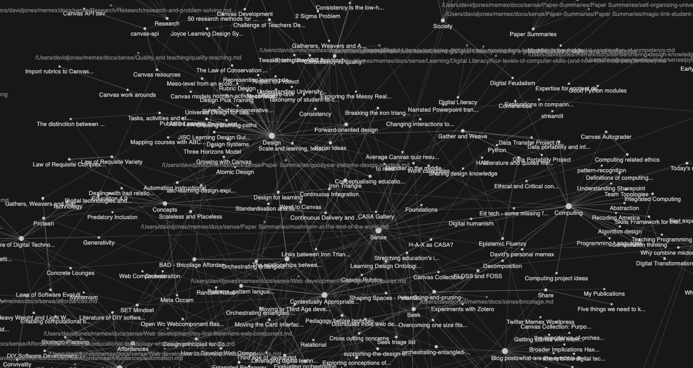

Foam has a graph/map feature for notes from within VS-Code

<figure markdown>

<figcaption>Sample graph/map of memex (within VSCode)</figcaption>
</figure>

## Examples

- [/home/huka](https://hukacode.github.io/graph/) - his [process](https://discord.com/channels/729975036148056075/735778843151040512/850931487187402793)

- [Obsidian example](https://notes.nicolevanderhoeven.com/obsidian-playbook/Using+Obsidian/01+First+steps+with+Obsidian/Obsidian)


- Use the code from Foam
- Add in some external JS
- write a script to build the graph data


[Paul's digital garden](https://garden.paulderaaij.nl/) - a more spacious and responsive popup design for the graph


## Libraries and examples

- [Cosmograph](https://cosmograph.app/#library)
- [Foam detail on graph visualisation](https://foambubble.github.io/foam/user/features/graph-visualization.html)
- Foam gatsby templates including graph visualisations
  - [foam-gatsby-template](https://github.com/mathieudutour/foam-gatsby-template)
  - [foam-gatsby-template-kb](https://github.com/hikerpig/foam-template-gatsby-kb) - quite nice
- [mkdocs-roamlinks-plugin](https://github.com/Jackiexiao/mkdocs-roamlinks-plugin) - could help with ideas
- [Python code](https://github.com/foambubble/foam/issues/1351#issuecomment-2206544442) that geneates are graphml file by reading all markdown files

    - This works and the file can be opened in Gephi. Need to choose some layouts to get reasonably visualisation.
    - Also doesn't read the front matter etc. Meaning less than stellar context. But workable.


## Broken Foam graph

Latest version of Foam has the graph breaking

```json
{
  "message": "Uncaught TypeError: Cannot read properties of undefined (reading 'type')",
  "filename": "https://file+.vscode-resource.vscode-cdn.net/Users/davidjones/.vscode/extensions/foam.foam-vscode-0.26.8/static/dataviz/graph.js",
  "lineno": 389,
  "colno": 46,
  "error": {}
}
```
