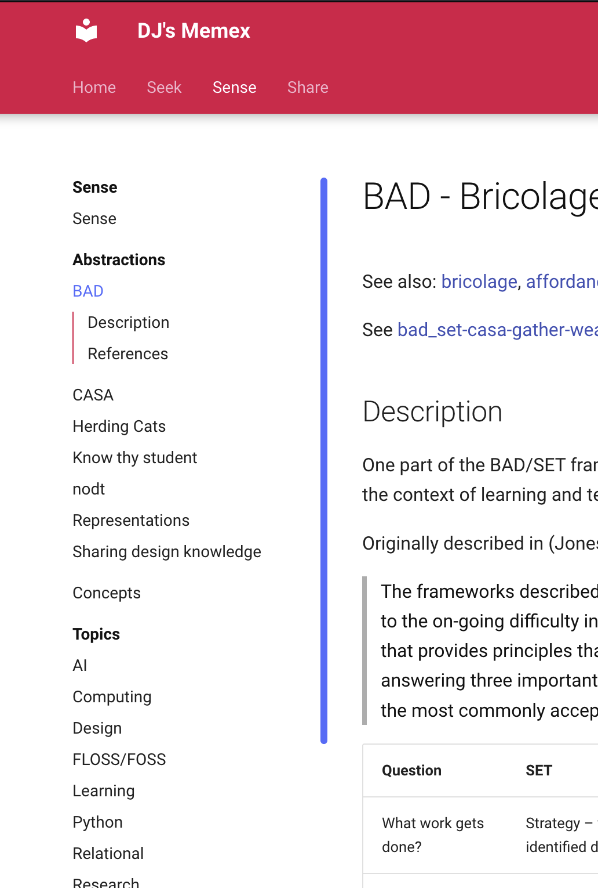

"Foam is not a philosophy" - [how you use Foam is really up to you](https://djon.es/blog/2020/07/06/designing-a-personal-memex-with-foam/#how-to-use-it)

While I'm happy with Foam, current use has some limitations. Most are focused on how Foam is published. The limitations may say more about me than Foam

- Lack of a search facility 
- Limited control of the interface in terms of design
- Inability to add different navigation structures

Through work on [[canvas-collections]] I've gained some experience and appreciation for [Material for MkDocs](https://squidfunk.github.io/mkdocs-material/). Experience which suggests that a combination of mkdocs and Foam might address these limitations. A suggestion reinforced by the existence [this template](https://github.com/Jackiexiao/foam-mkdocs-template#deploy-locally)

The combination of mkdocs and Foam appears likely to provide a more capable assemblage of technologies for my memex.

| Limitation | MkDocs | Possible use |
| --- | --- | --- |
| Lack of a search facility | [Search plugin](https://squidfunk.github.io/mkdocs-material/setup/setting-up-site-search/)  | Works fairly well with Collections. |
| Interface design | [Customisation](https://squidfunk.github.io/mkdocs-material/customization/) | Used in Collections to include [Shoelace Style components](https://shoelace.style){:target="_blank"}, opens ability to embed additional JavaScript/CSS |
| Navigation Structures | [Navigation](https://squidfunk.github.io/mkdocs-material/setup/setting-up-navigation/) | Can specify various aspects of the navigation to complement the wiki method |

## Other reasons

There are other reasons, 

- MkDocs is Python, I'm likely to be doing much more with Python.
- It has a large and active community, esp. Material for MkDocs.
- It provides useful support for local deployment.

### Lack of a search facility

Already working out of the box

<figure markdown>
{:width="75%"}
<figcaption>Successfully searching memex for <em>goodyear</em></figcaption>
</figure>

### Interface design

First example of a quick test is the additional styling (border, box shadow, and background colour) for the figure above.

!!! success "MkDocs admonition FTW"

     One way to add to the interface design is to use various in built [interface elements from Material for MkDocs](https://squidfunk.github.io/mkdocs-material/reference/).

### Navigation structure

I've found - and seen reported by others - a tension between the unstructured, ideas-led navigation through something like memex and the need to provide a more structured, purposeful navigation experience. MkDocs provides a way to specify a structure for the navigation that is independent of the physical structure of the files or the wikilinks.

Giving the best of both worlds.

<figure markdown>
{:width="50%"}
<figcaption>Additional navigation structure</figcaption>
</figure>

## Further exploration

With the "mkdocs foam" version rolled out, the next step is to identify ideas for further work. A list that starts with:

- [ ] How to add the network map visualisation as another navigation aid?
- Structure work How to supplement/replace the "see also" (dodgy) practice with 
  - [ ] Replace "see also" (dodgy) practice with "breadcrumbs" or similar
  - [ ] Explore if/how to get a more complete LHS menu without having to manually update it
- Page components 
  
    Identify/implement various page/purpose specific components.

## Further design 

### Seek 

"seek" should include 

- Some detail about how I'm getting pushed info 
- How I'm pulling info - what I'm actively searching for
  - big picture questions 
  - immediate questions - perhaps task driven
- triage spot to dump resources I need to follow up on

[//begin]: # "Autogenerated link references for markdown compatibility"
[canvas-collections]: ../sense/CASA/CASA/canvas-collections "Canvas Collections"
[//end]: # "Autogenerated link references"