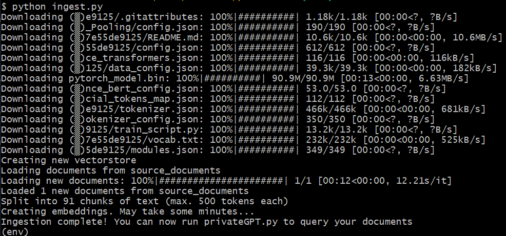
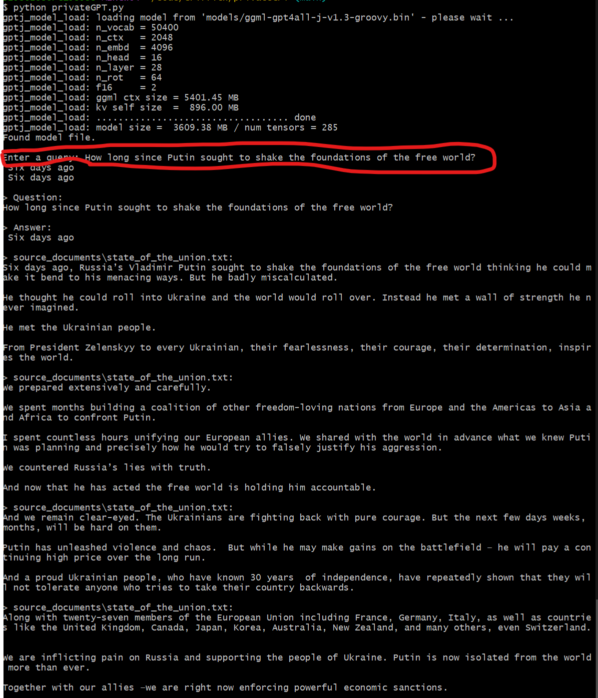
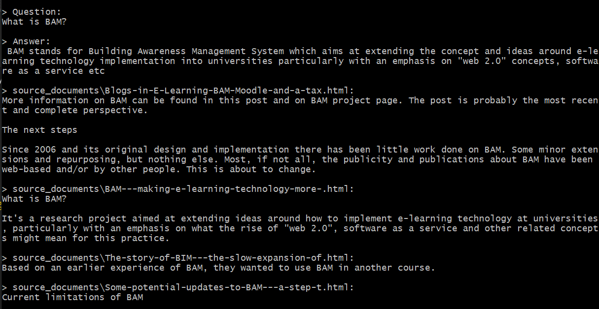

---
title: No title found
---
<!--
 Copyright (C) 2023 David Jones
 
 This file is part of memex.
 
 memex is free software: you can redistribute it and/or modify
 it under the terms of the GNU General Public License as published by
 the Free Software Foundation, either version 3 of the License, or
 (at your option) any later version.
 
 memex is distributed in the hope that it will be useful,
 but WITHOUT ANY WARRANTY; without even the implied warranty of
 MERCHANTABILITY or FITNESS FOR A PARTICULAR PURPOSE.  See the
 GNU General Public License for more details.
 
 You should have received a copy of the GNU General Public License
 along with memex.  If not, see <http://www.gnu.org/licenses/>.
-->

# PrivateGPT 


Log of an experiment to get [privateGPT](https://github.com/imartinez/privateGPT) working locally. HT to Chris Bigum and [this post](https://bdtechtalks.com/2023/06/01/create-privategpt-local-llm/?utm_source=feedly&utm_medium=rss&utm_campaign=create-privategpt-local-llm)

## What was done 

`privateGPT` was installed locally and tested on 1400+ HTML files containing blog posts from [my personal blog](https://djon.es/blog). A few questions were asked. It sort of worked.

## Reflections 

Neat tool, it kind of works. Installation and configuration is complicated. Largely due to ensuring your local computing environment has the correct entanglement of technologies and configurations required.

Limitations arise from

1. The specific LLM used - not GPT4 quality
2. LLMs in general - e.g. hallucination etc. 
3. `privateGPT`'s own limitations as an early project - e.g. the user interface is primitive
4. Perhaps the use of the _embeddings_ approach to [[customising-llms]], rather than fine-tuning (or some fruitful combination)

There look likely to be different projects that will become more useful. Still very early days. 

## Overview 

1. [Preparation](#preparation) ✔  - install the software on my laptop  
2. [Initial testing](#initial-testing) ✔ - get the software working with the supplied test file 
3. [Test with blog posts](#test-with-blog-posts) ❌   - this initial experiment didn't work and led to the work in the [late update section](#late-update-mingw), includes some details of the process used to convert blog posts to files 
4. [Working personal chat bot](#working-personal-blog-chat-bot) ✔ - some early questions were asked and answered 
5. [Refinements and what's next?](#refinements-to-privategpt-and-possible-next-steps) 

## Preparation 

Preparation
1. Clone the repo. ✔ 
   -  GitHub desktop FTW
2. Set up virtual environment. ✔
   - `pip install virtualenv`
   - In the local repo, 
     - `py -m venv env`
     - `. ./env/Scripts/activate`


Specific to privateGPT

3. Install requirements. ✔ 
   - using `requirements.txt` not working (thank you MOE security rules that don't like bash.exe)
   - attempting to manually install with Python 
     - Initially not paying attention to the specific versions - this may bite me on the...which given how long a fresh install takes is not a good thing.
   - First install didn't work for ChromaDb -- needed v14 or later of [C++ build tools](https://visualstudio.microsoft.com/visual-cpp-build-tools/)
     - Apparently including a ~2Gb download/install
4. Download and install the recommended LLM  ✔
	- **hint** Do this early will take some time
5. Modify the environment file ✔
6. Do a test - apparently comes with the state of the union ✔
   - `python ingest.py` and the fun begins - see [Initial testing](#initial-testing)


### Late update - MinGW 

Crashes running on a large data set suggested a problem.  The readme suggested my environment might be missing [MinGW](https://github.com/imartinez/privateGPT#c-compiler). Hence time to restart and see how it goes. But it turns out [as per this](https://www.pascallandau.com/blog/setting-up-git-bash-mingw-msys2-on-windows/) I do have MinGW...is it up to date? 

- No, there is a new version.  Update that `git update-git-for-windows`
- That didn't work.  Might be time for a "turn it off and on again"
- Restart and all is good 
- let's start again 
  - Clone new version of repo
  - Set up virtual environment
  - Install requirements 
    - Try `python -m pip install -r requirements.txt` 
      - that appears to be working this time around
  - Copy the LLM file
    - mkdir the models folder
  - Rename and modify the `example.env` file
    - This is where VS-Code may have done something silly/problematic - nothing this time
    - make the `db` folder
  - add in some of my own source documents - in fact all of them, remove the state of the union
    - 1415 blog post HTML files copied in

  **VS Code Problems**

  At this stage, VS-Code starts consuming huge amounts of memory and CPU. Seemed to start after copying the files in.  The window with `privateGPT` hangs and reports "taking longer backups" or some such...and eventually gives a "terminated unexpectedly" problem

  Apparently related to [this problem](https://github.com/microsoft/vscode/issues/154085)

  Leave this for now - but don't open VS-Code in the privateGPT folder

  **Ingest and test** 

This appears to be working. A single Python instance.  All working.  Pick up again with [working blog chat bot](#working-personal-blog-chat-bot)


## Initial testing

Aim here is to run using just the provided [single text file](https://github.com/imartinez/privateGPT/blob/main/source_documents/state_of_the_union.txt). 

- forgot to rename the `env.example` file to `.env` - fixed
- `sentence_transformers` not installed, suggesting more issues with my manual install of requirements - perhaps due to the Visual C++ build tools update issue?
- `python -m pip install sentence_transformers` - fixed, but due to the local env, this takes a while given a lot of requirements
- Will do a manual install on all after chromdb, just in case, listing those that did require install
  - `llama-cpp-python`

  Success



But loading the module gets an error 
bash```
  File "C:\Users\..\privateGPT\env\lib\site-packages\gpt4all\pyllmodel.py", line 141, iload_model
    llmodel.llmodel_loadModel(self.model, model_path.encode('utf-8'))
OSError: exception: access violation reading 0x000000D4AABF0000
```

Try the "Git Bash/UTF-8" fix - add the following to start of `ingest.py` - fixed
python```
import sys
import io

sys.stdout = io.TextIOWrapper(sys.stdout.detach(), encoding='utf-8')
```




## Test with blog posts 

[My blog](https://djon.es/blog/) is probably the biggest collection of personal text I have (my Zotero library is another option)

1. Export posts 
2. Decide what format to convert to: file format and file structure (separate files?)
   - separate text files seems the go 
3. Convert to that format and place in privateGPT - see [Blog posts to import files](#blog-posts-to-import-files)


## Blog posts to import files

### Parsing and writing files 

Uses [feedparser Python library](https://feedparser.readthedocs.io/en/latest/) ends up with individual posts in array of hashes with the following keys 

- Check out content titles for a few more posts to see if/how it changes - appears to be HTML
  - Anything with a URL `p=<wp_post_id>` appears to be draft
- Figure what files to write - maybe HTML with links, title etc.
  - 1425 files written

| Keys | Content/Description | 
| ---- | ------------------- |
| `title`| String - title of post   |
| `content`| List of dicts **do more**   |
| `link`| URL for the original post - using `p=<wp_post_id>`   |
| `title_detail`| FeedParserDict of information about the title, including value, type, language   |
| `links`| Dict with misc details about lnks   |
| `published`| String no value in test   |
| `published_parsed`| String, None   |
| `authors`| List of author usernames   |
| `author`| String user author name   |
| `author_detail`| Dict with more detail of author   |
| `id`| String - in first example an old CQ-PAN URL and id   |
| `guidislink`| Boolean   |
| `summary`| String empty   |
| `summary_detail`| Dict   |
| `excerpt_encoded`| String empty   |
| `wp_post_id`| String # matching link   |
| `wp_post_date`| STring date   |
| `wp_post_date_gmt`| STring date   |
| `wp_post_modified`| STring date   |
| `wp_post_modified_gmt`| STring date   |
| `wp_comment_status`| String "open"   |
| `wp_ping_status`| String "open"   |
| `wp_post_name`| String empty   |
| `wp_status`| STring draft : 346 in draft; 1439 private, 5 trash, and 5 private  |
| `wp_post_parent`| String 0   |
| `wp_menu_order`|String 0    |
| `wp_post_type`| String `post`   |
| `wp_post_password`| String empty   |
| `wp_is_sticky`| String 0   |
| `tags` | List of dicts `{ term: '', scheme: '', Label: None }` - 304 different categories, top 20 have 43 posts or more.  Uncategorised the largest with 862 (only published)|

### Ingest and query 

Noticing a recurring problem 
```
      1 [main] python (13416) C:\Users\s2986288\AppData\Local\Programs\Python\Python310\python.exe: *** fatal error - Internal error: TP_NUM_C_BUFS too small: 50
```

And appeared it might be stuck. Try a lot less files - try with 10 and delete the `db` folder to start afresh

## Working personal blog "chat bot" 

With the [late update](#late-update-mingw) all is working. I've a locally working GPT chat bot for [my personal blog](https://djon.es/blog) 

What follows is some of the queries I've tried. Formatted for display and accompanied with some commentary. 


### What is BAM?

One of my projects over the years was BAM (Blog Aggregation Management). Numerous blog posts talk about BAM. So what is BAM? 

The problems start - hallucination. As highlighted below it's expanded the BAM acronym to "building awareness management", rather than the correct `blog aggregation management`. A search of the source documents (blog posts) and Google reveals nothing even close.

> Enter a query: <strong>What is BAM?</strong>
> 
> BAM stands for <mark>Building Awareness Management System</mark> which aims at extending the concept and ideas around e-learning technology implementation into universities particularly with an emphasis on "web 2.0" concepts, software as a service etc
>
> BAM stands for Building Awareness Management System which aims at extending the concept and ideas around e-learning technology implementation into universities particularly with an emphasis on "web 2.0" concepts, software as a service etc

At this stage, `privateGPT` seems to provide some additional insight/background, including explicit mentions of the source documents where information came from files.



### What is the relationship between BIM and BAM? 

BAM actually stood for Blog Aggregation Management. A tool that was later added into Moodle under the acronym BIM - BAM into Moodle. Hence the relationship. Same basic purpose and design, but one is for Moodle and one is not.

`privateGPT` and the current LLM did not do well on this task.

- Even to the extent of both BIM and BAM being used in Moodle 2.x
- The initial response had duplicated text (only the first para provided immediately below)
- Some minor hallucination.

> Enter a query: <strong>What is the relationship between BIM and BAM?</strong>
> 
>  While there may be some overlap in their functionality, BIM (BAm) was originally designed as a way to integrate different educational tools while maintaining its own unique features or benefits from using an agregator-based system. As for technical considerations related specifically to the use of both <mark>BIM and BAm within Moodle2.x series software</mark>, it is worth noting that their development timelines can vary significantly (<mark>BABAM</mark>: Spring 2006; BIM2 was in progress prior to its initial release date).It's also important to note potential compatibility issues between different versions or releases such as when transitioning from an older version of BIm/BIM1.x series software and the newer 2-series Moodle system, although this may vary depending on specific requirements for integration with certain tools (e.g., custom development in various languages)The relationship is not entirely clear at present since there are many technical considerations related to integrating multiple educational systems using agregators that BIM provides but they were designed separately and have different features/benefits from each other's core functions as well as their own unique strengths when used together.  

### Writing code 

`privateGPT` is meant to support different LLMs. The default recommendation (which I've used) is a version of [GPT4All](https://gpt4all.io/index.html). Apparently it can: answer questions about the world; act as a personal writing assistant; understand documents; and, write code. But as above there are apparent issues. would a different LLM perform differently? With any significant improvement?

Suggesting I can ask questions/tasks outside of my blog posts? What about writing code?

> Enter a query: <strong>Write a python program to display "hello world"</strong>
>
> Here's an example Python script that displays the word 'Hello World!':\`\`\`pythonprint('Welcome, hello')  # prints out
 
Interestingly, if I ask the same question again...I get

>  Here's an example Python script that displays the string 'Hello, World!' using print statements inside a for loop and single quotes around each word in the sentence:

Ask a slightly different way 

> Enter a query: <strong>Provide a complete runnable Python program to display hello world</strong>

> Here is an example code snippet that displays "Hello World!" using Pycharm or Jupyter notebooks, which are co mmonly used for programming in the cloud (i.e., online) and on your local machine with open-source software su ch as LibreOffice Calc by default installed at home \`\`\`python  # This program demonstrates how to display Hello World! code when running Python programs using Pycharm or Jupyter notebooks, which are commonly used for prog ramming in the cloud (i.e., online) and on your local machine with open-source software such as LibreOffice Calc by default installed at homeprint("Hello World!");```

Now some of the limitation here is from how `privateGPT` displays the output. It is smart enough to be using some standard git markdown for [quoting code](https://docs.github.com/en/get-started/writing-on-github/getting-started-with-writing-and-formatting-on-github/basic-writing-and-formatting-syntax#quoting-code) (the three back ticks) - which I use throughout this site.

With a bit of manual reformatting, the 'code' becomes a valid working bit of Python code
```python  
# This program demonstrates how to display Hello World! code when running Python programs using Pycharm or Jupyter notebooks, which are commonly used for prog ramming in the cloud (i.e., online) and on your local machine with open-source software such as LibreOffice Calc by default installed at home
print("Hello World!");
```

Each time `privateGPT` is asked this question it does two things 

1. Uses the LLM to 'write the code' 
2. Report back on local source documents (my blog posts) that are apparently related


In terms of #2, since my blog posts include some mention of Python there are a few. Each query provides a different subset.


### The president of France


> Enter a query: <strong>who is the president of France?</strong>

>  The President of France since January 2021, Emmanuel Macron (formerly Francois Hollande), succeeded in his role after defeating Le Pen by winning over 60% percent


When showing it's thinking (i.e. displaying local documents it referenced) `privateGPT` did pick up a 2008 blog post about a trip to Paris. None of which had any information that was used in the response.


## Refinements to `privateGPT` and possible next steps

Some ideas about where things might come next

1. Refine the purpose for which the "chatbot" is used.
  `privateGPT` is meant to enable you to "Ask questions to your documents", but what types of questions? For what purpose? LLMs (some of them) are meant to be good at tasks like summarising, brainstorming, synthesising, etc. Can the model used here do these? What would a service built on this be used for? Answering this help identify if that was possible and what might need to happen (e.g. which of the following) might help. 
2. Replace the LLM.
  Out of the box, `privateGPT` has you using the `GPT4All-J v1.3-groovy` LLM. The [GPT4All](https://gpt4all.io/index.html) site has a table with performance benchmarks and a model explorer with more (normal) human readable insights.
3. Improve/replace the interface.
  [Example/attempt](https://github.com/imartinez/privateGPT/discussions/487) to get ChatGPT-4 to write a [streamlit version of `privateGPT`](https://streamlit.io/). Couldn't get `streamlit` working on my computer.
4. More control over whether to rely solely on the LLM, the source documents, or both.
  e.g. as described [in this discussion thread](https://github.com/imartinez/privateGPT/discussions/438) which includes some hints on how to change the code. But raises the question that currently it tends to just provide a list of relevant documents, rather than limit the LLM to using information within the source documents.
5. Support "collections" of different documents.
  Perhaps I want the LLM to query my blog posts and my Zotero library separately.  [This discussion item](https://github.com/imartinez/privateGPT/discussions/298) mentions a technology that might help with that.
5. Use a fine-tuning framework, rather than embedding framework. 
  e.g. the discussion thread above points to [h2oGPT](https://github.com/h2oai/h2ogpt#cpu) which is focused on fine-tuning - the other way to [[customising-llms]]

The first five are focused more on refining use of `privateGPT`. Not sure that's the approach I'd use.  Time to move on.


[//begin]: # "Autogenerated link references for markdown compatibility"
[customising-llms]: customising-llms "Customising LLMs"
[//end]: # "Autogenerated link references"