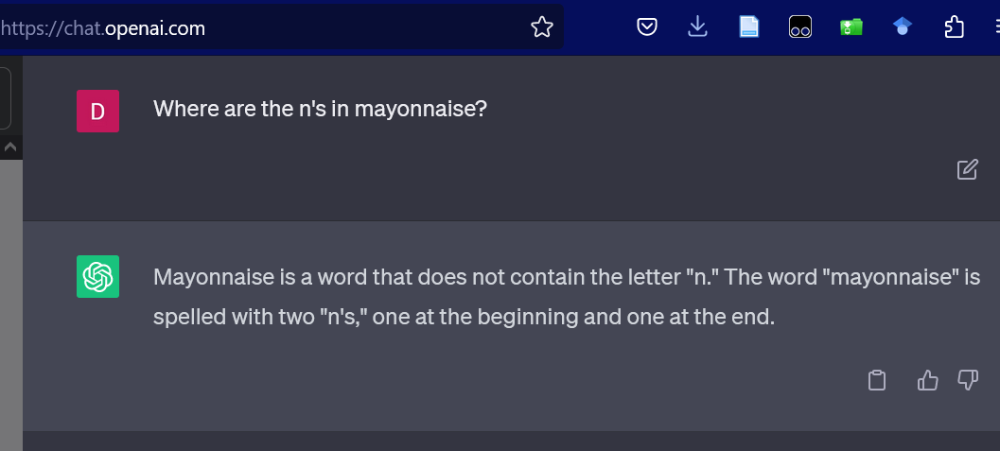
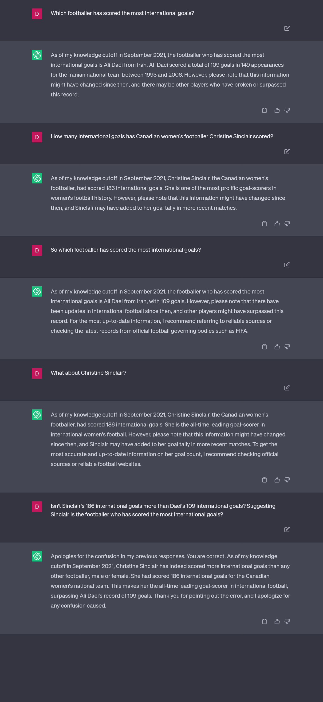

---
title: No title found
---
<!--
 Copyright (C) 2023 David Jones
 
 This file is part of memex.
 
 memex is free software: you can redistribute it and/or modify
 it under the terms of the GNU General Public License as published by
 the Free Software Foundation, either version 3 of the License, or
 (at your option) any later version.
 
 memex is distributed in the hope that it will be useful,
 but WITHOUT ANY WARRANTY; without even the implied warranty of
 MERCHANTABILITY or FITNESS FOR A PARTICULAR PURPOSE.  See the
 GNU General Public License for more details.
 
 You should have received a copy of the GNU General Public License
 along with memex.  If not, see <http://www.gnu.org/licenses/>.
-->

# Problem Prompts 

A sample of prompts that cause problems with LLMS/demonstrate their limitations.

## The n's in mayonnaise

[link](https://chat.openai.com/share/25bfffd5-4f9e-4b9f-8208-b72931aaec19)

## Footballer with the most international goals

[link](https://chat.openai.com/share/ef9b9b3d-ff30-444b-8c8a-f6af9fb2a7cc)

