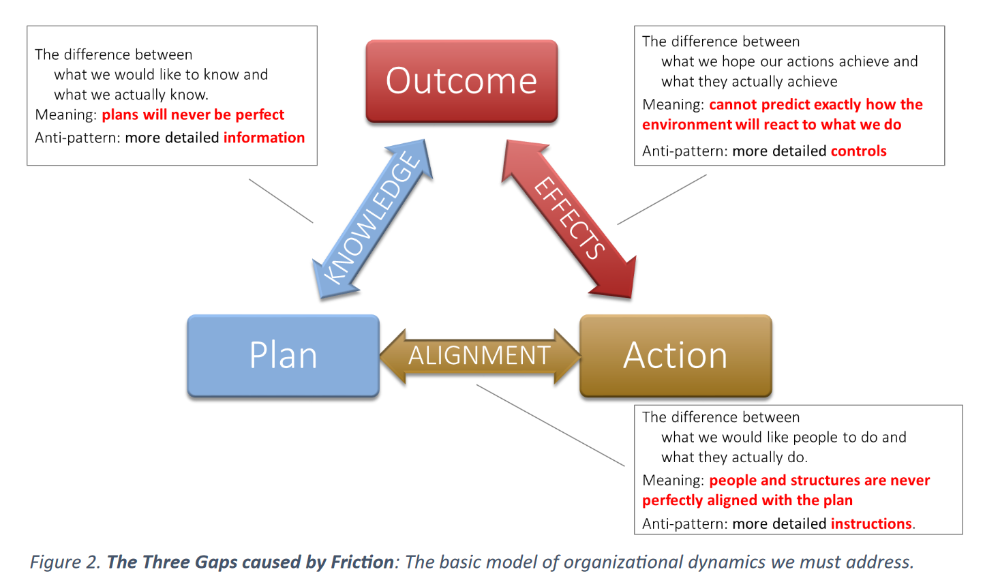

# Three gaps caused by friction

See also: [[bad-mindset]]

The challenges/problems/friction for most project management.  i.e. why the project management approach to the LMS migration project (and so much) failed. 

The presentation that led me here argues that the solution is faster release times.  i.e. reduce the length of each of those arrows so that you're more quickly able to detect problems and correct.  i.e. agile development, devops/CI/CD and basically what we do.

  

[//begin]: # "Autogenerated link references for markdown compatibility"
[bad]: ../CASA/bad "BAD - Bricolage Affordances Distribution"
[//end]: # "Autogenerated link references"