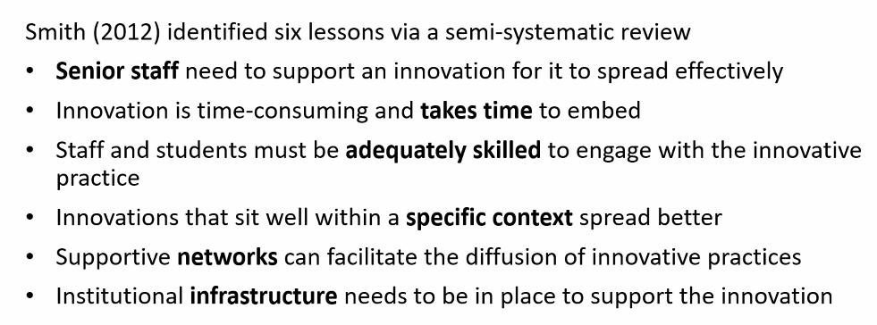
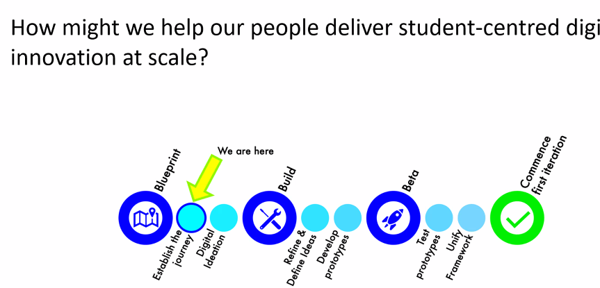
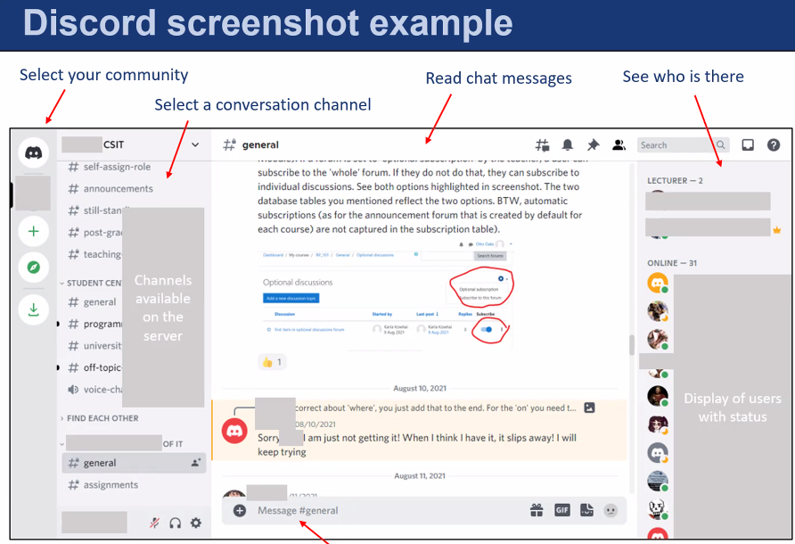

---
title: ASCILITE 2022 - Day 1
---
See [[ascilite-2022]] Monday 5 December 2022

### Keynote - Using educational technologies to create relationships that enable student learning and thriving

Good fit with conference theme and important topic.

- In questions, need for structural change required to get feedback loops working proper (e.g. contract grading)

Peter Felten - [book details](https://www.elon.edu/u/news/2021/01/04/lambert-and-felten-explore-the-power-of-relationship-rich-education-in-new-book/)

> Decades of research demonstrate that the quality of student-student and student-staff interactions are foundational to learning, belonging, and well-being for all undergraduates, and are particularly significant for students from groups that have been (and too often continue to be) marginalized in higher education. Drawing on more 450 interviews with students and staff across U.S. higher education, including scores of student interviews during the pandemic, this interactive session will explore how academic staff can use educational technologies to nurture relationships that support student thriving at university. Because these relationships tend to have lasting legacies, we also will consider how relationship-rich experiences can enable students to develop the skills and capacities – as well as the constellations of colleagues and mentors – that will empower them to contribute positively to their communities and professions after they graduate.

> not where the students where, but what they were asked to do

i.e. no significant difference phenomena

Building human connections online four suggestions

- Humanise the instructor
- Provide personalised Feedback
- Reach out to students
- Support student peer collaboration (Glazier, 2021)

Positioned as working online, but it really not technology dependent

#### References

Glazier, R.A. (2021). Connecting in the Online Classroom: Building Rapport between Teachers and Students. (Johns Hopkins 	University Press).

### Using educational technologies to create relationships that enable student learning and thriving

### Re/Connecting university teachers with digital teaching tools for “jobs to be done”

[Paper](https://publications.ascilite.org/index.php/APUB/article/view/118)

decision making/conversation starting Framework and apparent website to scaffold making decisions...linking to tools

The actual [tool guide](https://tl-tools-guide.deakin.edu.au/)

> Although constructive alignment is well understood within university teaching practices, technology does not always feature explicitly within this conceptual model. When educators seek digital technologies to assist them in their teaching, how do they find out both what is available to them within their higher education institution and, more importantly, which tools might make a good pedagogical “fit” within their unit of study? One university in Australia recently designed and developed a Teaching and Learning Tools Guide to assist their teachers to determine which educational technologies are available for their various educational purposes. This new resource offers guided navigation to assist teacher choice of tool to align to their intended pedagogical strategy. As an open-source resource, the guide is also offered widely to the higher education community. This paper recommends that this or a similar resource is used to support digital tool choice within the constructive alignment process.

### Co-creating a digital learning innovation framework through design thinking approaches 

[Paper](https://publications.ascilite.org/index.php/APUB/article/view/140)

Abstract
> Although innovation is widely used as a marker of excellence by universities it remains a poorly conceptualised idea, particularly in the realm of teaching and learning. In this paper, we describe an institution-wide project to co-create a Digital Learning Innovation Framework at a large Australian university. Through design thinking approaches a central learning and teaching unit led a co-design process to investigate and define digital learning innovation within their institutional context. This initiative involved a total of 114 stakeholders who design and deliver digital learning innovations at the University. This paper reports on a tentative, working definition of digital learning innovation and six guiding principles that arose out of this Digital Learning Innovation Framework co-design process. In this way, this paper makes significant contributions in conceptualising and contextualising practice-based innovation for digital education. Future implications and limitations of this study are also noted.

- Most claims of innovation in higher ed is incremental and focused on efficiency
- Own experience didn't impact practice

Smith 2012 six lessons
  

Looking for framework and infrastructure to support innovation

Talk with people - 3 3 hour workshops.  Design thinking, sprint.  External moderator for workshops

  

Gathered lots of feedback ideas and developed 6 principles

Six principles

1. Create a safe place for new ideas
2. Keep focused on your purposes.
3. Keep focused on your users.
4. Be ethical.
5. Start small and build up.
6. Think holistically

    Argues against traditional organisational approaches that rely on teleological approaches that suffer from not being able to see the whole.

### In the business of nudging

[Paper](https://publications.ascilite.org/index.php/APUB/article/view/222)

Abstract
> We have long been leveraging the use of technologies to help build and sustain connections in the online environment. The pandemic opened our eyes to the value of these connections and the ability to better use technologies to facilitate them. Now we must question what more we can do. Creating communities through safe environments, building trust, showing students our ‘human’ sides through rapport building and teacher presence which may have previously been hidden in plain sight when operating in a face-to-face mode are a good start. By breaking down traditional barriers brought about through power relationships, the foundations of a quality learning experience are both created and maintained. Using case scenarios and personal narrative from two metropolitan university business schools, we explore techniques that have been used to build connections during lockdowns and begin to reconnect as we emerge from the pandemic. We found that nudging our students through initial uncomfortableness really helped them feel part of a community of learners, one which we also belonged.

Nudge theory is mentioned.  Also CoI and the importance of teacher presence and in particular "setting climate"

### Fostering connections for professional identity formation: two case studies of Discord discipline-focused communities 

[paper](https://publications.ascilite.org/index.php/APUB/article/view/136)

How do support or students with online communication & networking. - Professional identity formation

More an exploratory feature.

Two case studies - both using Discord

- Computer science/Information technology 

    - 4+ years of discord use   
	- bottom up use - one tutor - community developed organically
	- interview with 19 students
	- distance students included lots of them, incl. part-time
- Veterinary sciences

    - new use of discord in one core course
	- aiming to be more online help-seeking
	- interviews with 4 staff

Computer science discord set up 

  

### Social Anxiety in Digital Learning Environments: Empirical Evidence and Call to Action

[paper](https://publications.ascilite.org/index.php/APUB/article/view/37)

Abstract
> It is internationally accepted that digitally-supported learning increases the accessibility of higher education due to its capacity to overcome traditional university's spatial and temporal limitations. At the same time, increased student-teacher ratios and reduced student-targeted support may lower the quality of learning and instruction in higher education. Research focussed on digital learning environments in higher education identified social anxiety as an increased challenge for learners and teaching staff. This international case study investigates students’ social anxiety at two higher education institutions. Findings show that social anxiety exists in higher education digital learning environments and differs across cultural contexts and gender. The data suggests that it is worth tertiary educators pausing to consider the role that social anxiety may be playing in reducing interactions within online units. Additional research is required to establish the causes of social anxiety in digital learning environments and develop strategies to minimise its effect.

Teacher education

  

Findings

- Oz students have higher social anxiety when interacting with peers in digital learning environments

### How can EdTech support graduate employability?

[paper](https://publications.ascilite.org/index.php/APUB/article/view/184)

Abstract
> Pressure is mounting upon universities to ensure that our graduates are employable. Business and governments increasingly demand that graduates are equipped with skills and competencies that map into labour market needs. But students often struggle to choose courses, subjects and activities that will support their career goals and aspirations. This paper introduces an approach designed at UTS which aims to embed a skills analytics tool at key transition points for our students. The need to support such tools will a well-grounded learning design is discussed, along with the need to move beyond a “one size fits all” model for supporting EdTech tools. A solution that utilises a series of modules in the LMS is introduced.

“This paper introduces an approach designed at UTS which aims to embed a skills analytics tool at key transition points for our students.” ([Kitto, 2022, p. 1](zotero://select/library/items/PGU678XZ)) ([pdf](zotero://open-pdf/library/items/PIWZVSWA?page=1&annotation=267EU9AV))

“How might we use EdTech to support graduates in meeting this agenda without adding undue stress to teaching teams and students?” ([Kitto, 2022, p. 1](zotero://select/library/items/PGU678XZ)) ([pdf](zotero://open-pdf/library/items/PIWZVSWA?page=1&annotation=2J86IUH9))

“Indeed, it is often easier for professionals to recognise mistakes made by someone attempting to learn an epistemic game associated with a profession than it is to explicitly list what people should be doing ahead of time (Markauskaite and Goodyear, 2017)” ([Kitto, 2022, p. 1](zotero://select/library/items/PGU678XZ)) ([pdf](zotero://open-pdf/library/items/PIWZVSWA?page=1&annotation=RGBE624X))

“Furthermore, universities need to do more than support our students in developing a rich portfolio of attributes and skills; we also need to help them to demonstrate those attributes, in a manner that employers can understand and interpret.” ([Kitto, 2022, p. 2](zotero://select/library/items/PGU678XZ)) ([pdf](zotero://open-pdf/library/items/PIWZVSWA?page=2&annotation=CE7VHWVF))

“Tools are designed to provide a scaffold (Reiser, 2004) that helps students to undertake the open ended and complex task of career planning. Students build up a skills profile that they can use to: set career goals; explore skills gaps between their skill profile and the skills they will need for an identified goal; and, identify training pathways through the curriculum that we offer” ([Kitto, 2022, p. 2](zotero://select/library/items/PGU678XZ)) ([pdf](zotero://open-pdf/library/items/PIWZVSWA?page=2&annotation=E9AXGECP))

“Reiser (2004), EdTech tools have the potential to provide scaffolding by both (i) structuring the task at hand, and (ii) problematising aspects of the subject matter” ([Kitto, 2022, p. 2](zotero://select/library/items/PGU678XZ)) ([pdf](zotero://open-pdf/library/items/PIWZVSWA?page=2&annotation=AZGNSDF9))

“Wrapped around these analytics services (many of which we are now building upon and extending) is a web based framework with an Angular front end, GraphQL middle layer which enables us to decouple front end development from the back end, and a Node based back end. This design makes tools accessible from multiple domains (i.e. not just the learning management system, LMS), with various application components reused as appropriate” ([Kitto, 2022, p. 2](zotero://select/library/items/PGU678XZ)) ([pdf](zotero://open-pdf/library/items/PIWZVSWA?page=2&annotation=ASNWDVSH))

“However, simply pointing students to an EdTech based tool that they “may want to explore” rarely results in significant uptake of the service (Kitto et al., 2017)” ([Kitto, 2022, p. 3](zotero://select/library/items/PGU678XZ)) ([pdf](zotero://open-pdf/library/items/PIWZVSWA?page=3&annotation=MPRPTF6A))

“How can we embed such tools into a course’s design without disrupting the course structure itself?” ([Kitto, 2022, p. 3](zotero://select/library/items/PGU678XZ)) ([pdf](zotero://open-pdf/library/items/PIWZVSWA?page=3&annotation=EEK5WGQT))

“However, beyond the FYE there are likely to be a number of other key transition points where students are focused upon career goals and employability which provides an opportunity for designing a successful intervention” ([Kitto, 2022, p. 3](zotero://select/library/items/PGU678XZ)) ([pdf](zotero://open-pdf/library/items/PIWZVSWA?page=3&annotation=RKWYKX6C))

“However, as Shibani et al. (2019) argue, in attempting to build tools that are scalable it is all too common to adopt a one size fits all mentality, which fails to contextualise their use to the different problems that students are likely to be facing throughout this whole of course journey.” ([Kitto, 2022, p. 3](zotero://select/library/items/PGU678XZ)) ([pdf](zotero://open-pdf/library/items/PIWZVSWA?page=3&annotation=EIRJI2CU))

“At present, this contextualization process is managed using a set of reusable Canvas pages. These are labelled such that they can be flexibly assembled in a way that supports student goal setting and development at the various transition points listed above.” ([Kitto, 2022, p. 3](zotero://select/library/items/PGU678XZ)) ([pdf](zotero://open-pdf/library/items/PIWZVSWA?page=3&annotation=7KRGZYZN))

“We note that the current functionality of Canvas Commons does not really support the type of structure we would like to enable for sharing these resources” ([Kitto, 2022, p. 4](zotero://select/library/items/PGU678XZ)) ([pdf](zotero://open-pdf/library/items/PIWZVSWA?page=4&annotation=DXFGMN4L))

“This is an issue, as the creation of reusable learning objects is likely to require that the object can be structured beyond simple pages” ([Kitto, 2022, p. 4](zotero://select/library/items/PGU678XZ)) ([pdf](zotero://open-pdf/library/items/PIWZVSWA?page=4&annotation=5ZBGRGUK))

“Similarly, it is not currently possible to control which activity is imported into a subject. This is problematic as it is possible that students might be provided with the same activity across multiple subjects with the current shareable structure” ([Kitto, 2022, p. 4](zotero://select/library/items/PGU678XZ)) ([pdf](zotero://open-pdf/library/items/PIWZVSWA?page=4&annotation=5IFE33SL))

“We encourage LMS vendors to think about how these types of extensions might be enabled in their systems to support reusable learning objects” ([pdf](zotero://open-pdf/library/items/PIWZVSWA?page=4&annotation=ZRMCQZAG))

### How should educators adapt as AI tools become available to students? - Panel discussion

Abstract 
>  AI tools are becoming increasingly prevalent in everyday life, and are often freely available to our students. Many of these tools change the way that students engage with the study activities that they are set by educators, potentially disrupting our ability to assess and direct students’ learning. A written essay may not reflect a student’s writing ability if it has been helped along by Grammarly or generated by Jasper, and their fluency in a foreign language may be poorer than appears if responses make use of Google Translate or DeepL. How do we, as educators, adapt to this brave new world? We will present and discuss views on whether we can effectively control the use of AI tools by students, as well as the longer term implications for education and the skills required of students.

Judy Kay 

- Cites the 2 sigma finding (median to top level) with expert teaching
- Points to current tools rely on big data
- [Gradescope](https://www.gradescope.com/) tool to help marking - particular short answer questions

Phil Dawson

- Lot of the tech at ASCILITE is what we do to students, AI tech is something that has its own agency and likely to be done to us

[//begin]: # "Autogenerated link references for markdown compatibility"
[ascilite-2022]: ascilite-2022 "ASCILITE 2022"
[//end]: # "Autogenerated link references"