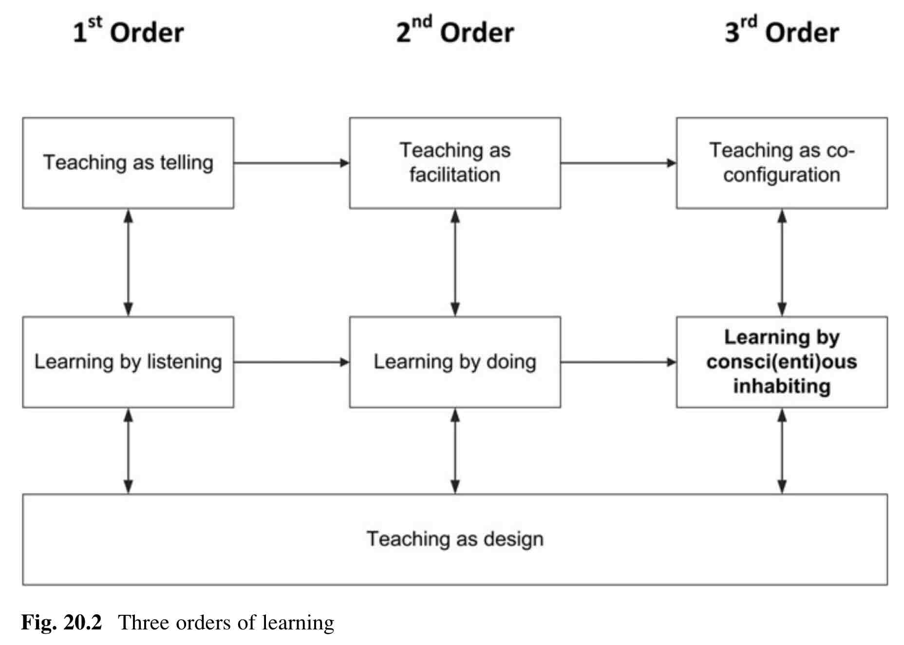

---
title: Meddler in the middle
---

Also mentioned in [[the-last-mile-meddler-in-the-middle]]

McWilliam's ([2009](https://eprints.qut.edu.au/32389/1/c32389.pdf)) addition of "meddler in the middle" to the "sage on the stage" and "guide one the side" got a [mention somewhere at the conference](https://twitter.com/leanner000/status/1599571032708636672). Apparently related [to this blog post](https://warburton.typepad.com/liquidlearning/2022/03/claiming-the-middle-ground-the-agile-and-adaptive-educator.html) which appeared in Campus Morning Mail. A post that describes McWilliam's distinction between the three roles and includes a call for folk likely to be in the ASCILITE crowd to avoid being either sages or guides and become more likely meddlers.

## Three orders of learning

Markauskaite & Goodyear (2017) have similar idea with the three orders of learning. Where the 3rd order is _teaching as co-configuration_

> “The third-order perspective positions the learner as a system that has intrinsic capacities for learning, including for the construction of new understandings and for creating the conditions for its own learning. If a teacher is available, they act as a partner in co-configuring these conditions. However, the learner has the capacities needed to manage their own learning – part of the teacher’s modus operandi must be to fade their participation over time, strengthening the learners’ agency and capacity to (co)construct environments conducive to their own learning–knowing (and their capacity to do this with others). We can call this ‘teaching as co-configuration’.” ([Markauskaite and Goodyear, 2017, p. 606]

<figure markdown>

<caption>Three orders of learning (Markauskaite and Goodyear, 2017, p. 606)</caption>
</figure>

### Impact of this view on [[teaching-as-design-science]] (or just "as design")

> The three instances of ‘teaching as design’ vary in terms of what is designed. In the first-order example, design is focussed on selecting and sequencing elements of an exposition.” ([Markauskaite and Goodyear, 2017, p. 607]

> In the middle -- second order -- instance, design focusses on the learning environment. It works with three main design components -- task design and the design of the physical and social situation in which learning activity will unfold. (Markauskaite and Goodyear, 2017, p. 607)

> In the case of third-order learning, on the right-hand side of Fig. 20.2, the teacher's upstream design work would focus on designing sets of tasks that prompt students both to engage in their learning and inquiry activities and monitor and adjust their working methods and working environment. And as with the top-line teaching activities, these teaching-as-design activities also expand from left to right: they are best conceived as becoming more comprehensive rather than as mutually exclusive. (Markauskaite and Goodyear, 2017, p. 607)

## References

Markauskaite, L., & Goodyear, P. (2017). Creating Epistemic Environments: Learning, Teaching and Design. In L. Markauskaite & P. Goodyear (Eds.), *Epistemic Fluency and Professional Education: Innovation, Knowledgeable Action and Actionable Knowledge* (pp. 595--614). Springer Netherlands. [https://doi.org/10.1007/978-94-007-4369-4\_20](https://doi.org/10.1007/978-94-007-4369-4_20)

[//begin]: # "Autogenerated link references for markdown compatibility"
[the-last-mile-meddler-in-the-middle]: reflections/the-last-mile-meddler-in-the-middle "Meddler in the middle - the missing last mile?"
[teaching-as-design-science]: ../../Teaching/teaching-as-design-science "Teaching as design science"
[//end]: # "Autogenerated link references"