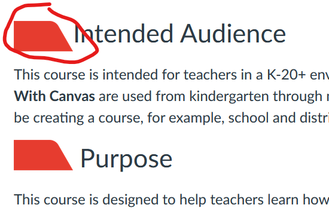
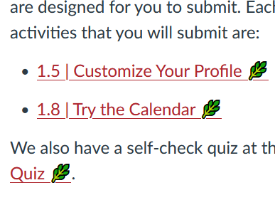
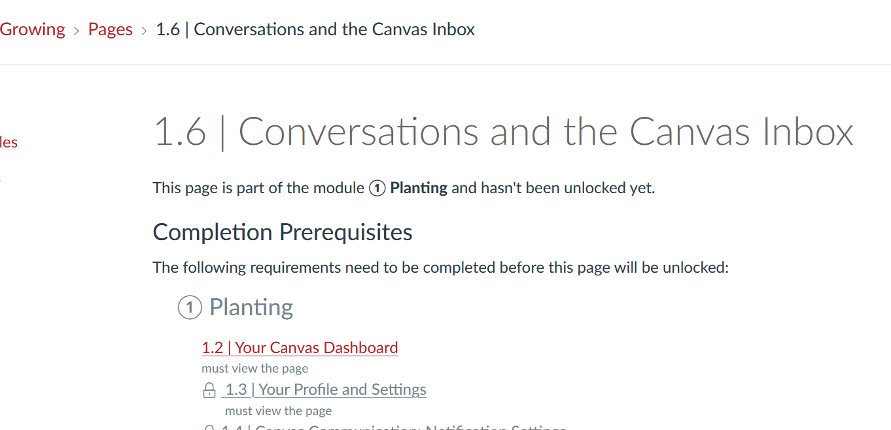

Summary of working through [a training course](https://www.canvas.net/browse/cn-pd/courses/growing-with-canvas) offered by Canvas. Ooh, and earning badges ��.

## Reflections

- Forcing us to move sequentially through content is frustrating
- Visual Design	
  - is 10+ years old both in terms of appearance and the HTML used to achieve it
- Modules
  - Next/prev buttons appear to work between modules, is this configurable?
  - How do you link to other pages in a module? Is this hard coded? (see below)
  - Using requirements and internal module links can create confusion because jumping to pages you haven't completed requirements for generates a warning and also tends to have breadcrumbs that confuse
- Videos
  - All the videos are hosted in Vimeo - assuming easier to share content via commons without requiring sharing of videos
- Assessment
  - Pointing toward two broad ways of designing Assessment
    - Entirely inline + Marks
    - Addition of an Assessment module that provides a central point for all Assessment
      - Perhaps information that could be shared with modules, assignments
- Calendar
  - Any way/value in prepopulating calendar with study period weeks (1, 2, 3)

## Canvas Language

- requirements - similar to review status/activity completion
- pre-requisites - adaptive release
- modules
- conversations - Canvas internal messaging system

## Course Design

Minimal home page - cards with major sections, including introduction

Minimal left hand menu - Home / Modules / Marks

Does use pre-requisites and requirements to force sequential access to content.

Apparently uses all of the Canvas activity types. A list that only includes: assignments, discussions and quizzes.

Assignments are embedded within the modules, but also available as assignments.  There is a _Marks_ menu item that shows them. But doesn't appear to give an overview

### Content

With the absence of CSS, the page headings appear to use explictly embedded images to change the visual appearance of headings.

Some modules have links to other pages within the module (e.g below). Do these have to be hand coded? If so would many teachers do this?  

And the breadcrumb confusion made worse by requirements and internal links

## Home page

Banner plus blurb plus cards.

Cards implemented with constrained HTML/CSS. Only the images are clickable on the cards.

Clicking on a card takes you to the modules page probably with a specific modeul at the top.