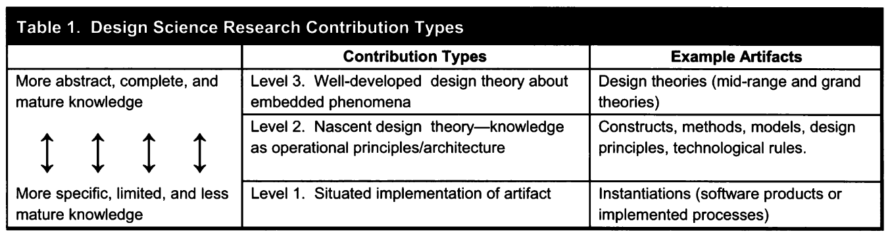
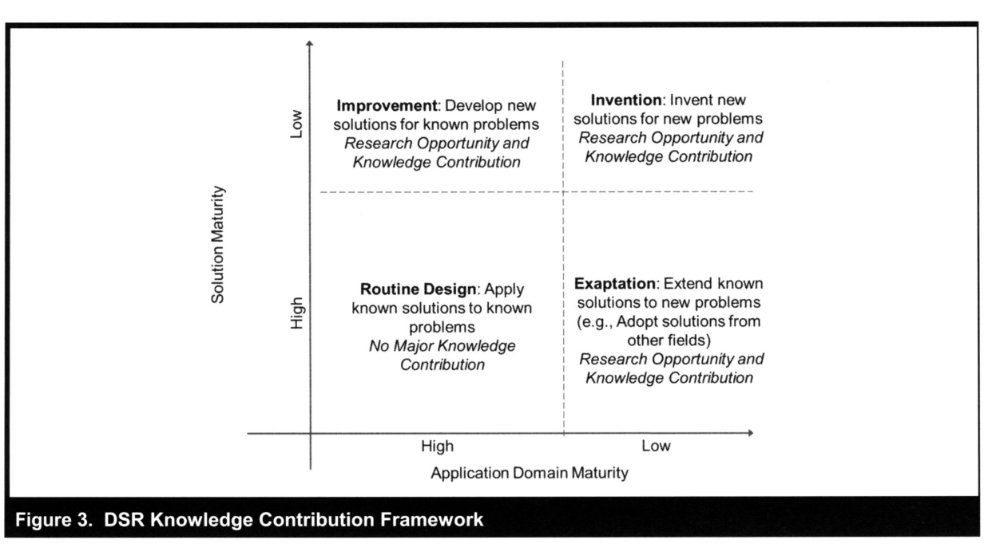

---
title: Design Science Research
---
## Definitions

> Design Science Research (DSR) is a problem-solving paradigm that seeks to enhance human knowledge via the creation of innovative artifacts. Simply stated, DSR seeks to enhance technology and science knowledge bases via the creation of innovative artifacts that solve problems and improve the environment in which they are instantiated. The results of DSR include both the newly designed artifacts and design knowledge (DK) that provides a fuller understanding via design theories of why the artifacts enhance (or, disrupt) the relevant application contexts. (vom Brocke, Hevener & Maedche, 2020)

## Contribution

<figure markdown>

<caption>DSR Contribution types adapted from Gregor & Hevner (2013)</caption>
</figure>

<figure markdown>

<caption>DSR Knowledge Contribution Framework (adapted from Gregor & Hevner, 2013, p. 345)
</figure>

## Publication schema (Gregor & Hevner, 2013)

| Section | Content |
| --- | --- |
| 1. Introduction | Problem definition, problem significance/motivation, introduction to key concepts, research questions/objectives, scope of study, overview of methods and findings, theoretical and practical significance, structure of remainder of paper. For DSR, the contents are similar, but the problem definition and research objectives should specify the goals that are required of the artifact to be developed. |
| 2. Literature Review | Prior work that is relevant to the study, including theories, empirical research studies and findings/reports from practice. For DSR work, the prior literature surveyed should include any prior design theory/knowledge relating to the class of problems to be addressed, including artifacts that have already been developed to solve similar problems. |
| 3. Method | The research approach that was employed. For DSR work, the specific DSR approach adopted should be explained with reference to existing authorities. | 
| 4. Artifact Description | A concise description of the artifact at the appropriate level of abstraction to make a new contribution to the knowledge base. This section (or sections) should occupy the major part of the paper. The format is likely to be variable but should include at least the description of the designed artifact and, perhaps, the design search process. |
| 5. Evaluation | Evidence that the artifact is useful. The artifact is evaluated to demonstrate its worth with evidence addressing criteria such as validity, utility, quality, and efficacy. |
| 6. Discussion | Interpretation of the results: what the results mean and how they relate back to the objectives stated in the Introduction section. Can include: summary of what was learned, comparison with prior work, limitations, theoretical significance, practical significance, and areas requiring further work. Research contributions are highlighted and the broad implications of the paper's results to research and practice are discussed. | 
| 7. Conclusions | Concluding paragraphs that restate the important findings of the work. Restates the main ideas in the contribution and why they are important. |

## Evaluation

From Gill & Hevner (2013)

| Guideline | Hevner, et al. [2004, p.83] Description | Fitness-Utility Impact |
| --- | --- | --- |
| Design as an artifact | DSR must produce a viable artifact in the form or a construct, a model, a method or an instantiation. | Fitness-utility DSR seeks to impact design through enhancing our ability to evaluate the fitness of design artifacts. |
| Problem relevance | The objective of DSR is to develop technology-based solutions to important and relevant business problems. | The objective of fitness-utility DSR is to improve our ability to estimate the fitness of technology-based artifacts. |
| Design evaluation | The utility, quality and efficacy of a design artifact must be rigorously demonstrated via well-executed evaluation methods. | The fitness of a design artifact must be estimated using a utility function that involves the full range of characteristics that impact the likelihood that the artifact will replicate and evolve. |
| Research contributions | Effective design-science research must provide clear and verifiable contributions in the area of the design artifact, design foundations and/or design methodologies.  | Effective DSR impacts the design problem space through contributions in the areas of constructing design artifacts, design fitness, design foundations and theories, and/or design methods. |
| Research rigor | Design-science research relies upon the application of rigorous methods in both the construction and evaluation of the design artifact. | DSR requires that the construction and evaluation of design artifacts be investigated employing a level of rigor appropriate to the nature and stage of design. |
| Design as a search process | The search for an effective artifact requires utilizing available means to reach desired ends while satisfying laws in the problem environment. | The search for an effective artifact requires utilizing available means to reach desired ends while satisfying laws in the problem environment and constraints imposed by the design fitness landscape. |
| Communication of research | Design research must be presented effectively both to technology oriented as well as management oriented audiences. | Design research must be communicated to those communities most likely to supply the resources required for future design using communication channels appropriate to each community. |

## References

Brocke, J. vom, Hevner, A., & Maedche, A. (2020). *Introduction to Design Science Research* (pp. 1--13). [https://doi.org/10.1007/978-3-030-46781-4\_1](https://doi.org/10.1007/978-3-030-46781-4_1)

Gill, T. G., & Hevner, A. R. (2013). A Fitness-Utility Model for Design Science Research. ACM Transactions on Management Information Systems, 4(2), 5:1-5:24. https://doi.org/10.1145/2499962.2499963

Gregor, S., & Hevner, A. (2013). Positioning and Presenting Design Science Research for Maximum Impact Positioning and Presenting Design Science Research for. *MIS Quarterly*, *37*(2), 337--335.