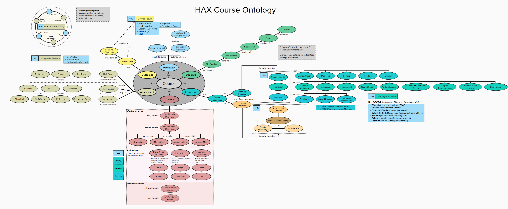

---
title: No title found
---
<!--
 Copyright (C) 2023 David Jones
 
 This file is part of memex.
 
 memex is free software: you can redistribute it and/or modify
 it under the terms of the GNU General Public License as published by
 the Free Software Foundation, either version 3 of the License, or
 (at your option) any later version.
 
 memex is distributed in the hope that it will be useful,
 but WITHOUT ANY WARRANTY; without even the implied warranty of
 MERCHANTABILITY or FITNESS FOR A PARTICULAR PURPOSE.  See the
 GNU General Public License for more details.
 
 You should have received a copy of the GNU General Public License
 along with memex.  If not, see <http://www.gnu.org/licenses/>.
-->

# Learning Design Ontologies 

## Overview 

Deep approaches to learning design typically end up creating an "ontology" of learning design. 

## HAX Course Ontology 

Adapted from [broader Mural-based ontology](https://app.mural.co/t/haxontologybrainstorming9982/m/haxontologybrainstorming9982/1681756048455/510134d2a848ecdd11975713d888fa363310401e?sender=1cbcf0d7-e6d5-4720-9e21-0e58408feec6&utm_source=visitor_signup&utm_medium=email)

