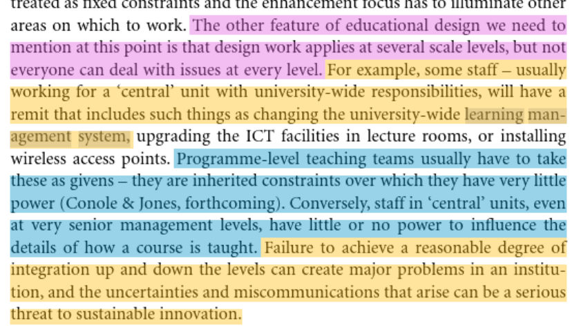

---
title: 'Meso-level from an ecological perspective '
---
## Ellis and Goodyear (2009)

Identifying the need for the meso-level

> Hence sustainable innovation depends upon conditions of feedback and balance within the ecology. Innovation that depends upon regular injections of energy, funding, resources, etc., from outside the system will fail. (p. 10)

> …central unit…remit that includes such things as changing the university-wide learning management system….Programme-level teaching teams usually have to take these as givens – they are inherited constraints over which they have very little power (Conole & Jones, forthcoming). Conversely, staff in ‘central’ units, even at very senior management levels, have little or no power to influence the details of how a course is taught. Failure to achieve a reasonable degree of integration up and down the levels can create major problems in an institution, and the uncertainties and miscommunications that arise can be a serious threat to sustainable innovation. (p. 119)

> To reduce uncertainty and develop self-awareness in the ecology of a university, a key area of activity is the meso-level, the natural province of programme teams and the point at which ‘ bottom up ’ and ‘ top down ’ processes, information fl ows and fi elds of in fl uence come to meet. This is the level at which university policies are translated into locally sensible action. Attention to the meso-level, by university leaders, helps mitigate the uncertainties and other damage associated with misalignment. (p. 188)

## Reference

Ellis, R., & Goodyear, P. (2009). *Students' Experiences of e-Learning in Higher Education: The Ecology of Sustainable Innovation*. Taylor & Francis Group.