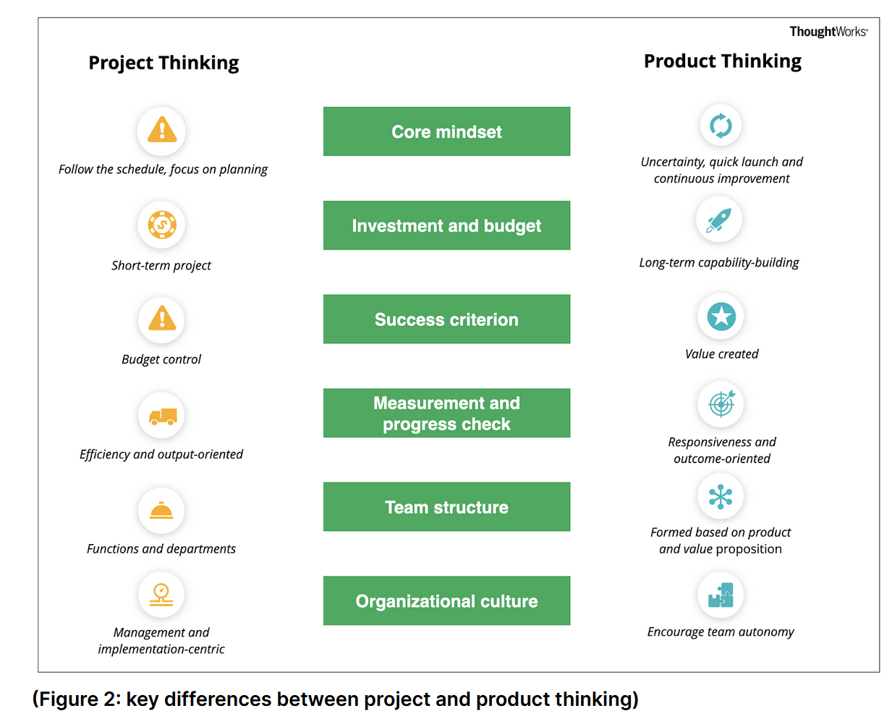

Idea from agile, lean, devops, digital transformation. In part about moving IT from cost to profit center.

[Shift IT from projects to products: Part 1- What is a product?](https://www.thoughtworks.com/en-au/insights/blog/shift-it-projects-products-part-1-what-product)

## Definition of a digital product

1. Software plays a key role
2. It creates distinct value for a group of people, such as customers and users

## Key differences

