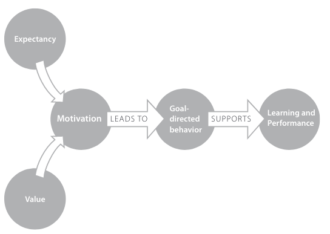
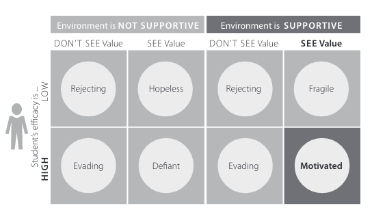

See also: [[learning]], [[teaching]]

Ambrose et al (2010, pp. 68-69)
> Motivation refers to the personal investment that an individual has in reaching a desired state or outcome (Maehr & Meyer, 1997). In the context of learning, motivation influences the direction, intensity, persistence, and quality of the learning behaviours in which students engage...The importance of motivation, in the context of learning, cannot be overstated (Ames, 1990)

## What research tells us about motivation

<figure markdown>

<caption>Impact of value and expectancy on learning and performance (Ambrose et al, 2010, p. 70)</caption>
</figure>

Goals create the context through which values and expectancy derive meaning and influence motivation. Numerous different goals in operation at any one time

Motivation is highest when

- the goal is valued;
- expectancies for success are positive
- the environment is perceived to be supportive

The interaction between these lead to an array of behaviours. No silver bullet

<figure markdown>

<caption>Interaction of environment, efficacy and value (Ambrose et al, 2010, p. 80)</caption>
</figure>

In turn use these categories to analyse student behaviours

| Category | Description | 
| -------- | ------------------- | 
| Rejecting | Don't care, can't do it. Apathy, alienation, anger | 
| Evading | Task is doable, but no value. Easily distracted. Do the minimum amount. | 
| Hopeless | Task is seen as hard, but valued. Unsupported. No expectation of success | 
| Defiant | Valued task, able to do it, but not supported.  | 
| Rejecting | Don't see value, can't do it. Reject the task | 
| Evading | Don't see value, can do it, supportive environment. Camouflage |
| Fragile | task is seen as hard, but value. Supported. Protect self-esteem: avoidance, camouflage, denial, excuses  | 
| Motivated | Valued, able to perform task. |

### Goals

Goal mismatch

- between student and teacher goals
- performance versus learning goals

- goal alignment means "powerful learning situations tend to result" (p. 73)
- satisfying more than one goal increases likelihood of engagement in activity
- students with multiple types of goals are more successful

Types of goals

- performance avoidance looks to avoid incompetency
- work avoidance goals - minimum effort
- affective goals
- social goals

### Recommended strategies

#### Establish value

1. Connect the material to students' interests. 
2. Provide authentic, real-world task.
3. Show relevance to student's current academic lives.
4. Demonstrate the relevance of higher-level skills to students' future professional lives.
5. Identify and reward what you value.
6. Show your own passion and enthusiasm for the subject.

#### Build positive expectancies

1. Ensure alignment of objectives, assessments, and instructional strategies. 
2. Identify an appropriate level of challenge.
3. Create assignments that provide the appropriate level of challenge. 
4. Provide early success opportunities. 
5. Articulate your expectations
6. Provide rubrics. 
7. Provide targetted feedback. 
8. Be fair. 
9. Educate students about the ways we explain success and failure. 
10. Describe effective study strategies. 

#### Address value and expectancies

1. Provide flexibility and control.

    Allow students to choose among options to suit their goals.

2. Give students an opportunity to reflect

## References

Ambrose, S. A., Bridges, M. W., DiPietro, M., Lovett, M. K., & Mayer, R. (2010). What factors motivate students to learn. In *How learning works: Seven research-based principles for smart teaching*. John Wiley & Sons.

[//begin]: # "Autogenerated link references for markdown compatibility"
[learning]: ../Learning/learning "Learning"
[teaching]: ../Teaching/teaching "Teaching"
[//end]: # "Autogenerated link references"