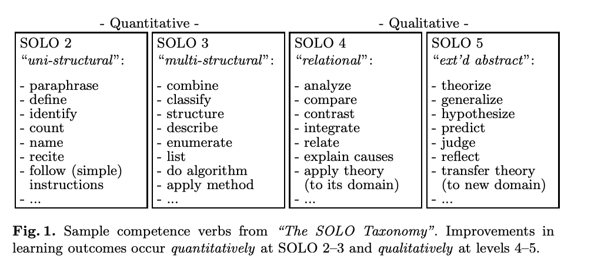

See also: [[learning]]

Aiming to produce a course learning journal to encourage more active and deeper learning, through

- Asking the learner to externalise their learning/thinking in a shared artefact.
- Asking a teacher to engage with the shared artefact to discuss with and ask questions of the learner.

## Form and contents

A shared Google doc for a course containing the following sections

### About the course

Information and insight about the course as a whole, including

- Course Information

    Accessible links to all course related information. Course outline, website, synopsis etc.

- Assessment

    Summary of what, when etc of the course assessment.

- Course expectations/predictions

    What does the learner expect and want to learn from this course? Do they expect to learn anything new? Do they expect to struggle or find it easy? What will be the likely challenges?

- 🆕 Course resources 🆕 

    Pointers to releveant resources, including: textbooks, online resources, timetable for lectures/tutes/practicals etc.

- Course connections

    An evolving (fill in this section as early as possible and modify as learning proceeds) description of how the course (and its content) connects with other courses and broader professional practice.

- Course reflections

    Reflections on the course as a whole. What worked, what didn't, what was useful, what was not useful, what was interesting, what was boring, etc.

    This section should be updated regularly (e.g. weekly) to reflect the learner's evolving understanding of the course and its content.

### Weekly content (one of these for each week)

Information and insight about each week of the course.

- Information

    Accessible links to all information/resources related to the week both provided to you (e.g. lecture slides, readings, tutorial sheets, etc,) and used by you (e.g. YouTube videos, articles etc)

- Required actions

    What you need to do this week. A space to plan what's required, both learning and assessment.

- Diary

    Descriptions of the individual learning sessions you did for the week, including

    - What you did, When you did it
    - Links to artefacts you generated whilst learning (e.g. notes, code etc.)
    - What you learned
    - What you didn't understand

- Minute paper 

    Answers to these two questions

    - What was the most important thing(s) you learned this week?
    - What questions do you have about the week? What's not clear?

## Random supports

- [Conversational model of learning](https://acbart.com/learningandteaching/LearningAndTeaching/www.learningandteaching.info/learning/pask.html)

>  She likes to get to the bottom of things and often reflects on possibilities, implications, applications, and consequences of what she is learning. She uses high-level learning activities such as reflecting, analyzing, and comparing that continually deepen her understanding.

<figure markdown>

</figure>

[//begin]: # "Autogenerated link references for markdown compatibility"
[learning]: learning "Learning"
[//end]: # "Autogenerated link references"