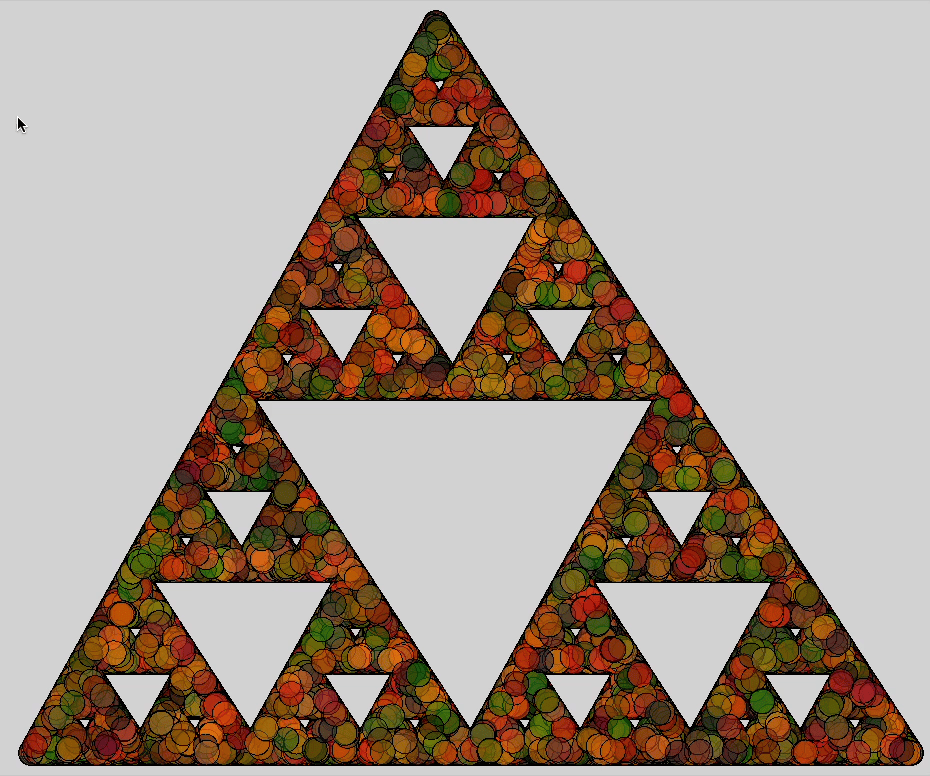

See also: [[creative-coding-with-python]]

To do

- [x] Create Sierpinski's triangle using Processing with [Python P5](https://github.com/p5py/p5)
- [ ] Learn more about the Processing API/model

## p5 model

- Each program is a sketch
- coords from 0,0 top left

Have to remember that it keeps looping

## [Processing overview](https://processing.org/tutorials/overview)

- `draw` is run continuously
- there are global variables e.g. `size` sets `width` and `height`

## Generative art process

Just a bit of playing around and there's something approaching a bit of generative art

<figure markdown>

<caption>A flashing Xmas tree (Sierpinski triangle)</caption>
</figure>

Nothing amazing. But the process of exploring how to code with p5, slowly iterating as new things are learned and interesting new effects occur. For example, the flashing effect largely comes from the fact that the main `draw` function in a p5 (Processing) **sketch** (the name for a program) is repeatedly run. Hence my original loop to place 2000 dots to form the triangle is run over and over again....flashing lights.

[//begin]: # "Autogenerated link references for markdown compatibility"
[creative-coding-with-python]: ..%2Fcreative-coding-with-python "Creative coding experiments"
[//end]: # "Autogenerated link references"