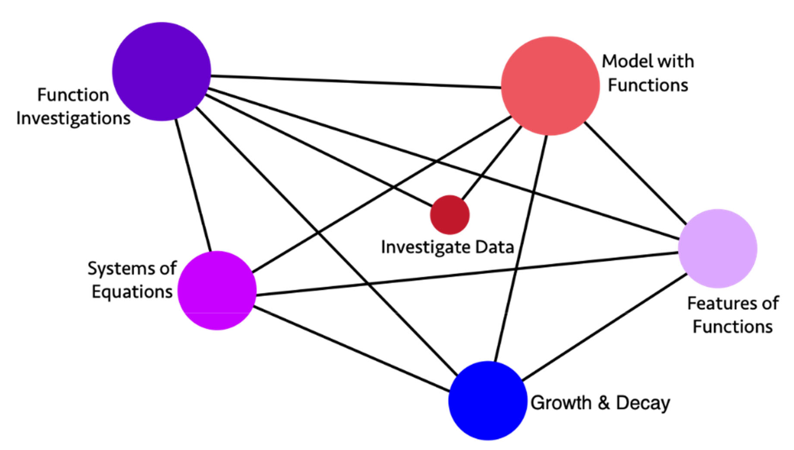
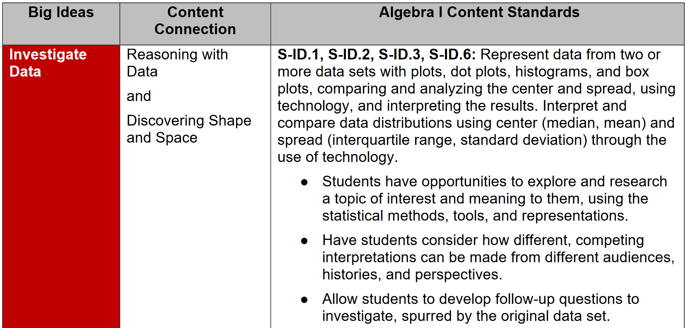

# Exploring australian curriculum

See also: [[casa]], [[datasette]], [[australian-curriculum]], [[other-oz-curriculum-code-projects]]

The [[australian-curriculum]] defines most of what Australian school students learn. It is provided as [website](https://australiancurriculum.edu.au/) and related resources. For teachers, understanding and working with the curriculum is an essential part of their work. But no website can serve all the potential uses for the curriculum and its content. This [[casa]] serves a few purposes

1. Explore how the Australian Curriculum can be made more [generative](https://djplaner.github.io/memex/sense/nodt/generativity/).
2. Offer a purposeful reason to explore different [Python](https://www.python.org/) based technologies in service of that goal.
3. Explore various useful applications of a generative Australian Curriculum to teachers and schools.
4. Encourage me to explore and better understand the curriculum for my teaching areas - [[teaching-mathematics]] and [[teaching-digital-technologies]]

Current code is available in [the project's Git repo](https://github.com/djplaner/exploring-australian-curriculum)

Early explorations of the the [[australian-curriculum]]. Taking a CSV download and using one or two Python data visualisation tools.

## Related work

[Wikidata for Education](https://www.wikidata.org/wiki/Wikidata:Wikidata_for_Education) a 2020 project started by Wikimedia foundation to mak curriculum data more open. Has produced a [data model](https://docs.google.com/document/d/1Ks0y7itd-YaTxESRGyoCzNdBAFtzRHweDlqkJONxOq8/edit#heading=h.e7dxu7x4rf2n). This model document gives more detail. Initial project working Ghana's curriculum. -- [related presentation](https://docs.google.com/presentation/d/1be9xNf2mQZGaFTY9qOWMZoZ3yTuVyWqU05qLORvfk2A/edit#slide=id.g8d30e70985_1_53)

Links to related documents, including

- Ward & Nicholas (2010) - USQ based work pushing the semantic web approach and benefits to curriculum
- [Barker (2020)](https://blogs.pjjk.net/phil/mapping-learning-resources-to-curricula-in-rdf/) - blog post on connected educational content and curriculum frameworks. It references a BBC Curriculum (that now 404s). Also mentions [OER Schema](http://oerschema.org/)

The Australian Curriculum - through the company implementing the curriculum site - has done a lot of work with RDF/semantic web/linked data. [This 2010 interview](https://www.poolparty.biz/news-events/les-kneebone-semantic-web-technologies-are-one-solution-to-linking-education-data-in-australia/) is hosted on a company site that talks about the [Schools Online Thesaurus (ScOT)](https://scot.curriculum.edu.au/). Going into a lot of detail for the benefits of the approach (and the complexity). A pre-cursor to the Australian Curriculum in current form. In turn linked to Golder et al (2010)

## What might some useful applications be?

Slowly emerging from the sections below are the following "strands" that might be usefully woven together 

- Curriculum - _big ideas_ used to bring related standards together and map out links with other _big ideas_.

    Allowing connections to be made across a learning area and possibly beyond.

- (Cultural) Context - weaving in different contexts with whichever curriculum "unit" is the focus (big idea, standard etc)

   Helping teachers weave in the context explicitly, but also through teaching approaches that enable student agency to do this weaving. Perhaps even requiring it? Roberts (2023b) cites Certeau (1980) as classifying this work as strategies and tactics? More broadly under the term _curriculum enactment_ and _integrated curriculum models_?

### Curriculum studies

Roberts (2023b) emphasis added
> To reference Pinar’s (2004, P.2) seminal text "what is curriculum theory?" curriculum theory "is the interdisciplinary study of educational experience." For me, it includes the **intersection** of questions of knowledge, value, teacher preparation, education policy and resourcing, staffing, community economies, and the sustainability of rural communities. (p. 94)

### Making connections between disconnected learning areas

Boaler (2015) argues 

> Curriculum standards often work against connection making, as they present mathematics as a list of disconnected topics. But teachers can and should restore the connections by always talking about and valuing them and asking students to think about and discuss connections. (p. 184)

What interfaces might help enable this connection making? To enable the necessary gathering and weaving?

Boaler makes a [similar point in this video](https://www.youtube.com/watch?v=KZnGSVwIpeU&t=1732s) in which she talks about work she's contributing to on a "Big Ideas" driven mathematical framework for California.

### California's Mathematics Framework - Big Ideas

[Schwartz (2023)](https://www.edweek.org/teaching-learning/california-adopts-controversial-new-math-framework-heres-whats-in-it/2023/07) provides background on the development, nature, and reaction to [California's new Math Framework](https://www.cde.ca.gov/ci/ma/cf/). "Big ideas in mathematics" are outlined and intended to drive instruction which draws on inquiry-based instruction. It apparently is intended to "illustrate the connections across topics, both within the grade and between grades". Apparently, it is the inquiry-based part that has drawn the most flack.

[The framework documents](https://www.cde.ca.gov/ci/ma/cf/) specify the big ideas by year and represented with images like the following _Big Ideas Map for Algebra 1_. The size of the circles represent the importance of the ideas.

<figure markdown>

<caption>Big Ideas map for Algebra 1 (adapted from Chapter 8 of <a href="https://www.cde.ca.gov/ci/ma/cf/">California's 2023 Mathematics Framework</a>, p. 38)</caption>
</figure>

These images are supplemented with a table that provides more detail on the big ideas. Connecting each big idea with related content and then relevant content standards.

<figure markdown>

<caption>Big Ideas, Content Connections, and Content Standards (adapted from Chapter 8 of <a href="https://www.cde.ca.gov/ci/ma/cf/">California's 2023 Mathematics Framework</a>, p. 39)</caption>
</figure>

### Rural students and making connections to cultural context

[Roberts, 2023a](https://www.theguardian.com/australia-news/2023/sep/11/on-closing-the-divide-between-city-and-country-students-in-australia-we-keep-repeating-past-mistakes) focuses on the challenge of closing the gap between city and country students. Arguing that incentives to lure students isn't enough. Instead, [pointing to research](http://www.edhub.unsw.edu.au/projects/cultural-context-in-education) (Dobrescu et al, 2021) that found modifications to the cultural context in NAPLAN tests reduced gaps by 33% (rural-urban) and 50% (Indigenous students). However, recent reforms make it more difficult to make these changes

> Before the Gonski reforms, Australia had specific programs that helped teachers make their teaching material more relevant to rural students. These were removed for a more explicit one-size-fits-all model. We know that students learn by first connecting new concepts to their experience, but under the current model the opportunity to do this is actively removed. When teachers’ work is reduced to dishing out pre-prescribed materials and focused on narrow measures, it is no wonder that we have a staffing shortage. We are actively de-professionalising the very people we need to turn things around

>  Increasing cash bonuses, rental subsidies and transfer rights to teachers cannot overcome the persistent undermining of their professional work. Indeed, the most common sentiment I hear from rural teachers is that they are too busy to teach, to make the curriculum meaningful for their students and to build the very relationships that motivated them to enter the classroom in the first place.

> The education system likes to ignore that rural Australia exists as a distinct space with distinct cultures, knowledges and histories. Instead, its focus on standardisation ensures rural students struggle to see themselves or their communities in education. I’m yet to meet a parent whose aspirations for their child’s education is a Naplan or HSC grade, but that is the focus of policymakers.

More formal discussion of these ideas in Roberts (2023b)

### Making connections in general

Boaler (2015) also offers [a collection of norms/advice](https://djplaner.github.io/memex/sense/Teaching/Mathematics/teaching-mathematics-for-a-growth-mindset/#opening-mathematics) to help teach mathematics. In theory, something like this (or other pedagogical/other frameworks) could also be useful in terms of connections with/to/from the curriculum and its components.

Question being how to enable ad hoc connection maps between the different components in the curriculum? For separate purposes.

Perhaps the very essence of gather/weave.

### Clever approaches to curriculum visualisation?

[Michaela Epstien](https://www.michaelaepstein.com.au/about) asks about ["other clever approaches to curriculum visualisation"](https://www.michaelaepstein.com.au/post/why-curriculum-visualisation-matters). Sparked by hearing designers talk about the impact of even the smallest combinations of words and images on meaning she asks what curriculum design tells us.  Her response? 

> The curriculum is linear.

She gives alternatives (images appear to be currently )

Yes, and also need to think about [the affordances](https://djplaner.github.io/memex/sense/Affordances/affordances/) those designs provide (and to whom).

## Development log

- 27 August 2023 - [[001-exploring-oz-dev-log]] - initial import v8.4, datasette
- 24 September 2023 - [[002-exploring-oz-dev-log]] - importing v9, links with memex

## References

Barker, P. (2020, August 19). Mapping learning resources to curricula in RDF --- Sharing and learning Phil Barker's work. *Sharing and Learning*. <https://blogs.pjjk.net/phil/mapping-learning-resources-to-curricula-in-rdf/>

Dobrescu, L., Holden, R., Motta, A., Piccoli, A., Roberts, P., & Walker, S. (2021). *Cultural Context in Standardized Tests* (SSRN Scholarly Paper 3983663). <https://doi.org/10.2139/ssrn.3983663>

Eriksson, H. (2015). *Digitizing Curricula: An Approach for Digital Usability*. eChallenges e-2015 Conference, Vilnius, Lithuania. <https://doi.org/10.1109/eCHALLENGES.2015.7441086>

Golder, D., Kneebone, L., Phipps, J., Sunter, S., & Sutton, S. A. (2010). A configurable RDF editor for Australian curriculum. *Proceedings of the Role of Digital Libraries in a Time of Global Change, and 12th International Conference on Asia-Pacific Digital Libraries*, 189--197.

On closing the divide between city and country students in Australia, we keep repeating past mistakes. (2023, September 10). *The Guardian*. <https://www.theguardian.com/australia-news/2023/sep/11/on-closing-the-divide-between-city-and-country-students-in-australia-we-keep-repeating-past-mistakes>

Roberts, P. (2023a, September 10). On closing the divide between city and country students in Australia, we keep repeating past mistakes. *The Guardian*. <https://www.theguardian.com/australia-news/2023/sep/11/on-closing-the-divide-between-city-and-country-students-in-australia-we-keep-repeating-past-mistakes>

Roberts, P. (2023b). Contemplating curriculum in an urban world. *Curriculum Perspectives*, *43*(1), 93--96. <https://doi.org/10.1007/s41297-023-00194-y>

Schwartz, S. (2023, July 13). California Adopts Controversial New Math Framework. Here's What's in It. *Education Week*. <https://www.edweek.org/teaching-learning/california-adopts-controversial-new-math-framework-heres-whats-in-it/2023/07>

Ward, N., & Nicholas, N. (n.d.). *Benefits of Machine Readable Curricula*. [http://www.achievementstandards.org/sites/default/files/BenefitsMachineReadableCurricula\_Mar10.pdf](http://www.achievementstandards.org/sites/default/files/BenefitsMachineReadableCurricula_Mar10.pdf)

[//begin]: # "Autogenerated link references for markdown compatibility"
[casa]: ../CASA/casa "Contextually Appropriate Scaffolding Assemblages (CASA)"
[datasette]: datasette "datasette"
[australian-curriculum]: ../Teaching/Curriculum/australian-curriculum "Australian Curriculum"
[other-oz-curriculum-code-projects]: ../Teaching/Curriculum/other-oz-curriculum-code-projects "other-oz-curriculum-code-projects"
[teaching-mathematics]: ../Teaching/Mathematics/teaching-mathematics "Teaching Mathematics"
[teaching-digital-technologies]: ../Teaching/Digital_Technologies/teaching-digital-technologies "Teaching Digital Technologies"
[001-exploring-oz-dev-log]: exploring-oz-curriculum/001-exploring-oz-dev-log "001 - Exploring Australian Curriculum - Dev log"
[002-exploring-oz-dev-log]: exploring-oz-curriculum/002-exploring-oz-dev-log "Exploring Oz Curriculum - Dev log 2"
[//end]: # "Autogenerated link references"