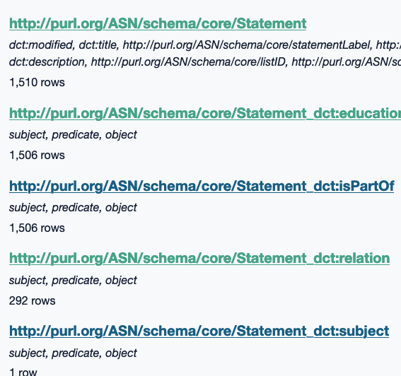

<!--
 Copyright (C) 2023 David Jones
 
 This program is free software: you can redistribute it and/or modify
 it under the terms of the GNU Affero General Public License as
 published by the Free Software Foundation, either version 3 of the
 License, or (at your option) any later version.
 
 This program is distributed in the hope that it will be useful,
 but WITHOUT ANY WARRANTY; without even the implied warranty of
 MERCHANTABILITY or FITNESS FOR A PARTICULAR PURPOSE.  See the
 GNU Affero General Public License for more details.
 
 You should have received a copy of the GNU Affero General Public License
 along with this program.  If not, see <http://www.gnu.org/licenses/>.
-->

# Exploring Oz Curriculum - Dev log 2

See also: [[exploring-australian-curriculum]]

## Tasks 

- [X] Download and import v9 of the Australian Curriculum
- [X] Identify components of v9 curriculum
- [ ] Explore notions of ontology, RDF, and graph databases
- [ ] What ontologies re: mathematical concepts exist?
- [ ] Design how to link with memex

## v9 curriculum - download and import

### Download

- [X] Is there a download? - [Machine-readable Australian Curriculum (MRAC)](https://v9.australiancurriculum.edu.au/machine-readable-australian-curriculum)

Provided in HTML, RDF/XML, [JSON LD](https://json-ld.org/), and [a SPARQL endpoint](https://en.wikipedia.org/wiki/SPARQL).  The HTML version is a just a page with a description and link to the RDF.

Organised into the following categories each with individual downloads for separate values:

- Learning Areas 
- General Capability 
- Cross-curriulum priorities

Questions 

1. Which version to use: RDF, JSON LD?

    RDF appears the core version and Python has [RDFLib](https://github.com/RDFLib/rdflib).  sqlite-utils can import JSON, but doesn't appear to have anything explicit for JSON-LD. Suggesting a bit more work, which may be required for RDF anyway.
2. How to get those into sqllite?
3. Other options for querying/interacting with the data?

### Experiment with Mathematics learning area

**Download RDF and JSON files**

RDF initial explorations not great. Wondering if JSON LD might be more recent/accessible. 

Going to have to learn more about [[rdf]]

**Explore use of rdf-to-sqlite**

[rdf-to-sqlite](https://github.com/bradleypallen/rdf-to-sqlite) python module to convert RDF file into SQLite database tables (inspiried by datasette related work)

Does require identification of the _RDF serialisation format_.  [This](https://ontola.io/blog/rdf-serialization-formats) suggests that RDF/XML is the most common and what is used by the given file

```sh
rdf-to-sqlite v9.db ../data/v9/MAT.rdf --format xml --context https://schema.org/docs/jsonldcontext.jsonld
Generated v9.db (33604 rows in 26 tables)
``` 

That's a lot of rows and tables. Suggesting a possible limitation. Illustrated in the following table. Not a lot of curriculum specific structure visible in the tables.

<figure markdown>

</figure>

Part of the challenge will be disentangling the complexity of the vocabulary etc. and transforming that into something specific.  Putting the context back into data, reducing the reusability. [[reusability-paradox]]


## Digging **deeper**

RDF triplets consist of subject, predictate, object. The subject is unique and may have multipled predicates. Write a script that groups all the predicates for a specific subject.

Hash keyed on subject value, with members object and predicate

### ontospy

[ontospy](http://lambdamusic.github.io/Ontospy/) - Python module with various options to convert RDF graph into representations.  None appear to work well with the MAT.rdf file.

## Starting again - 3 Dec

- [X] Summarise RDF and Python
- [ ] Learn how to use RDFLib

### Summary

`rdf.py` - is able to parse the MAT.rdf file using rdflib and do some basic exploration. No understanding no my part of what's happening.


### Learning - early explorations

[Serialize a graph](https://github.com/CSIRO-enviro-informatics/info-engineering/blob/master/notebooks/ld-api/Linked%20Data%20Example%201.ipynb) - turn this into the dumpGraph function

[[rdf-basics]]

The graph consists of 

- _subject_
- _predicate_
- _object_

### Gephi Visualisation

Apparently [gephi](https://gephi.org/) will import/visualise RDF graphs. -- **didn't work**

construct{
  ?x ?r ?y
} where {
  ?x ?r ?y
}

## Mapping out content

Manual digging in

Content description (e.g. label AC9M7N01) 

- found in tags `<statementNotation>` - which is a property
- the value is in `<dcterms:title>`
- `dcterms:description` also useful for expanded information
- also `<nominalYearLevel>` grade level
- `<statementLabel>` - has the value "Content Description"

Uses `<hasChild>` and `<isChildOf>` to form - not a standard for RDF?

`statementLabel` values

- 1 Learning Area

    1 learning area (maths) should be the parent of all?

- 1 Subject

    1 subject (mathematics) should be the parent of all? What's the relationship between learnign area and subject

- 11 Level

    The year level - perhaps the next parent level?

- 11 Achievement Standard

    1 achievement standard per year (Prep to Year 10)

- 185 Achievement Standard Component
- 240 Content Description

    Individual content descriptors - should be children of??

- 996 Elaboration

    Each content description may have multiple elaborations

- 63 Strand

    That seems to be quite a lot - what is this?

In the RDF, `statementLabel` is a predicate with the object being the literal and the the actual object given it's unique identifier - in turn it has other predicates

rdflib.term.URIRef('http://vocabulary.curriculum.edu.au/MRAC/2023/07/LA/MAT/4353387d-39f5-4222-bf3b-357193bb0221')
----- predicate
rdflib.term.URIRef('http://purl.org/ASN/schema/core/statementLabel')
----- object
rdflib.term.Literal('Content Description', lang='en-au')


### each rdf:Description

Seems related to a particular _subject_ and then specifies a list of properties?

Each _subject_ has a unique _identifier_ (a long hypenated hex number) and various common properties that belong to different "groupings" (ontologies???)

- rdf

  - `rdf:about` - the identifier
  - `rdf:type` - the type of thing it is - can have multipled

    **Question** What are the values for this

- Dublin Core

  - `dcterms:title` - the title of the thing
  - `dcterms:educationLevel` -  using Oz Curriculum vocab link
  - `dcterms:isPartOf` - 
  - `dcterm:modified` -

- ?? unresolved

  - `authorityStats` 
  - `skillEmbodied`
  - `statementNotation` 
  - `statementLabel`
  - `nominalYearLevel`

The groupings (may) belong to namespaces included at the beginning of the RDF file

| Name space | Description |
| ---------- | ----------- |
| [RDF](https://www.w3.org/1999/02/22-rdf-syntax-ns#) | RDF vocabulary |
| [RDFS](https://www.w3.org/2000/01/rdf-schema#) | RDF Schema vocabulary |
| [skos](https://www.w3.org/2004/02/skos/core#) | Simple Knowledge Organization System |
| [skosxl](https://www.w3.org/2008/05/skos-xl#) | SKOS eXtension for Labels |
| [owl](https://www.w3.org/2002/07/owl#) | Web Ontology Language |
| [dc](http://purl.org/dc/elements/1.1/) | Dublin Core |
| [dcterms](http://purl.org/dc/terms/) | Dublin Core Terms |
| [xsd](http://www.w3.org/2001/XMLSchema#) | XML Schema |
| [tags](http://www.holygoat.co.uk/owl/redwood/0.1/tags/) | Tags Ontology |
| [cycAnnot](http://sw.cyc.com/CycAnnotations_v1#) | Cyc Annotations |
| [foaf](http://xmlns.com/foaf/0.1/) | Friend of a Friend |
| [csw](http://semantic-web.at/ontologies/csw.owl#) | CSW Ontology |
| [dbpedia](http://dbpedia.org/resource/) | DBpedia |
| [freebase](http://rdf.freebase.com/ns/) | Freebase |
| [opencyc](http://sw.opencyc.org/concept/) | OpenCyc |
| [cyc](http://sw.cyc.com/concept/) | Cyc |
| [ctag](http://commontag.org/ns#) | Common Tag |


[//begin]: # "Autogenerated link references for markdown compatibility"
[exploring-australian-curriculum]: ../exploring-australian-curriculum "Exploring australian curriculum"
[rdf]: rdf "rdf"
[reusability-paradox]: ../../Bricolage/reusability-paradox "Reusability Paradox"
[rdf-basics]: rdf-basics "RDF Basics"
[//end]: # "Autogenerated link references"