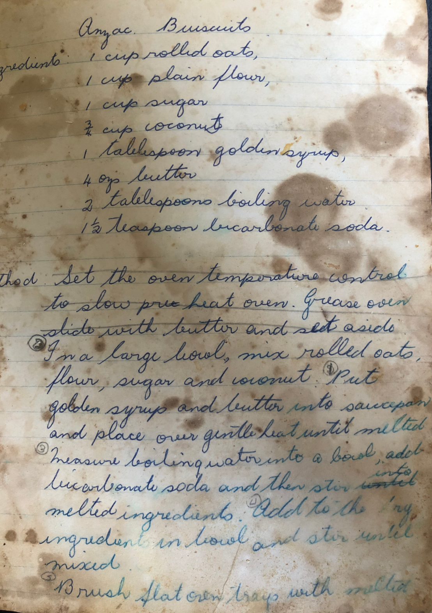
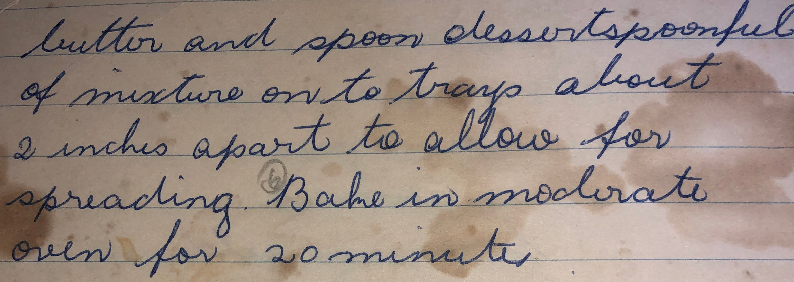

## Ingredients

- 1 cup rolled oats
- 1 cup plain flour
- 1 cup sugar
- .75 cups coconut
- 1 tablespoon golden syrup
- 4 ounces (113 grams/125 grams) butter
- 2 tablespoons boiling water
- 1.5 teaspoon bicarbonate soda

## Method

1. In a large bowl, mix rolled oats, flour, sugar & coconut
2. Put golden syrup and butter into saucepan and place over gentle heat until melted
3. Measure boiling water into a bowl, add bicarbonate soda & stir in melted ingredients
4. Add to the dry ingredients and stir until mixed
5. Brush flat oven tray with melted butter
6. Spoon dessertspoonful of mixture onto trays about 2 inches apart
7. Bake in 180oC oven for 20 minutes (but keep an eye out so they don't burn)

## Original

