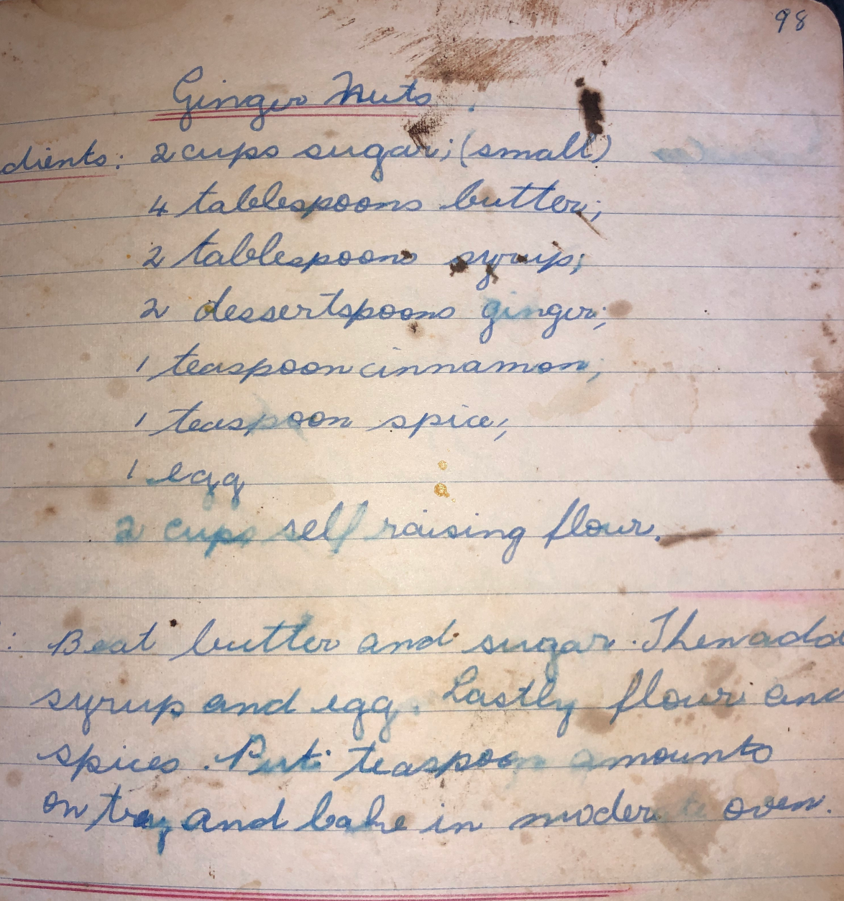

---
title: '# Ginger Nuts'
---
## Ginger Nuts

### Ingredients

- 2 cups sugar (small?)
- 4 tablespoons butter
- 2 tablespoons syrup
- 4 teaspoons ginger
- 1 teaspoon cinnamon
- 1 teaspoon spice
- 1 egg
- 2 cups self raising flour

### Method

1. Beat butter and sugar
2. Add syrup and egg, combine
3. Add flour and spices
4. Put teaspoon amounts on tray
5. Bake in moderate oven (180oC)

### Orginal

