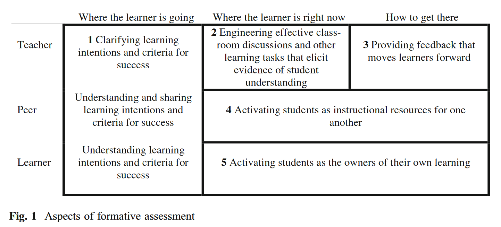

See also: [[assessment]], [[teaching]], [[learning]]

Apparently arising from ideas of Black and Wiliam (2009) aound formative learning. Designing assessment approaches that encourage/support learning

> Practice in a classroom is formative to the extent that evidence about student achievement is elicited, interpreted, and used by teachers, learners, or their peers, to make decisions about the next steps in instruction that are likely to be better, or better founded, than the decisions they would have taken in the absence of the evidence that was elicited. (Black & Wiliam, 2009, p. 9)

## Activity types for formative assessemtn

Black & Wiliam (2009) identify five practices suggested by evidence

1. Clarifying and sharing learning intentions and criteria for success;
2. Engineering effective classroom discussions and other learning tasks that elicit evidence of student understanding;
3. Providing feedback that moves learners forward;
4. Activating students as instructional resources for one another; and
5. Activating students as the owners of their own learning

<figure markdown>

<caption>Aspects of formative assessment (adapted from Black & Wiliam, 2009, p. 8)</caption>
</figure>

## References

Black, P., & Wiliam, D. (2009). Developing the theory of formative assessment. *Educational Assessment, Evaluation and Accountability(Formerly: Journal of Personnel Evaluation in Education)*, *21*(1), 5--31. <https://doi.org/10.1007/s11092-008-9068-5>

Wiliam, D. (2011). What is assessment for learning? *Studies In Educational Evaluation*, *37*(1), 3--14. <https://doi.org/10.1016/j.stueduc.2011.03.001>

[//begin]: # "Autogenerated link references for markdown compatibility"
[assessment]: assessment "Assessment"
[teaching]: ../teaching "Teaching"
[learning]: ../../Learning/learning "Learning"
[//end]: # "Autogenerated link references"