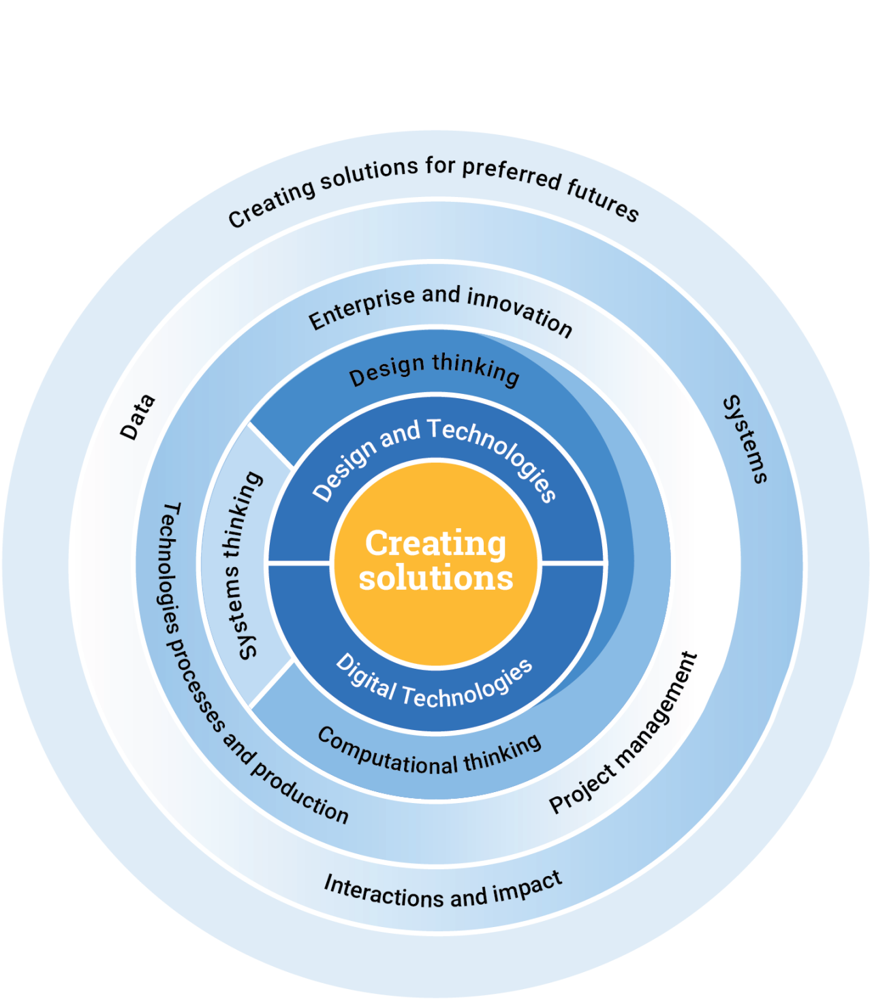

# v9-oz-digital-technologies

See also: [[australian-curriculum]]

[Digitial Technologies](https://v9.australiancurriculum.edu.au/f-10-curriculum/learning-areas/digital-technologies/year-7_year-8_year-9_year-10?view=quick&detailed-content-descriptions=0&hide-ccp=0&hide-gc=0&side-by-side=1&strands-start-index=0&subjects-start-index=0)

## Subjects

Two subjects

- Design and Technologies - design thinking and technologies to generate and produce designed solutions for authentic needs and opportunities.
- Digital Technologies - use computational thinking and inforamtion systems to define, design and implement digital solutions for authentic problems

Both studied from F-Y8.  y9 and 10 dependent on states and schools

## Strands and sub-strands

- Knowledge and understanding
- Processes and production skills

<figure markdown>

<figcaption>Overview of Technologies core concepts</figcaption>
</figure>

[//begin]: # "Autogenerated link references for markdown compatibility"
[australian-curriculum]: australian-curriculum "Australian Curriculum"
[//end]: # "Autogenerated link references"