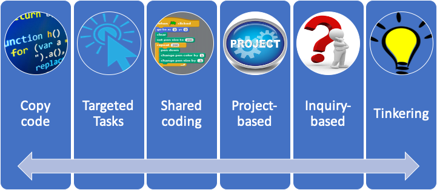

See also: [[computing]], [[teaching-digital-technologies]]

Source: [CSSC Instructional continuum](https://textbooks.cs.ksu.edu/tlcs/4-designing-cs-lessons/03-instructional-continuum/index.html)

A representation of the cognitive loads for learning computer science.

| Activity | Description |
|---|---|
| **Copy code** | Students follow step-by-step instructions | 
| **Targeted Tasks** | Students complete a short task (e.g. coding or [[parsons-problems]]) |
| **Shared coding** | Teacher writes code which the students are asked to write the same program at the same itme
| **Project based** | Students are given a project with a goal | 
| **Inquiry based** | Studetns consider a question and attempt to develop a solution |
| **Tinkering** | Completely student-led programming efforts |

<figure markdown>

</figure>

[//begin]: # "Autogenerated link references for markdown compatibility"
[computing]: ../../computing/computing "Computing"
[teaching-digital-technologies]: teaching-digital-technologies "Teaching Digital Technologies"
[parsons-problems]: ../../computing/parsons-problems "Parson's problems"
[//end]: # "Autogenerated link references"