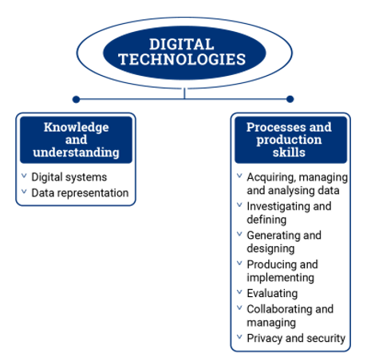

See also: [[teaching]], [[teaching-digital-technologies]]

Resources and ideas "unpicked" from the [Digital Technologies Hub](https://www.digitaltechnologieshub.edu.au/).

## [Understanding DT](https://www.digitaltechnologieshub.edu.au/understanding-dt/)

### Curriculum

| Strand | Description | 
| --- | --- |
| Knowledge & Understanding | Information system components of data and digital systems | 
| Processes and production skills | Required to create digital solutions |

<figure markdown>

<caption>DT Oz Curriculum Strands (source: [Digital Technologies Hub](https://www.digitaltechnologieshub.edu.au/understanding-dt/curriculum))</caption>
</figure>

#### Core Concepts

| Concept | Definition |
| --- | --- |
| Digital systems  | And the components that make them up: hardware, software, networks, and the way data is transmitted - [digital systems resources](https://www.digitaltechnologieshub.edu.au/teach-and-assess/classroom-resources/topics/digital-systems/) |
| Data representation  | How data is represented and structured symbolically for storage and communication by people and digital systems - [data representation resources](https://www.digitaltechnologieshub.edu.au/teach-and-assess/classroom-resources/topics/data-representation/) |
| Data acquisition  | Acquire, store, validate data from range of sources - linked with mathematics |
| Data interpretation  | Analyse and visualise data using a range of software to draw conclusions, make predictions, and identify trends - linked with mathematics  |
| Abstraction  |  ACARA defines it as "reducing complexity by hiding details so that the main idea, problem or solution can be defined and focus can be on the manageable number of aspects. |
| Specification (Problem decomposition) | Defining a problem precisely and clearly, identifying requirements, and breaking the problem into manageable pieces |
| Algorithms | Precise sequence of steps and decisions needed to solve a problem, often involving iterative processes - [algorithm resources](https://www.digitaltechnologieshub.edu.au/teach-and-assess/classroom-resources/topics/algorithms/) |
| Implementation (Programming) | Automation of an algorithm, typically by writing a computer program or using appropriate software - [visual programming](https://www.digitaltechnologieshub.edu.au/teach-and-assess/classroom-resources/topics/visual-programming/) and [general purpose programming](https://www.digitaltechnologieshub.edu.au/teach-and-assess/classroom-resources/topics/general-purpose-programming/) |
| Privacy and security |  Data is protected when it is stored or transmitted through digital systems. Privacy includes knowledge of the risks faced online and how to mitigate. Security covers the appropriate social, cognitive, communicative, and decision-making skills to address network security risks. |

#### Overarching concepts

| Concept | Definition |
| --- | --- |
| [[computational-thinking]] | Helps organise data (sic[^1]) by: breaking down problems into parts; defining abstract concepts; and designing & using algorithms, patterns and models - see [computational thinking resources](https://www.digitaltechnologieshub.edu.au/teach-and-assess/classroom-resources/topics/computational-thinking/) |
| Systems thinking | Thinking holistically about the interactions and interconnections that shape the behaviour of systems - see [systems thinking resources](https://www.digitaltechnologieshub.edu.au/teach-and-assess/classroom-resources/topics/systems-thinking/) |
| Design thinking | Helps empathise and understand needs, opportunities and problems; generate, iterate and represent innovative, user-centered ideas; and analyse and evaluate those ideas - see [design thinking resources](https://www.digitaltechnologieshub.edu.au/teach-and-assess/classroom-resources/topics/design-thinking/) |

[^1]: Positioning it as a method to organise data is very, very narrow - see [[computational-thinking]]

## Plan and Prepare

### Scope and sequence

Offers suggestions for how to sequence topics

#### Years 7-8

Recommendation is three topics per year e.g.

- Year 7 (cycle one) - spread over the entire year

    - Binary numbers
    - Working with data 
    - General-purpose programming

- Year 8 (cycle two)

    - Hardware, networks and cyber threats
    - Collaborative data project
    - Creating a digital solution

### School implementation

Suggests starting with a whole school plan with  possibilities

- explicit/specialist model - i.e. me teaching, increases importance, means other students don't develop experience
- integrated mode - e.g. [[integrated-computing]] - implement digital technologies into other subject areas

## Teach and assess

Starts with lesson ideas and [self-paced courses (groups of lesson)](https://www.digitaltechnologieshub.edu.au/teach-and-assess/classroom-resources/courses-or-tutorials/)

- [100 available](https://www.digitaltechnologieshub.edu.au/search/?filters=10135%2C10106&p=1&items=8) for 7/8
- [49 available](https://www.digitaltechnologieshub.edu.au/search/?filters=10135%2C10106&p=1&items=8) for 9/10

[Topics](https://www.digitaltechnologieshub.edu.au/teach-and-assess/classroom-resources/topics/) - provide another way into resources/lessons

### Classroom Resources

### Effective pedagogies

### Assessment overview

### Assessment resources

## AI

[//begin]: # "Autogenerated link references for markdown compatibility"
[teaching]: ..%2Fteaching "Teaching"
[teaching-digital-technologies]: teaching-digital-technologies "Teaching Digital Technologies"
[computational-thinking]: ..%2F..%2Fcomputing%2Fcomputational-thinking "Computational thinking"
[integrated-computing]: ..%2F..%2Fcomputing%2Fintegrated-computing "Integrated Computing"
[//end]: # "Autogenerated link references"