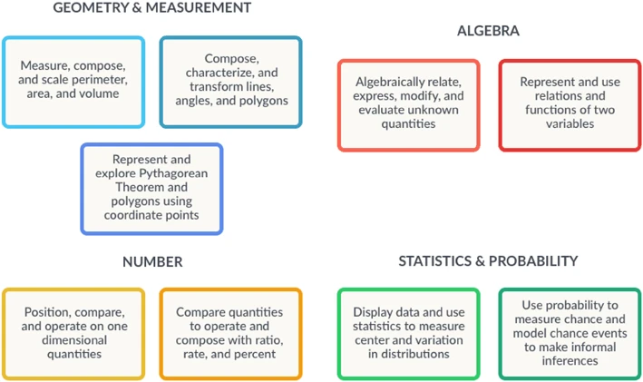

See also: [[teaching-mathematics]], [[exploring-australian-curriculum]], [[mathematical-structure]]

A way of seeing mathematics as coherent and connected whole. Rather than a collection of (apparently) disconnected topics. Big ideas run across traditional curricula strands.

> a statement of an idea that is central to the learning of mathematics, one that links numerous mathematical understandings into a coherent whole (Charles, 2005, p. 10)

Simeon (2022) suggests there is little agreement on what the mathematical big ideas are or how to use them in L&T. Beyond the idea that big ideas should be

1. Mathematically important; and,
2. Pedagogically important.

Simeon's (2021) bullet point summary 

- are “mathematically big, conceptually big, and pedagogically big” (Askew, 2015, p. 13), that is, they have a basis in mathematics but also in how mathematics is taught and learnt (Fosnot & Dolk, 2001; Watson et al, 2013) 
- involve semi-ordered structures of supporting, interrelated ideas and processes often described as maps, networks, or webs (Confrey et al., 2014; Hurst, 2019; Siemon, 2006; Van de Walle et al., 2010) 
- grow in depth and complexity over time as they are connected with other aspects of mathematics and as they are applied in a broader range of contexts (Hiebert & Carpenter, 1992; Ma, 1999; Mason et al, 2009) 
- provide a basis for a more coherent approach to the teaching and learning of mathematics that seeks to build connections, values multiple strategies and reasoning, and supports further learning with understanding (Confrey et al., 2017; Siemon, 2021; Siemon et al., 2012, 2019; Askew et al., 1997).

## Another form of technology?

For me, echoing Dron's [[drons-technology|definition of educational technology]] as per this quote and the following table

> Big ideas in mathematics providing an organising framework for teachers to think about their task as teachers of mathematics (Simeon, 2022, p. 2)

Though the purpose Simeon is suggesting appears a little narrow. Though subsequent mention of Clarke's et al (2012) idea that it's the enabling teacher conversations that are the real benefit.

| Dron | Big ideas |
| --- | --- |
| orchestration of | A _big idea_ specifies how different mathematical K&S are connected (orchestrated) into a bigger construct |
| phenomena | The mathematical K&S being orchestrated |
| for a purpose | The specific pedagogical context and purpose |

## Why?

QCoT (2015) suggest that big ideas help (Simeon, 2021 supports this and gives a citation): 

- teachers - mathematics to be more coherent; and, 
- students - to develop a deep understanding of mathematics and its applications. That seems an arbitrary distinction with both advantages apply universally.

Ma & Kessel (2003) argue that teachers require a fundamental understanding of mathematics in terms of four key features:

- connectedness,
- multiple perspectives,
- recurring basic ideas, and 
- longitudinal coherence

Australian Curriculum sees mathematics "of multiple but interrelated and interdependent concepts and systems". Which it apparently contributes to through four proficiency strands: understanding, fluency, problem solving, and reasoning. Currently associated under the considerations as part of _proficiency in mathematics_

Making connections between areas is one of the stated aims of the v9 oz curriculum. Askey et al (1997) found good teachers believing that being numerate requires "having a rich network of connections between different mathematical ideas". As opposed to "death by a thousand bullet points" of curriculum frameworks.

Simeon (2021) 

- Learning with understanding - echoing [[instrumental-relational-mathematics]]

    Organising into a conceptual framework supports greater transfer.

- Curriculum coherence

    "One of the most damaging aspects of school mathematics, particularly as it is represented in commercial texts and computer-based mathematics programs is the atomisation of the curriculum into a seemingly endless list of discrete ‘topics’ where ‘coverage’ becomes the major goal of planning, the predominant mode of learning is ‘example/demonstrate-practice-practice’, and the majority of those exercises remain as they were observed by Vincent and Stacey in 2008 as relatively low-level, skill based repetitious exercises." (Siemon, 2021, p. 8)

- Key to effective teaching 

    Linked to [[instrumental-relational-mathematics|learning with understanding]]

- Impact student outcomes

### Teacher need

Kuntze et al (2011) and Clarke et al (2012) found that pre-service and in-service teachers need support in identifying, describing and linking important ideas in mathematics.

### Variations of school curriculum

Steen (1990) - 6 broad categories

- Quantity
- Dimension
- Pattern 
- Shape
- Uncertainty 
- Change

Rutherford & Ahlgren (1989)

- Numbers
- Shapes
- Uncertainty 
- Summarising data 
- Sampling 
- Reasoning

## Overarching and integrative big ideas - top down

## From atomised to clustered: bottom-up

## Examples Big Idea collections

### Confrey et al (2017)

<figure markdown>

<caption>Four fields and nine big ideas of the learning map</caption>
</figure>

## Corovic (2017)

Suggest two approaches to using big ideas in unit planning

- Top down - real world to curriculum 

    The approach used in [[reading-and-writing-the-world-with-mathematics]]

- Bottom up - start from curriculum and find the connections

    Using the big ideas across disparate content descriptions to weave a coherent narrative.

## Siemon (2022)

Links to the ideas of Bruner (1960) suggesting that without sufficient structure knowledge is likely to be forgotten. Echoing the Gee quote from [[how-learning-works]]. Uses the Charles (2005) definition of a big idea. In turn, Simeon uses the term _concept_ from Clarke (1997) as a "big idea that helps us make sense of, or connect, lots of little ideas."

With the number of connections related to the level of understanding.

Seeks to answer two questions

### What are Big Ideas in school mathematics and why are they important?

Variety of definitions. Diversity mapped using the dimensions of 

- size; and

    Some "big ideas" are seen as too "big" to inform teachers' everyday practice.

- mode of expression.

    Expressed as _concepts_ or _processes_. Processes seen as problematic. Related to how big ideas are identified: top-down leading to declarative statements from analysis of knowledge, bottom-up - expressed as evidence-based descriptions of concepts/processes over time..

Also references projects that developed the following "big ideas" for teaching

| By end of | Big Idea | Indicated by |
| --------- | -------- | ------------ |
| Prep/K | Trusting the Count | Access to flexible mental objects for the numbers to ten based on part-part-whole knowledge derived from subitising and counting |
| Year 2 | Place-value | Capacity to recognise and work with place-value units and view larger numbers as counts of these units rather than collections of ones. Appreciates structure in terms of ’10 of these is 1 of those’ |
| Year 4 | Multiplicative Thinking | Initial Ideas – Works with multiple representations of multiplication and division (e.g., the ‘for each’, ‘times as many’ and ‘area’ ideas). Moving to factor-factor-product idea, efficient strategies for multiplication facts | 
| Year 6 | Equi-partitioning | Uses partitioning strategies to construct line and areas models for fractions and decimals, uses representations to compare, order and locate fractions and decimals on number lines, recognise that numbers can be divided to create new numbers, solves simple problems involving fractions | 
| Year 8 | Proportional Reasoning | Ability to recognise and work with an extended range of concepts for multiplication and division including rate, ratio, percent, solves problems involving intensive quantities and proportional relationships | 
| Year 10 |  Generalising | Capacity to recognise and represent patterns and relationships in multiple ways including symbolic expressions, devise and apply general rules and properties |

Also offers the following

| Big Idea | Description |
| --- | ---- |
| Unitising | Recognition of small collections as composite units (e.g. 7 ones is 1 seven) |
| Part-Part-Whole | (not well described)  |
| Place value | Where a number if placed changes its value. Move easily between 100s, 10s, 1s. A multiplicative process |
| Equivalence | TIMTOWDI - there are multiple different ways to represent numbers, measures, and number sentences | 
| Relational thinking | Being able to see and use possibilities of _variation_ between numbers in a number sentence. Ability to work with equivalence, part-part-whole knowledge and recognising properties (commutativity, distributivity, associativity) |
| Structural thinking | Identification of general properties instantiated in particular situations as relationships between elements or subsets of elements of a set |
| Multiplicative thinking | Moving beyond repeated addition so as to engage effectively with fractions, decimals, percent, rate, ratio and proportion |

## References

Charles, R. I. (2005). *Big Ideas and Understandings as the Foundation for Elementary and Middle School Mathematics*. *7*(3).

Corovic, E. (2017). Big Ideas in Mathematics. *The Common Denominator*, *263*. <https://www.mav.vic.edu.au/Tenant/C0000019/00000001/downloads/Resources/Common%20Denominator/2017-July.pdf>

Confrey, J., Gianopulos, G., McGowan, W., Shah, M., & Belcher, M. (2017). Scaffolding learner-centered curricular coherence using learning maps and diagnostic assessments designed around mathematics learning trajectories. *ZDM*, *49*(5), 717--734. <https://doi.org/10.1007/s11858-017-0869-1>

QCoT. (2015). *Big ideas in mathematics* (QCoT Research Digest). QCoT. [https://cdn.qct.edu.au/pdf/Research%20Periodicals/QCTResearchDigest2015\_11.pdf](https://cdn.qct.edu.au/pdf/Research%20Periodicals/QCTResearchDigest2015_11.pdf)

Siemon, D. (2022). *Teaching with the Big Ideas in Mathematics* (p. 28). State of Victoria (Department of Educationa nd Training). <https://www.education.vic.gov.au/Documents/school/teachers/teachingresources/discipline/maths/teaching-with-the-big-ideas-in-mathematics.pdf>

[//begin]: # "Autogenerated link references for markdown compatibility"
[teaching-mathematics]: teaching-mathematics "Teaching Mathematics"
[exploring-australian-curriculum]: ../../Python/exploring-australian-curriculum "Exploring australian curriculum"
[mathematical-structure]: mathematical-structure "Mathematical structure"
[drons-technology|definition of educational technology]: ../../nodt/drons-technology "Dron's take on technology"
[instrumental-relational-mathematics]: instrumental-relational-mathematics "Two types of teaching mathematics: instrumental and relational"
[instrumental-relational-mathematics|learning with understanding]: instrumental-relational-mathematics "Two types of teaching mathematics: instrumental and relational"
[reading-and-writing-the-world-with-mathematics]: reading-and-writing-the-world-with-mathematics "Reading and writing the world with mathematics"
[how-learning-works]: ../../Learning/how-learning-works "How learning works"
[//end]: # "Autogenerated link references"