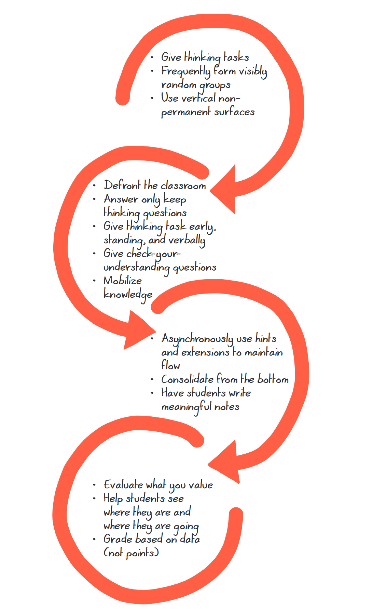

Framework introduced in Liljedahl (2020) represented in the figure below.

Introduced as four toolkits that are recommended to be implemented sequentially. Though not all orders were evaluated.

First - implement all three simultaneously

- Give thinking tasks 
- Frequently form [[visibly-random-groups]]
- Use vertical nonpermanent surfaces 

Second - no optimal order beyond after the first and before the third toolkit

- Defront the classroom 
- Answer only keep thinking questions 
- Give thinking task early, standing, and verbally 
- Give check-your-understanding questions 
- Mobilize knowledge 

Third toolkit - best implemented, one at a time, in order

- Asynchronously use hints and extensions to maintain flow 
- Consolidate from the bottom 
- Have students write meaningful notes

Fourth toolkit - the 2nd and 3rd are most important

- Evaluate what you value 
- Help students see where they are and where they are going 
- Grade based on data (not points)

<figure markdown>

<caption>The Building Thinking Classrooms Framework (Liljedahl, 2020, p. 281)
</figure>

## References

Liljedahl, P. (2020). *Building Thinking Classrooms in Mathematics, Grades K-12: 14 Teaching Practices for Enhancing Learning*. Corwin Press. 

[//begin]: # "Autogenerated link references for markdown compatibility"
[visibly-random-groups]: visibly-random-groups "Visibly random groups"
[//end]: # "Autogenerated link references"