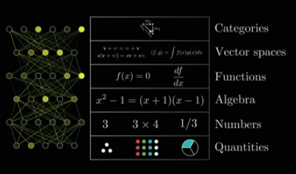

# Checks for pedagogy

Checklist for pedagogy in mathematics teaching offered by Grant Sanderson in a talk titled [_Math's pedagogical curse_](https://www.youtube.com/watch?v=UOuxo6SA8Uc)

- Are core ideas given diagrams? see [[dual-coding]]
- Are new abstractions preceded with concrete examples?
- Does the lesson start with a motivating question?

Mentions ideas related to [[low-floor-high-ceiling-wide-walls]], particularly Boaler's description of 'low-threshold, high-ceiling tasks'

## Levels of abstraction

The following example (subset) of layers of abstraction is given. The example given moves from algebra down to numbers and quantities before engaging with algebra.

<figure markdown>

<caption>Layers of abstraction</caption>
</figure>

## Motivating questions

This practice is linked to the idea of [[productive-failure]]

## References

[//begin]: # "Autogenerated link references for markdown compatibility"
[dual-coding]: ../../Learning/dual-coding "Dual coding"
[low-floor-high-ceiling-wide-walls]: ../low-floor-high-ceiling-wide-walls "Low Floor, High Ceiling, Wide Walls"
[productive-failure]: productive-failure "Productive Failure"
[//end]: # "Autogenerated link references"