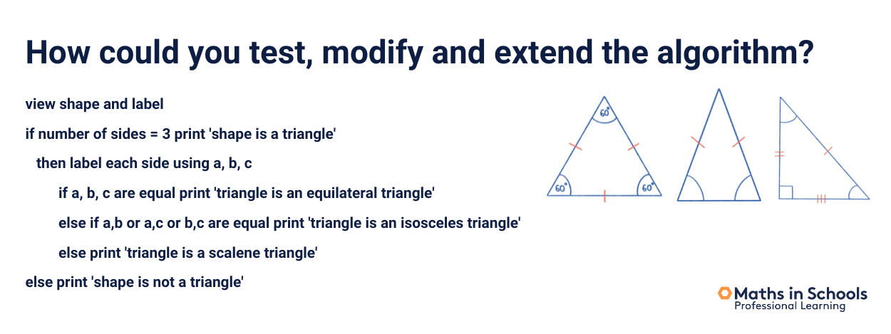
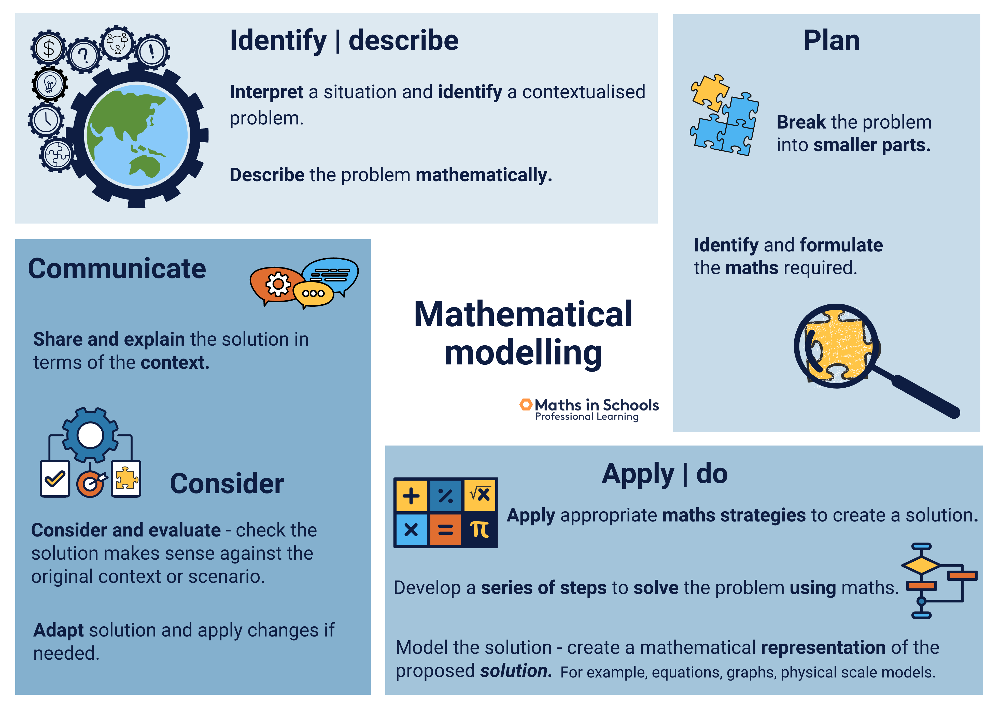

See also: [[maths-in-schools]], [[teaching-mathematics]]

## Mathematics & Numeracy

Definitions

- Mathematics - study and science of numbers, shapes, space, patterns and symbols and the ways of manipulating them

    Explicitly mentions that v9 of the [[australian-curriculum]] separates the 6 content strands (number, algebra, measurement, space, statistics, probability) in spite of the natural connections
- Numeracy - the ability to understand, recognise and apply mathematics concepts and skills to everyday life

??? question "Distinctions applied to my context?"

    Is year 11 essentials more about mathematics or numeracy? Should a distinction be made? What does the syllabus suggest?

Does offer a particular [[mathematical-structure]] and introduce the idea of mathematical processes

### Algorithms

Apparently there is some new requirements for design/create/test/refine algorithms in the Space strand of [[v9-learning-areas]].  Some examples include: [[AC9M7SP04]] and [[AC9M8SP04]].

??? question "How to meaningfully engage students in algorithms?"

    The elaborations for the two content descriptions given include mention of flow charts and classification schemes. Can't imagine that being very engaging. How to do it more meaningfully?

    See example below which seems to establish this process more for demonstrating understanding. Is there value beyond this? Students developing this type of algorithmic skill - in mathematics, more broadly?

    The point made again later is that in mathematics hte focus is on designing, testing, and refining rather than implementing them. A more explicit example of meaningless/harmful decomposition.

The following example is given. The context is Year 3. A student demonstrates their understanding of the geometric properties of shapes by writing an algorithm to identify the shape. Testing can be done by sharing with a friend.

??? example "Is the shape a triangle?"

    <figure markdown>
    
    <caption>Example shape identification algorithm (from CSER MOOC)</caption>
    </figure>

### Mathematical Modelling

Describes the expectations of secondary students to be developing the ability to

- interpret complex problems or situations;
- identify the maths to apply and represent the solution;
- test and evaluate their solution

<figure markdown>

<caption>Mathematical modelling processes images (from CSER MOOC)</caption>
</figure>

### Computational thinking

[[computational-thinking]] is also included in the maths learning areas.  But algorithm implementation meant to be only required in the digital technologies learning area.

### Mathematical language

talks about the challenges and importance of learning mathematical language. Which has me thinking about [[know-and-do-tables]]

??? tip "Resources glossary"

    Points to NSW DoE [glossary](https://education.nsw.gov.au/schooling/parents-and-carers/going-to-school/learning-resources/maths/maths-a-to-z)

### Summary

Ways of increasing the relevance of mathematics

- Investigate real-world problems - more than one answer
- Start with the real world and have students identify the maths
- Make the maths explicit
- Apply the maths back into the real-world context

Offers an explanation for why mathematicians research everyday topics like the mathematics of juggling

- can lead to answers about more complex problems
- fun to explore the beauty and enjoyment of mathematics

Offers some guiding questions for students

- How would you solve this problem?
- How can you record the maths of this problem?
- What are the patterns?
- Why is it important to record maths? (this one is a bit questionable)

## Positive mindsets in maths

Draws heavily on Boaler's and Dweck's work (e.g. [[mathematical-mindsets]], [[growth-mindset]])

Links to [Boaler's positive norms](http://www.youcubed.org/wp-content/uploads/Positive-Classroom-Norms2.pdf)

### Designing inclusive classrooms

Suggests "engaging and inclusive" enables everyone the chance to "develop their identity, sense of belonging and thrive as successful learners"

Links to various reports for "steps" for how to achieve this

[CSO](https://www.chiefscientist.gov.au/sites/default/files/OCS_Women_in_STEM_datasheet.pdf) steps for gender equity

1.  Eliminate stereotypes and bias.
2.  Emphasise real-life STEM applications in teaching.
3.  Reward hard work and build confidence.
4.  Encourage others to create supportive and inclusive spaces and monitor progress.

[Girls in STEM Toolkit](https://www.esa.edu.au/solutions/our-solutions/girls-in-stem-toolkit) offers [7 principles](https://www.thegist.edu.au/educators/girls-in-stem/inclusive-classrooms/seven-principles-for-a-gender-inclusive-learning-environment/)

1.  Create a gender-neutral learning environment.
2.  Ensure everyone gets hands-on.
3.  Design learning experiences to embrace context and problem-solving.
4.  Connect learning to careers and role models.
5.  Engineer collaborative learning.
6.  Provide choice and creative opportunities to demonstrate learning.
7.  Encourage a [[growth-mindset]].

### Visible thinking

Maths not (just) about the right answer. Creativity, explanation, justification help with connection building. This needs to be scaffolded.  Suggests 

- [graphic organisers](https://en.wikipedia.org/wiki/Graphic_organizer) in particular a [Lotus Diagram](https://www.edrawmax.com/article/what-is-lotus-diagram.html) to make explicit connections.
- [word wall](https://www.readingrockets.org/classroom/classroom-strategies/word-walls) to help build declarative knowledge about the current mathematical knowledge
- Bump-it-up wall - a student collaborative activity in developing a digital/visual exemplars of success criteria for an assessment task
- Visible thinking routines - e.g. [Project Zero](https://pz.harvard.edu/projects/visible-thinking) routines - see [routine toolbox](https://pz.harvard.edu/thinking-routines)

    - TPS
    - What can you do with this?

### Classroom dialogue

References NSW DoE [Talk Moves](https://education.nsw.gov.au/teaching-and-learning/curriculum/literacy-and-numeracy/teaching-and-learning-resources/numeracy/talk-moves) as method(s) for supporting rich, meaningful, classroom discussion in mathematics - see [[talk-moves]]

## Maths in the home

Cites Bragg et al (2020) and Victorial DoE [Maths teaching toolkit resource](https://www.education.vic.gov.au/school/teachers/teachingresources/discipline/maths/Pages/research_engagingfamiliesinmaths.aspx) for practical strategies to engage families. Recognises some practices of engaging families requires school policies etc.

## Module task - Maths mindsets

One of three tasks

1. eNewsletter - write one for school around maths mindsets
2. Reflection - use [4Cs](https://pz.harvard.edu/sites/default/files/The%204%20Cs_1.pdf) to reflect (#MindsetsReflect)

    - Connections - between reading and prior experience?
    - Challenges - what do you want to challenge from the text (if any)?
    - Concepts - what key concepts are you taking away?
    - Changes - what changes will you make to your practice (or that of others)?

3. In practice - share an example of how this can be encouraged in your school (#PromoteMindsets)

    - Brief outline/description of what the practice
    - Explain how you will measure impact
    - If implemented - how did your students respond?
    - Include photo/link to resources

"Math is contextual and creative"    "What does math mean for you"

### In practice

#### Approach

In 2024 I'll be a first year teacher. Everything is new. Hence my current _in practice_ focus is my overall approach to learning and teaching. I've already accepted the #PromoteMindsets idea as a key principle. The question now is how and what will it look like? 

As for how will I know it worked? Primarily my hope is that having effective assessment for learning practices as a key component will help answer that question. Along with my observations, more general discussion with students and peers, and of course final results.   

What follows is a brief (but probably still longer than necessary for these purposes, apologies) current description. The reality is likely to be very different. It will definitely by an on-going iterative and emergent design process. 

- Expectations, norms and design principles.

    Adopt and adapt [Boaler's mathematical mindsets approach/principles](https://www.frontiersin.org/articles/10.3389/feduc.2021.784393/full) principles and norms. Weave in principles from other work (e.g. the [GiST 7 principles](https://www.thegist.edu.au/educators/girls-in-stem/inclusive-classrooms/seven-principles-for-a-gender-inclusive-learning-environment/) and [Gutstein's reading and writing the world with mathematics (RWWM)](https://wordpress.oise.utoronto.ca/robertson/reading-and-writing-the-world-with-mathematics/)). 
    
    Weave these with school expectations and practices (e.g. awarding PBL points to students asking good mathematical questions, esp. those arising from outside class observations.)

- underpinning practices;

    Beyond the norms/principles there will be a range of other insights/practices underpinning this approach. Possible examples include: lesson planning using [[productive-failure|productive failure]]; designing collaborative learning informed by [[complex-instruction|complex instruction]] and [[building-a-thinking-classroom|thinking classrooms]];  [[assessment-for-learning|assessment for learning]]; and leveraging digital technologies.

- structure the unit/term to aid learning;

    Draw on mathematical big ideas and RWWM to create a structure for the unit's mathematical knowledge and skills (K&S) that is meaningful/accessible to students. Develop graphical organisers and other assessment for learning practices/resources that have the students actively engaged with the structure and their progress.

- identify and refine a set of learning activity types;

    Establish a common class language and understanding of the purpose of the tasks we engage in. Some early examples, include: 

      - starters;

        Move beyond just simple revision to integrate [[number-talks|number talks]] etc. designed to engage students more broadly in fundamental mathematical K&S.

      - recognising/modelling tasks; 

        e.g. ["Which one doesn't belong"](http://wodb.ca/) (HT: [Janelle](https://canvas.catalog.adelaide.edu.au/courses/1042/discussion_topics/3098/entry-3745)), [[contemplate-then-calculate]], [What Can You Do With That (WCYDWT)](https://blog.mrmeyer.com/2010/wcydwt-car-talk/), or [[math-watch|Math Watch]]

      - [[rich-mathematical-tasks|rich tasks]];

        Tasks with a [[low-floor-high-ceiling-wide-walls|a low floor, wide walls, and high ceilings]] 

      - "wax on, wax off"; 

        I suspect there will still be call (if only due to personal inertia) for explicit teaching/worksheets. Focused on mathematical K&S and perhaps other topics (e.g. brain science, growth mindset, the learning pit etc.). Hence give it a label that makes the purpose explicit.

    - closers

        Exit tickets or [others](https://www.edutopia.org/blog/22-powerful-closure-activities-todd-finley). 

[//begin]: # "Autogenerated link references for markdown compatibility"
[maths-in-schools]: ..%2Fmaths-in-schools "Maths in Schools Online: Year 7 - 10 course"
[teaching-mathematics]: ..%2Fteaching-mathematics "Teaching Mathematics"
[australian-curriculum]: ..%2F..%2FCurriculum%2Faustralian-curriculum "Australian Curriculum"
[mathematical-structure]: ..%2Fmathematical-structure "Mathematical structure"
[v9-learning-areas]: ..%2F..%2FCurriculum%2Fv9%2Fv9-learning-areas "Learning Areas"
[AC9M7SP04]: ..%2F..%2FCurriculum%2Fv9%2FMathematics%2FAC9M7SP04 "AC9M7SP04"
[AC9M8SP04]: ..%2F..%2FCurriculum%2Fv9%2FMathematics%2FAC9M8SP04 "AC9M8SP04"
[computational-thinking]: ..%2F..%2F..%2Fcomputing%2Fcomputational-thinking "Computational thinking"
[know-and-do-tables]: ..%2F..%2Fknow-and-do-tables "Know and do tables"
[mathematical-mindsets]: ..%2Fmathematical-mindsets "Mathematical mindsets"
[growth-mindset]: ..%2Fgrowth-mindset "Growth Mindset"
[talk-moves]: ..%2Ftalk-moves "Talk moves"
[productive-failure|productive failure]: ..%2Fproductive-failure "Productive Failure"
[complex-instruction|complex instruction]: ..%2Fcomplex-instruction "Complex instruction"
[building-a-thinking-classroom|thinking classrooms]: ..%2Fbuilding-a-thinking-classroom "Building a thinking classroom"
[assessment-for-learning|assessment for learning]: ..%2F..%2FAssessment%2Fassessment-for-learning "Assessment for learning"
[//end]: # "Autogenerated link references"