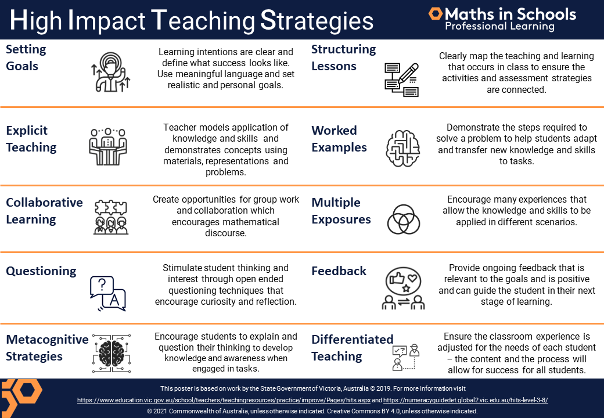

See also: [[maths-in-schools]], [[teaching-mathematics]]

Examines several practices/pedagogies for exploring mathematical concepts and ideas. Uses the _add to your toolkit_ metaphor.

## Overview

Starts with the disclaimer about the complexity of teaching. Multiple approaches chosen by teachers based on their assumptions of how to produce certain outcomes and the fit with the concept/skill and students.

References Hattie's [Visible Learning work](https://www.visiblelearningmetax.com/) and offers the following image adapted from Hattie's work and the Victorian DoE's 10 high-impact strategy work. 

<figure markdown>

<caption>High Impact Teaching Strategies</caption>
</figure>

??? question "Are there inconsistencies (and related issues) in the provided advice?"

    Given the complexity and entanglement of teaching and the standard atomisation involved in formal research etc (i.e. [[all-models-are-wrong]]) there is likely to be inconsistencies in the advice provided. Especially in a course like this which seeks to weave together multiple sources of advice. For example

    - Variety versus consistency/cognitive load.

        The summary of the overview recommends using "a variety of pedagogies" to aid inclusion/engagement etc.

    - Ability grouping or not?

        Boaler and other references from the first module in this course argues against ability grouping. But Hattie's visible learning identifies ability grouping for gifted students as a positive. The distinction ("for gifted students") perhaps points at some of the complexity here.

### Targeted teaching

The first of three "key considerations" included in the overview illustrates that complexity. [[targeted-teaching]] (a "variation" of [[assessment-for-learning]]) could be seen as a fine-grained version of ability grouping. On the plus side it is losing what perhaps creates the issues with ability grouping - encouraging a fixed mindset - but at the cost of sustainability as a teacher tries to cater for each student's needs.

Explicit advice is given that at the start of the year, test students to see what they recollect from the year before. Given the cumulative nature of the Australian Curriculum.

!!! info "AC learning progression extracts"

    The numeracy capability provides a "comprehensive view of observable progressive indicators" of K&S in numeracy concepts. Suggested it is linked to the content descriptions in some areas.

    Task for [[exploring-australian-curriculum]]

### Manipulatives, modelling, and mathematical modelling

### Transference

## Universal Design for Learning (UDL)

## Explicit teaching (using Concrete, Representational, Abstract (CRA) approach)

## Math investigations

## Culturally responsive maths pedagogy

## Module task: Practice and pedagogies

- Need to integrate ideas/content from [[cser-content-in-action-connection-with-community]] module

Three options

- Classroom activity ✔ 

    Take on practice/pedagogy and create/adapt an existing classroom activity

    - identify the approaches used 
    - describe the mathematics covered in the activity 
    - explain what you would do in the activity, including relevant resources
    - provide tips for other teachers that can guide their use of the approach 
    - Use the hashtag #LessonPractices

- Family information session
- Teacher workshop

[//begin]: # "Autogenerated link references for markdown compatibility"
[maths-in-schools]: ..%2Fmaths-in-schools "Maths in Schools Online: Year 7 - 10 course"
[teaching-mathematics]: ..%2Fteaching-mathematics "Teaching Mathematics"
[targeted-teaching]: ..%2F..%2FAssessment%2Ftargeted-teaching "Targeted teaching"
[assessment-for-learning]: ..%2F..%2FAssessment%2Fassessment-for-learning "Assessment for learning"
[cser-content-in-action-connection-with-community]: ..%2Fcser-content-in-action-connection-with-community "cser-content-in-action|Connection with community"
[//end]: # "Autogenerated link references"