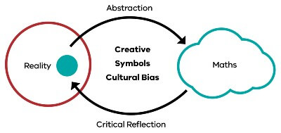

See also: [[teaching-mathematics]], [[cser-practices-and-pedagogies]], [[what-do-mathematicians-do]], [[what-is-mathematics]], [[ramr-cycle]]

A model for describing what mathematics is and how it develops. This can be used for thinking about teaching mathematics. It emphasises mathematics as

- connected structure;
- a life-describing language; 
- a tool for problem solving;
- leading to a focus on big ideas

Has three tenets (from [YuMi Deadly Maths](https://research.qut.edu.au/ydc/about/yumi-deadly-maths/))

> 1. Mathematics is a cultural and contextual abstraction of reality based on symbols.
> 2. Mathematics reflects back on reality and empowers people to solve problems in their own lives.
> 3. This abstraction and reflection is a creative but also a culturally biased act.

<figure markdown>

<caption>The Goompi Model: Relationship between perceived reality and invented mathematics</caption>
</figure>

??? note "Goompi model appears a good fit for [[my-approach-to-teaching-mathematics]]"

    Starting with use in the first lessons to abstract out the lessons from the [[number-scabble]] activity. Also linking this later to the mathematical investigation process.

[//begin]: # "Autogenerated link references for markdown compatibility"
[teaching-mathematics]: ..%2Fteaching-mathematics "Teaching Mathematics"
[cser-practices-and-pedagogies]: cser-practices-and-pedagogies "CSER Maths in Schools - Practices and pedagogies"
[what-do-mathematicians-do]: ..%2Fwhat-do-mathematicians-do "What do mathematicians do?"
[what-is-mathematics]: ..%2Fwhat-is-mathematics "What is mathematics"
[ramr-cycle]: ramr-cycle "ramr-cycle"
[my-approach-to-teaching-mathematics]: ..%2Fmy-approach-to-teaching-mathematics "My approach to teaching mathematics"
[//end]: # "Autogenerated link references"