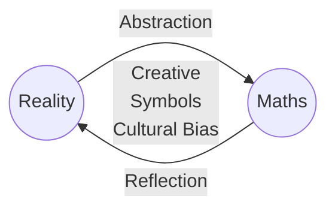

---
backlinks:
- title: CSER Math Connections with Community
  url: /sense/Teaching/Mathematics/cser-connections-with-community.html
- title: When will I ever use mathematics
  url: /sense/Teaching/Mathematics/when-will-i-ever-use-mathematics.html
- title: Reality, Abstraction, Mathematics, Reality (RAMR) cycle
  url: /sense/Teaching/Mathematics/cser-mooc/ramr-cycle.html
- title: CSER Maths in Schools - Practices and pedagogies
  url: /sense/Teaching/Mathematics/cser-mooc/cser-practices-and-pedagogies.html
tags: teaching-mathematics, teaching
title: Goompi model
type: note
---
Sources: [Culturally Responsive Pedagogyies](https://www.mathematicshub.edu.au/plan-teach-and-assess/teaching/embedding-indigenous-knowledges/culturally-responsive-pedagogies-goompi-model/)

A model for describing what mathematics is and how it develops. This can be used for thinking about teaching mathematics. It emphasises mathematics as

- connected structure;
- a life-describing language; 
- a tool for problem solving;
- leading to a focus on big ideas

Has three tenets (from [YuMi Deadly Maths](https://research.qut.edu.au/ydc/about/yumi-deadly-maths/))

> 1. Mathematics is a cultural and contextual abstraction of reality based on symbols.
> 2. Mathematics reflects back on reality and empowers people to solve problems in their own lives.
> 3. This abstraction and reflection is a creative but also a culturally biased act.

<figure markdown>

<caption>The Goompi Model: Relationship between perceived reality and invented mathematics</caption>
</figure>

??? note "Goompi model appears a good fit for [[my-approach-to-teaching-mathematics]]"

    Starting with use in the first lessons to abstract out the lessons from the [[number-scrabble]] activity. Also linking this later to the [[mathematical-investigation]] process.

## Experimental mermaid representation

[//begin]: # "Autogenerated link references for markdown compatibility"
[my-approach-to-teaching-mathematics]: ../my-approach-to-teaching-mathematics "My approach to teaching mathematics"
[//end]: # "Autogenerated link references"