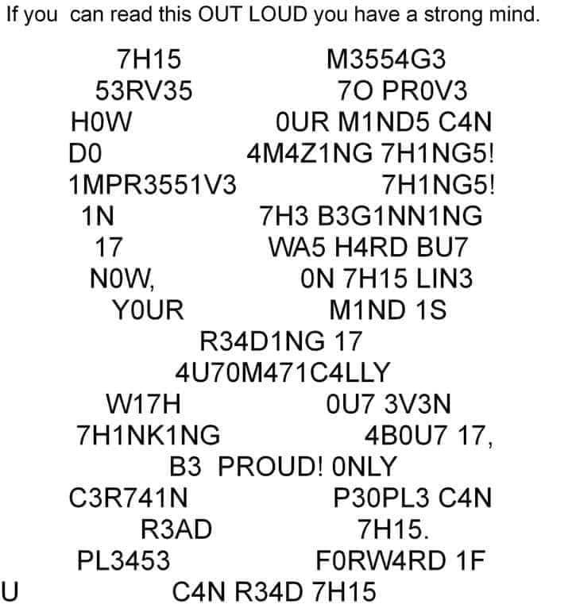

Source: [Tweet](https://twitter.com/jim_rutt/status/1732164665763893408)

Image written with [leet speak](https://en.wikipedia.org/wiki/Leet) that can be read after spending a bit of time. Perhaps linking with [[brain-plasticity]] and [[growth-mindset]].

[//begin]: # "Autogenerated link references for markdown compatibility"
[brain-plasticity]: ../../Learning/brain-plasticity "Brain Plasticity"
[growth-mindset]: growth-mindset "Growth Mindset"
[//end]: # "Autogenerated link references"