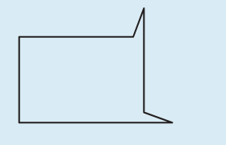
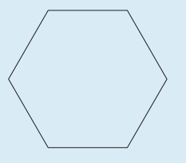

---
title: Cannot name a hexagon
---

From Boaler (2015). A misconception said to arise due to the common way hexagons are shown in mathematical textbooks - a misconception available in lots of similar shapes, lines, etc

Name the following shape

Does it help if you're told it has the same name as the following shape

## References

Boaler, J. (2015). Creating Mathematical Mindsets: The Importance of Flexibility with Numbers. In *Mathematical Mindsets: Unleashing Students' Potential Through Creative Math, Inspiring Messages and Innovative Teaching* (pp. 33--56). John Wiley & Sons, Incorporated.