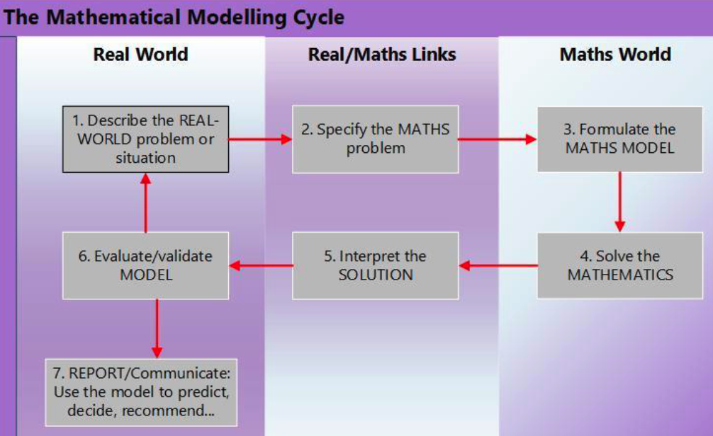

# The Mathematical Design and Implementation Framework

[Original source](https://www.mathsmodellingenablers.com/design-and-implementation-framework.html) - is the _Enablers of Mathematical Modelling_ ARC project. References Niss (2010) for enablers. Origins of this framework provided by Geiger et al (2022)

A framework developed with feedback from teachers. Framework originally divided in two parts (design of the mathematical modelling task, and design of the classroom implementation) but most recent presented as four stages

## 1. Design Principles

As a teacher, you'll have greater success if

- Understand the modelling princples and process
- Apply it to a problem before presenting to students
- Encourage students to develop their report as they go

Design principles are

### 1.1  Nature of the problem 

Open-ended and involve both intra- and extra- mathematical information. Vary open-endedness dependent on students’ previous experience with modelling. Add more scaffolding if required.

### 1.2 Relevance and motivation 

Genuine link with students' real-world. Heavily dependent on students and context. Further adaptation may be required.

### 1.3 Accessibility 

Mathematically tractable questions are evidence from a general problem statement. Accessible to student math content and perspective.

### 1.4 Feasibility of approach 

The solution process is available to students given (a) their mathematical K&S, (b) the making of necessary assumptions, and (c) the assembly of necessary data. Teachers must work through the problem. 

### 1.5 Feasibility of outcome 

Will students actually be able to solve and evaluate their solution to the problem?

### 1.6 Didactical flexibility (a form of [[generativity]]?)

Able to structure the problem in different ways (sequential questions). What other didactical scaffolds might be required?

## 2. Preparation and pre-engagement

Ensure students are understand are prepared to engage in the modelling process

### 2.1 Preparation

Ensure problem is sufficiently open-ended and accessible to the students. Providing scaffolding where required for less familiar students. Provide both intra and extra-mathematical information.

Considering, possible solution pathways, scaffolding questions, sufficient non-mathematical content, description of the problem solving method, examples etc.

<figure markdown>

<caption>The mathematical modelling cycle (<a href="https://www.mathsmodellingenablers.com/uploads/1/3/1/9/131996757/maths_modelling_a4_c.pdf">original</a>)</caption>
</figure>

### 2.2 Classroom environment

- Small group best social structure 
- encourage discussion, share of all ideas, solutions, approaches - especially the unconventional
- group role allocation may be considered
- Where possible provide access to technology to record, research, clarify and validate work

## 3. Delivery: stages of the lesson

### 3.1 Review of the modelling process

Review the process and consider making points such as

- will likely require non-mathematical information - can't rely just on math
- may be different models, rarely a single best model
- not a quick, get an answer activity
- will likely require simplifications and assumptions to make tractable
- assumptions can be made at any point
- encourage question asking

### 3.2 Initial problem presentation

- brief teacher provided description
- students in group read and discuss the problem and likely approach
- whole class discussion to check understanding, approach and perhaps provide pointers
- groups consider assumptions, variables as well as other observations
- whole class discussion with teacher synthesising and prioritising 
- focus on student decision making

### 3.3 Body of the lesson: modelling in progress

Teacher will

- monitor and support student process
- anticipate problems
- prompt and scaffold, rather than answer
- encourage tools
- support student engagement in report preparation

Students should

- Document process
- consider forms of collaborations

### 3.4 Conclusion: presentation of findings and teacher summary

Findings presented in succinct way. Focus on what was learnt about the modelling process. Questions posed for clarification and to test arguments.

## 4. Reporting

### 4.1 Guidelines for reporting writing

- provide a specific target
- connect with assessment
- apply to any modelling problem
- provide space for providing feedback

### 4.2 What the report should include

Report missteps. Seen as a means to communicate findings. Succinct, coherent, systematic.

- describe the problem
- precisely specify the resulting mathematical question/s
- list assumptions
- indicate how numerical values were decided on
- show all mathematical working
- interpret the meaning of mathematical results in terms of the real world problem
- evaluate the answer
    - Does the answer make sense mathematically
    - Does it help to answer the real problem?
    - Are there qualifications
    - Can the result be validated in the real-world?
    - Are there recommendations that arise? Further work required?

- Students identify how the modelling cycle informed their problem solving.

### 4.3 Forms of reporting

Different forms.

- beginning modellers might use [this type of booklet](https://www.mathsmodellingenablers.com/uploads/1/3/1/9/131996757/student_maths_modelling_booklet.docx)
- if not a summative task, butcher's paper, whiteboard etc.
- if group work, how to assess individual work
- genres other than reports - blogs, video presentations etc.

## References

Geiger, V., Stillman, G., Brown, J., Galbriath, P., & Niss, M. (2018). Using mathematics to solve real world problems: The role of enablers. *Mathematics Education Research Journal*, *30*(1), 7--19. <https://doi.org/10.1007/s13394-017-0217-3>

Geiger, V., Galbraith, P., Niss, M., & Delzoppo, C. (2022). Developing a task design and implementation framework for fostering mathematical modelling competencies. *Educational Studies in Mathematics*, *109*(2), 313--336. <https://doi.org/10.1007/s10649-021-10039-y>

Niss, M. (2010). Modeling a Crucial Aspect of Students' Mathematical Modeling. In R. Lesh, P. L. Galbraith, C. R. Haines, & A. Hurford (Eds.), *Modeling Students' Mathematical Modeling Competencies: ICTMA 13* (pp. 43--59). Springer US. [https://doi.org/10.1007/978-1-4419-0561-1\_4](https://doi.org/10.1007/978-1-4419-0561-1_4)

[//begin]: # "Autogenerated link references for markdown compatibility"
[generativity]: ../../nodt/generativity "Generativity"
[//end]: # "Autogenerated link references"