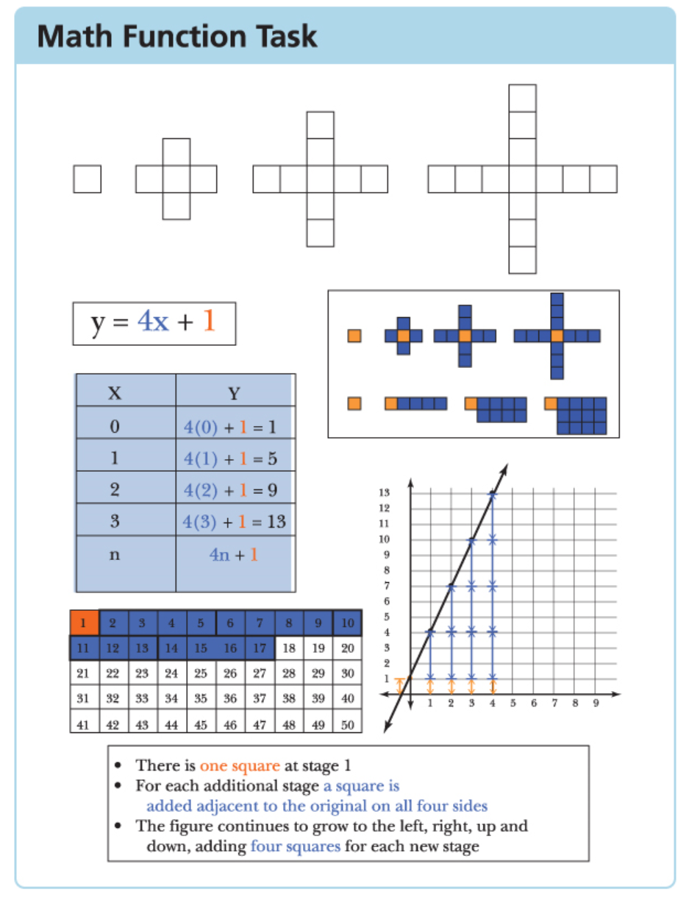

# Mathematical mindsets

See also: [[mathematical-mindset]]

Resources: [YouTube video](https://www.youtube.com/watch?v=bxrPy1fjVU4&t=472s) - associated with YouCubed - Boaler and students

Following are rough notes from reading 

Boaler, J. (2015). Mathematical Mindsets: Unleashing Students’ Potential Through Creative Math, Inspiring Messages and Innovative Teaching. John Wiley & Sons, Incorporated.

> this books is about the creation of _mathematical mindsets_ through a new kind of teaching and parenting that is, at its heart, about growth, innovation, creativity, and the fulfillment of mathematics potential.

## Chapter list

### 1. The brain and mathematics learning

### 2. The power of mistakes and struggle

- Find ways to celebrate mistakes
- Highlight/value conceptual mistakes, rather than numerical errors
- Abandon testing and grading as much as possible - being marked down for mistakes has consequences

### 3. The creativity and beauty of mathematics

- What do students see as their role in a mathematics class?
    - Mostly it's a solver of problems.  Rather than being there to appreciate the beauty of maths, ask deep questions, explore rich connections, learn about the applicability of the subject.

### 4. Creating mathematical mindsets: The importance of flexibility with numbers

- Repetitive and simple ideas (common mathematical teaching approach) fail to move students into disequilibrium - part of learning

### 5. Rich Mathematical Tasks

Provides numerous examples and then moves onto offering 6 questions to ask about a mathematics learning task that will help transform them into [[rich-mathematical-tasks]]

### 6. Mathematics and the path to equity

- Mathematics (in the US) has the largest achievement differences due to ethnicity, gender and socio-economic levels.
- Argues that the push for mathematics as a "performance subject" and an elitist take
- A view that reinforces the fixed mindset view (you are good at math or not) rather than growth (valuing effort and learning)
- Choices about who proceeds into "higher" math in high school also influences outcomes, and in turn is influenced by perceptions of "good" students (no disciplin problems, homework in on time)
- Parents equating "procedural skill" with capability, but ignoring conceptual understanding and problem solving
- Need to move mathematics from an "elitist, performance subject used to rank and sort students (and teachers) to an open, learning subject"
- Equitable strategies

    - Offer all students high-level content
    - Work to change ideas about who can achieve in mathematics
    - Encourage students to think deeply about mathematics
        Makes the case for mathematics as a "connected, inquiry-based subject" for addressing inequalities and increasing achievement.

    - Teach student to work together
        Research showing that working on mathematics collaboratively helps to make connections etc.

    - Give girls and students of color additional encouragement to learn math and science 
- Eliminate (or at least change the nature of) homework

    - PISA (2015) found "homework perpetuates inequalities in education"
    - Numerous other issues

### 7. From tracking to growth mindset grouping

- "Opportunity to learn" key factor in student achievement
- more access to high-level mathematics means higher achievement
- tracking seen as greatest reinforcement of fixed mindsets
- tracking can be seen as being helpful for teachers in being able to deliver learning experiences at the right level, but this argument ignores the fact that even in similarly tracked classes there is a wide range of abilities/needs
- Focus of this chapter is on modern/effective forms of grouping
- Growth mindset grouping - i.e. basically heterogenous grouping
- Teaching heterogeneous groups effectively: the mathematics tasks

    "It is not enough to de-track and then teach through narrow mathematics questions that will be accessible to only a few students"
    - Providing open-ended tasks - i.e. [[low-floor-high-ceiling-wide-walls#Mathematics]] 

        Point is made that the teacher will engage in explicit teaching, but in response to student working through of the open-ended task. Echoing Fry and Hillman (2018)

    - Offering a choice of tasks

        Where task explained as "going to different places", rather than easy/difficult.

    - Individualised pathways

        Mentions the [[SMILE]] cards from the UK.

    - Teaching heterogeneous groups effectively: complex instruction
           
       "... group work in classrooms can fail when students participate unequally in groups". With perceived status of participants being an issue.  Cohen and Lotan developed [[complex-instruction]]

##### Railside approach

- Multidimensionality - more student success because there are more ways to be successful

    - Typical math class has 1 dimension - "executing procedures correctly" - one way to be successful
    - Need to encourage engagement in "all the ways to be mathematical": ask good questions; propose ideas; connect different methods; use many different representations; reason through different pathways...
    - student survey "What does it take to be successful in maths" - 97% said "pay careful attention" 
    - Responses from RailSide students included: asking good questions; rephrasing problems; explaining; using logic; justifying methods; using manipulatives; connecting ideas; helping others
    - Railside used "rich tasks" that were "groupworthy" when they: 
      - illustrate important mathematical concepts; 
        - Railside organised curriculum around _big ideas_ e.g. "What is a linear function" (which strikes me more as a driving question) rather than mathematical methods
      - allow for multiple representations; 
        - physical manpulatives for algebra
        - encourage students to reprsent solutions/ideas in multiple ways see figure below
      - include tasks that draw effectively on the collective resources of a group; have several possible solution paths

<figure markdown>

<caption>Example of representing mathematical ideas in multiple ways. (adapted from Boaler, 2015)</caption>
</figure>

- Roles

    - Railside task sheets included explict direction for roles (e.g. facilitator; recorder/reporter; resource manager; team captain)
    - In England role names were changed: 
      - organiser - keep the group together and focused on the problem, no talking outside the group;
      - resourcer - only person that can get resources, make sure everyone is ready before you call the teacher;
      - understander - make sure all ideas are explained for understanding for all in group; encourage idea generators to explain if any don't; write down important parts of explanations; 
      - includer - make sure everyone's ideas are listened to; invite other people to make suggestions.

- Assigning competence

    - teachers raise status of students who think may be lower status in a group
    - feedback that is public, intellectual, specific and relevant to the group task - from (Cohen, 1994) - designer of complex instruction

- Shared student responsibility

    - Railside - first 10 weeks explicitly taught students who to work in groups
    - tactics

        - "do like and don't like group members do" lists generated by students
        - reinforcing what the teacher values
        - in group work, ask one member of the group a conceptual follow-up question, if not able to answer encourage the group to ensure everyone understands, teacher leaves, and returns later to ask the same student
        - group tests - taken individually, but only one random test from a group marked

### 8. Assessment for a growth mindset

Reducing the diversity of ways individual students understand mathematics to a number/grade si problematic - "not only fail to adequately describe children's knowledge, in many cases they misrepresent it"

Finland - reportedly - does not test students. Instead relying on teachers "rich understanding" of students

> Students with no experience of examinations and tests can score at high levels because the most important preparation we can give students is a growth mindset, positive beliefs about their own ability, and problem-solving mathematical tools that they are prepared to use in any mathematical situation

Regular testing and grading lead to various problems: ego comparison, fixed mindset etc.

### 9. Teaching mathematics for a growth mindset

## To follow up

### Resources

- [MindSetKit](https://www.mindsetkit.org/)

### Teaching and impact

- Cohen & Garcia (2014) - 1 experience/message can change everything for students
- Beilock, Gunderson, Ramirez & Levine (2009) - primary school teachers' negative emotions on math predict achievements of girls in their classes, not boys
- Silver (1994) - give students opportunities to pose mathematical problems, to consider a situation and think of mathematical questions to ask - the essence of real math - they become more engaged and perform at a higher level
- Boaler (2015a) - What's math got to do with it - describes a classroom approach based on posing mathematical questions
- Schwartz & Bransford (1998) - comparison of three ways of teaching mathematics - related to [[productive-failure]]
- Wang, 1998; Elmore & Fuhrman, 1995 - OTL most important condition for learning

- Good, Rattan & Dweck (2012) - studetns sense of belonging in math

### Value of mathematics

- Rose & Betts (2004) and Boaler (2005) - more math classes == higher earnings 10 years later - as much as 19.5%
- In the US the high school maths courses done from year 9 influence what people do for the rest of their life, is this the case in Australia?

### Rich tasks

- Horn 2005 - 
- https://nrich.maths.org
- Nasir et al (2014) Railside activities?
- (Picciotto, 1995) - physical manipulative for algebraic understanding

### Assessment

- Pulfrey, Buchs, and Butera (2011) replication of study on impact of assessment feedback as: grades, diagnostic comment, or both. Grades always negative

Not quite
- Gustein, Lipman, Hernandez & de los Reyes (1997) - curriculum designed to raise issues of gender, culture or class

### What is mathematics

- Devlin (1997) - mathematicians describe math as "the study of patterns; that it is an aesthetic, creative, and beautiful subject"
- Devlin (2006) - mathematics used by animals, and humans as natural mathematics users
- Reuben Hersh (1999) - What is mathematics, really?

### Misc

- Boaler (2008) - concept of _relational_ equity

## References

Fry, K., & Hillman, J. (2018). The Explicitness of Teaching in Guided Inquiry. In *Mathematics Education Research Group of Australasia*. Mathematics Education Research Group of Australasia. <https://eric.ed.gov/?id=ED592484>

[//begin]: # "Autogenerated link references for markdown compatibility"
[mathematical-mindset]: mathematical-mindset "Mathematical Mindset"
[rich-mathematical-tasks]: rich-mathematical-tasks "Rich mathematical tasks"
[low-floor-high-ceiling-wide-walls#Mathematics]: ../low-floor-high-ceiling-wide-walls "Low Floor, High Ceiling, Wide Walls"
[SMILE]: smile "SMILE"
[complex-instruction]: complex-instruction "Complex instruction"
[productive-failure]: productive-failure "Productive Failure"
[//end]: # "Autogenerated link references"