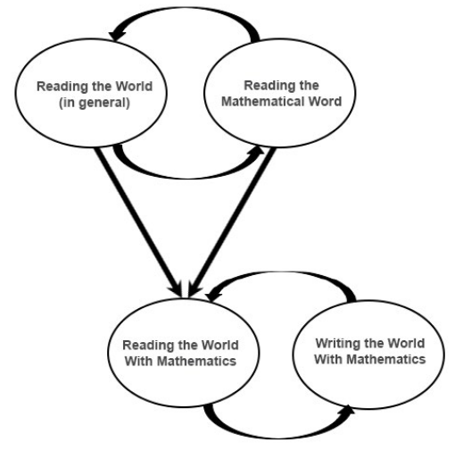
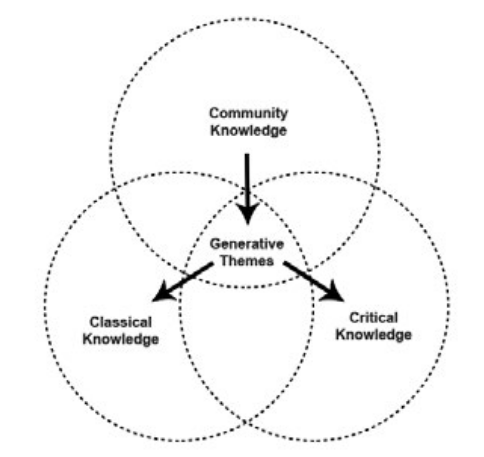

An approach - defined by Gutstein (2016) to teaching mathematics that explicitly aims to encourage students to develop a deep, conceptual understanding of mathematics (i.e. a [[conceptual-approach-to-mathematics]]) by "reading" their social reality and create/extend their analyses of the contradictions in society and their lives. Preparing them to "write" their own version by changing reality as they see fit.

> For me, RWWM means that students use mathematics to comprehend and change the world—and through the process, deepen their knowledge of both mathematics and their social reality. (Gutstein, 2016, p. 455)

Also known as: critical mathematics (CM), teaching and learning mathematics for social justice

## Is it practical?

Gutstein (2016) cites literature that suggests most work remains at a theoretical level. The practitioner questions being what to do?

### Theoretical foundations

Linked to Friere's idea of _reading and writing the world_ and education as _emancipatory praxis_ - "the dialectical interconnection of action and reflection for the purpose of libration and full humanisation" (Gutstein, 2016, 455)

- reading the world - interact with the world to understand the roots of injustice
- writing the world - to change reality 

Reading the world with mathematics has two interrelated processes, the challenge is how to supports students to integrate both

1. reading the world; and
2. reading the mathematical word.

<figure markdown>

<caption>Dialectical relationship of components of reading/writing the world with mathematics(adapted from Gutstein, 2016, p. 457)</caption>
</figure>

### Frameworks

| pedagogy/curriculum development | Types of knowledge |
| --- | --- |
| Creating a pedagogy of questioning | Community knowledge |
| Normalising politically taboo topics | Classical knowledge |
| Developing political relationships with students | Critical knowledge |

A key strategy is starting/building from community knowledge as the platform for "then interweaving and developing critical and classical knowledge with goal of transforming reality" (Gutstein, 2016, p. 458)

<figure markdown>

<caption>Connecting the 3Cs (adapted from Gutstein, 2016, p. 459)</caption>
</figure>

### From theory to practice

Gutstein (2016) draws on numerous studies to derive the following points.

1. RWWM can be implemented in various settings
2. Findings included

   - Facilitating conditions 

       - teachers' knowledge of sociopolitical contexts and student communities,
       - students' and teachers' cocreation of classrooms supporting investigation of generative themes
       - relationships between students and teachers involving shared political analysis and solidarities

   - challenges 

       - preparing and supporting teachers given their existing dispositions, knowledge & experience; 
       - dealing with curricular mandates and practical structural issues;
       - paying sufficient attention to all the complex interconnected knowledge strands; 
       - students' resistance to nontraditional curriculum and pedagogies

3. Explorations of aspects of identity
4. Limitations of research 

    - most examine limited duration projects, nothing that is year long and/or the core of the class
    - most have teachers choose the contexts students investigate

### What is missing - antiracist critical mathematics

RWWM has not dealt with race, racialisation, racism, sexism, ageism, or heterosexism. Friere doesn't.

## Example - RWWM at SOJO

Gutstein (2016) uses full year implementation of RWWM at a particular school (SOJO) - details follow

Students identified generative themes and Gutstein developed the following curriculum around 5 units

- elections - timed to fit with 2008 federal election
- Displacement - linked to subprime and other local issues - described in detail in the paper
- Criminalisation of youth and people of colour 
- Sexism (with HIV-AIDS and criminalisation)

## Principles

Not empirical findings, but suggestions

1. Themes prescribe neither curriculum or pedagogy

    Students identifying themes is a first step in them reading the world. Teacher must react appropriately.

2. Generative themes will not be transformative for students with inadequate educational resources, inequitable education, and systemic disinvestment.

    Insider the classoom is not a magic solution to what is happening outside, which students will bring into the classroom.

3. Teaching from generative themes creates conditions for classroom democracy, but also demands them.

    A system where teachers manage/discipline has a tendency to teach students to be passive and spoon fed, but also learn how to circumvent and rock established order.

4. Teaching from themes is not a motiviation gimmick

## References

Gutstein, E. "Rico." (2016). "Our Issues, Our People---Math as Our Weapon": Critical Mathematics in a Chicago Neighborhood High School. *Journal for Research in Mathematics Education*, *47*(5), 454--504. <https://doi.org/10.5951/jresematheduc.47.5.0454>

[//begin]: # "Autogenerated link references for markdown compatibility"
[conceptual-approach-to-mathematics]: conceptual-approach-to-mathematics "Conceptual approach to mathematics"
[//end]: # "Autogenerated link references"