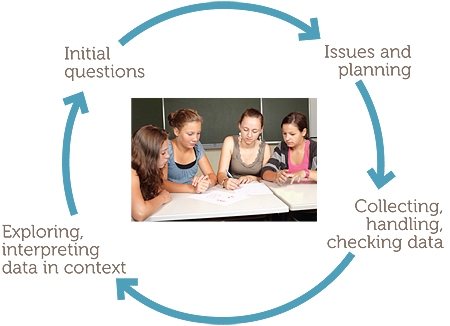

See also: [[statistics]], [[teaching-mathematics]]

## Year 8 - Data investigation and interpretation

[TIMES Module](http://amsi.org.au/teacher_modules/Data_Investigation_and_interpretation8.html)

See: [[mat081c-2024]]

### General notes

#### Information from data

- obtain data to obtain information
- census aims to get total information for a population
- obtaining sample data aims to obtain representative data
- representative data enables us to obtain representative information
- representative data relies on obtaining a random sample either by

    - choosing randomly if we're dealing with a population, or
    - taking observations randomly if we're dealing with observational/experimental situation

- practicalities means we have to assume data is representative of a more general situation
- very important to consider how data were obtained or collected
- data can be representative for some questions but not others

#### Generalising from data samples: statistical inference

- but care must be taken to **infer** from data
- **statistical inference** provides principles/methods for inferring from data to take account of variation
- these methods are studied at university level
- but examples comparing datasets collected under similar conditions (or simulation) can hep in understanding the need and being cautious in generalising from data

### Assumed pre-requisite knowledge

From F-7 students have some familiarity/understanding with concepts and usage

- statistical data investigative processes
- types of data and variables
- types of investigations
- some types of graphical and summary presentations of data

Arising from which is a need for representative data and for describing/allowing for variability within and across data sets

learning outcomes

- Understand the effects of sampling variability
- Challenges of obtaining representative data
- Emphasising the importance of clear reporting of how, when and where data are obtained or collected
- Identifying the issues/questions around what makes data representative
- Understanding of how sample proportions and averages vary across samples

- familiar with categorical, count and continuous data ??
- learning experience in recording, classifying and exploring individual datasets of each type
- seen and used tables, picture graphs and column graphs for categorical data and count data with small number of different counts treated as categories, dotplots and steam-and-leaf-plots for continuous and count data
- familiar with use of 
  - frequencies and relative frequencies of categories (categorical data)
  - counts (for count data) 
  - intervals of values (for continous data)
- students have used and interpreted averages (or means) and meadians of quantitaite
- familiar with concept of statistical variables and subjects of data investigation

### Motivation

- Societal calls for more information/evidence 
- A natural environment for learning statistical thinking is experiencing the process of real statistical data investigation: first thoughts; planning; collecting and exploring data, to reporting on its features
- conditions for active learning, hands-on experience and problem solving

### Content

- Focus on whether we can use data to comment on a more general situation? 
- yes because **random representativeness of data** our data are/considered to be a random set of observations that are representative of a general situation or population
- Consider

    - How data is collected
    - How to obtain random representative data
    - What can take our data to be representative

- Compare the nature of **censuses**, **surveys** and **observational investigations**
- If not **census data** are often samples of data
- Introduce notions of sampling to obtain random representative data
- Sample - A portion/segment/piece that is representative of a whole |
- Samples of data can be representative for some questions, but not others
- Only a random selection of data can be considered representative
- _Variation_ comes in multiple forms

| Concept | Definition |
| --- | --- |
| Population | The entire group of subjects of interest |
| Representative data | Set of observations obtained randomly in circumstances that are representative of a more general situation or larger population of interest |
| Statistical variable | Description of an entity that is being observed |

<figure markdown>

<caption markdown>Statistical investigation cycle ([source](http://amsi.org.au/teacher_modules/Data_Investigation_and_interpretation8.html))</caption>
</figure>

### Revision: Types of data and statistics variables

| Variable type | Description | Examples |
| --- | --- | --- |
| Continuous  | Can take any values in a given interval. Never exact and correspond to little intervals. Can't be any value. | Height, age |
| Count (aka discrete) | # of items in a set | # of students in a class |
| Categorical | Each observation fits into one of a number of categories | Pet preference between cat and dog |

### Initial questions

A [long list given](http://amsi.org.au/teacher_modules/Data_Investigation_and_interpretation8.html#Initial_questions_that_can_motivate_an_investigation.) summarised as

- school planning or wanting opinions from students or parents about issues
- other organisations wanting to promote/enquire about usage/preference of outcomes
- investigating features of objects of interest (e.g. length of most popular songs on JJJ over the years)
- interesting features of people (e.g. [observable human traits](https://learn.genetics.utah.edu/content/basics/observable/))

### Identifying issues and planning to obtain representative data

Planning a data investigation through the interaction of three questions

1. What do we want to find out about?
2. What data can we get?
3. How do we get the data?

Planning involves identifying

1. the _variables_ we want 
2. the _subjects_ the variables it will be about 
3. how to collect representative data

#### Census

Examples include

- survey to all school families
- census of top JJJ songs over 25 years | Accuracy 

Questions

- Do all families get the survey or respond?
- Misunderstandings about the survey questions?
- Changes between the design of the survey and the night of the concert?
- A census is not a random sample and can't be considered represenative more broadly (depending on the question)

#### Sample survey

Examples include

- Interviewing all parents of a school

Random sample by various means - e.g. **stratified random** random in each year level.

Challenging and complex

- Asking people to register an opinion is considered very unreliable - relying on their motivation

    Linking to Australian Idol etc. type approaches.
- Random contact is better, but not without issues (people hang up, unrecognised phone numbers)
- Importance on non-respondees should change depending on the nature of questions (e.g. opinion generating questions require more attention to ensure randomness to weed out influence of individual motivations/biases)
- Formal answers to the make up of a sample are difficult/university level 

    - Students can get some idea of effects through investigation and experimentation
    - Depend on the aims of the data investigation nature of variable
        - How much might a continuous variable range

Survey questions

- Avoid leading questions
- Statements that are difficult to agree with increase chance of distortion
- open and closed questions each have their advantages/disadvantages
- Pilot surveys can be useful

#### Observational investigation

e.g. which thumb is on top, estimating a length of time, usage of a facility

Not a survey, observing people. But still sampling. Questions of how to be random. This trait may be linked to other traits may need to gather other observations, but arbitrary sample may be appropriate

### Variation within and across data sets

**Statistics is teh science of variation and uncertainty** of investigating, identifying, measuring, estimating, describing, modelling, attributing, interpreting, minimising and allowing for, variation and uncertainty. 

#### Census data

- Collection information from whole population - questions of representativeness do not arise
- important to identify, describe, investigate and attribute variation are import
- But mistakes, omissions, non-responses must be considered, estimated, allowed for

Using dot plot and stem-and-leaf plots to visualise the data

#### Sample data: categorical dat

Relative frequencies or proportions of the different categories - census data we report % or proportions.

From sample data we're seeking to estimate proportions for a more general situation. Hence variation across different samples can be useful.

- Are our samples representative of the general situation/what are our samples representative of?
- Can the variation observed be attributed/explained by other variables?

e.g. since which thumb on top has a genetically dominant trait we don't need entirely random, just need to avoid all close relatives

Random samples will always have **sampling variability**.  Shows an example of 100 different samples showing variability from 30 to 80%. Goes onto show that the variability is reduced as the sample size increases, but it has to increase quite high.

Argument is we need a lot of data to accurately estimate proportions. Must always report how many observations collected, how collected, and can say only what the % was in our data

#### Sample data: continuous data

Interested in variation both

- within the sample
- between samples

Students estimating time - variation occurs for multiple reasons, including conditions.

### Explain variability

This can be of an interest. For multiple reasons. But beyond the scope here??

[//begin]: # "Autogenerated link references for markdown compatibility"
[statistics]: statistics "Statistics - mathematical content"
[teaching-mathematics]: teaching-mathematics "Teaching Mathematics"
[mat081c-2024]: ../Implementation/2024/MAT081C/mat081c-2024 "MAT081C-2024"
[//end]: # "Autogenerated link references"