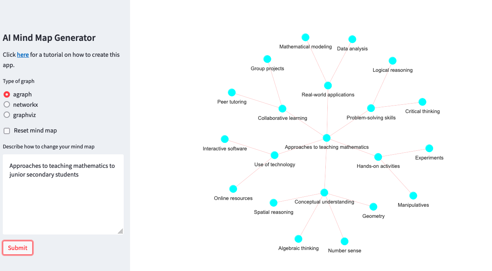

# Teaching Mathematics

Tags: [[teaching]], [[teacher-preparation]]

## Society

Mathematics and mathematics education in broader society.

### Why? Society?

- [[qld-girls-still-underrepresented]]

### Societal examples of mathematics

- [[poverty-premium]]

## Discipline

Notes related to the discipline of mathematics.

### Conceptions of mathematics

- [Two types of mathematics teaching - instrumental and relational](instrumental-relational-mathematics.md) 
- [[mathematical-mindset]]
- [[math-facts]]
- [[mathematical-misconceptions]]

### Probability

- [[normal-distribution]]

## Curriculum

Mathematics curriculum I'll be engaging with

- [[v9-oz-mathematics-learning-area]]

And other examples

- [California's 2023 Mathematics Framework](https://www.cde.ca.gov/ci/ma/cf/)
- [California's 2013 Mathematics Framework](https://www.cde.ca.gov/ci/ma/cf/mathfwchapters.asp)

## Pedagogy

Notes related to mathematics specific pedagogy

- [[practice-approach-to-mathematics]]
- [[conceptual-approach-to-mathematics]]
- [[teaching-mathematics-for-a-growth-mindset]]
- [The Science of Math](https://www.thescienceofmath.com/) - the explicit instruction folk :) 
    - [What is explicit instruction?](https://www.thescienceofmath.com/what-is-explicit-instruction)

### Activities

teaching activities

- [[number-talks]]

"games"

- _How close to 100_ - Partners with dice playing a game with a blank 100 grid. Roll, colour in grid, write the number sentence (Boaler, 2015)
- Use of [flash cards](http://www.youcubed .org/wp-content/uploads/2015/03/FluencyWithoutFear-2015.pdf) and find all cards with the same answer

Computer games 

- [Wuzzit Trouble](https://wuzzittrouble.com/) from a Keith Devlin led team
- [Mathbreakers](https://www.mathbreakers.com)
- [Number rack](https://www.k-5mathteachingresources.com/Rekenrek.html)
- [Motion math](https://motionmathgrams.com)

Homework

- [[reflective-mathematical-homework]]

## Misc resources

- [[python-teaching-mathematics]]
- [Multiplicty Lab](https://multiplicitylab.northwestern.edu/) - Primary focused - helping provide rich mathematical experience to all students
- [The Institute for Figuring](https://www.theiff.org/) - dedicated to the poetic and aesthetic dimensions of science, mathematics and engineering
- [Resources for teaching graph making and analysis skills](https://blog.tcea.org/graph-making-analysis-skills/)

### Learner generated examples

- [The power of student generated examples in mathematics](https://rtalbert.org/the-power-of-student-generated-examples-in-mathematics/)
- [Using learner generated examples to introduce new concepts](https://www.jstor.org/stable/40284537)

### Teaching tips

- [[foster-critical-creative-thinking-mathematics]]
- Example of QCAA "advice for students learning from home" [General Mathematics](https://www.qcaa.qld.edu.au/downloads/senior-qce/mathematics/snr_general_maths_21_covid_factsheet.pdf) - potential source of resources/ideas

### Mathematics teaching frameworks

- [IMPACT - Inquiry Maths Pedagogy in Action](https://www.mathsinquiry.com/) - UQ community providing access to resources for teaching and learning mathematics through guided inquiry. [Research basis](https://education.uq.edu.au/project/mathematical-inquiry)

### Approaches to teaching mathematics - mindmap

Generated from [AI Mind Map Generator](https://ferusandbeyond-mind-map-generation-main-7p68z9.streamlit.app/)

## References

Boaler, J. (2015). Creating Mathematical Mindsets: The Importance of Flexibility with Numbers. In *Mathematical Mindsets: Unleashing Students' Potential Through Creative Math, Inspiring Messages and Innovative Teaching* (pp. 33--56). John Wiley & Sons, Incorporated. [[annotations-boaler-2015]]

[//begin]: # "Autogenerated link references for markdown compatibility"
[teaching]: ../teaching "Teaching"
[teacher-preparation]: ../../../seek/teacher-preparation "Teacher preparation"
[qld-girls-still-underrepresented]: qld-girls-still-underrepresented "Queensland girls still underrepresented in specialist maths despite push to increase participation - ABC News"
[poverty-premium]: poverty-premium "Poverty Premium"
[mathematical-mindset]: mathematical-mindset "Mathematical Mindset"
[math-facts]: math-facts "Math Facts"
[mathematical-misconceptions]: math-misconceptions/mathematical-misconceptions "Mathematical misconceptions"
[normal-distribution]: probability/normal-distribution "Normal (Gaussian) distribution"
[v9-oz-mathematics-learning-area]: ../Curriculum/v9-oz-mathematics-learning-area "Mathematics learning area - Australian Curriculum v9"
[practice-approach-to-mathematics]: practice-approach-to-mathematics "Practice approach to mathematics"
[conceptual-approach-to-mathematics]: conceptual-approach-to-mathematics "conceptual-approach-to-mathematics"
[teaching-mathematics-for-a-growth-mindset]: teaching-mathematics-for-a-growth-mindset "Teaching mathematics for a growth mindset"
[number-talks]: number-talks "Number talks"
[reflective-mathematical-homework]: reflective-mathematical-homework "Reflective mathematical homework"
[python-teaching-mathematics]: python-teaching-mathematics "Python for teaching mathematics"
[foster-critical-creative-thinking-mathematics]: foster-critical-creative-thinking-mathematics "Fostering critical and creative thinking - mathematics"
[annotations-boaler-2015]: annotations-boaler-2015 "Creating mathematical mindsets - annotations"
[//end]: # "Autogenerated link references"