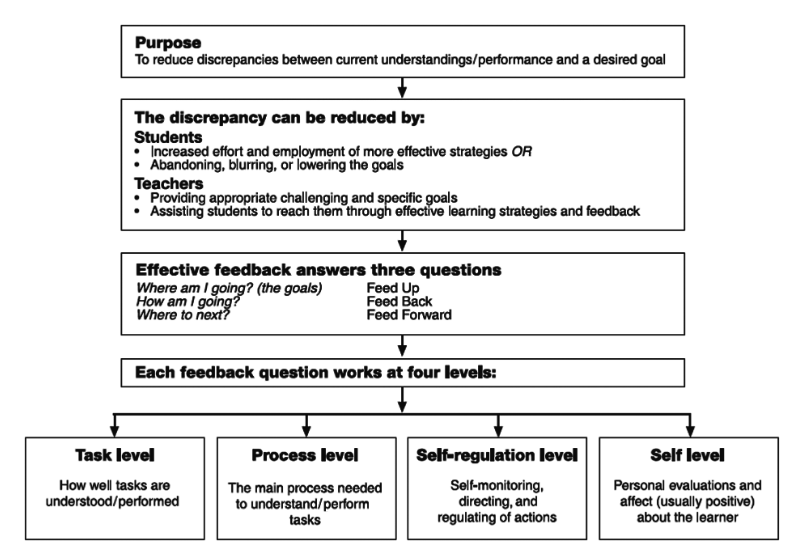

See also: [[acu-rtt]]

Second module in the ACU Return to Teaching course. 

Through the [[APSTs]] connect into a repertoire of teaching approaches. Which appear to be an almost random collection of learning theories, pedagogical practices, specific approaches. 

Might have been useful to include more [[design-for-learning]] and [[evolution-of-design-for-learning]]. Also the Learning Sciences, evidence based practice etc are visibly absent - at least in the summary. Given their prevalence in debates - e.g. around PISA - this is a little surprising.

## Repertoire of teaching practices

### Constructivism

As explained is resonates somewhat with a [[design-for-learning]] approach. We learn through activities, perhaps changing/perhaps not our mental models. Teaching aims at understanding students' pre-existing conceptions and guides activity to build/change them.

But with a focus on problem-solving and inquiry-based learning activities. "Constructivism transforms the students from a passive recipient of information to an active partipant in the learning process"

!!! question "On the tendency toward straw folk arguments?"

    This perspective has echoes of the straw man approach of the explicit teaching crowd and how they characterise non-explicit teaching methods. Echoes of the issues with [[not-how-bad-you-start]] and [[all-models-are-wrong]]

### Inquiry-based learning

As described here it is being positions as a high level pedagogy to match the philosophy of constructivism. Misc. video resources about school implementation.

### Scaffolding student learning

Nice analogy with ancient bridge building. Defines the Zone of Proximal Development and links.

### Providing feedback

General points about feedback linked to idea of formative feedback. Includes feedback model from Hattie & Timperley (2007) 

Perhaps most interesting from the diagram are the three questions and four levels summarised in the tables following.

<figure markdown>

<caption>A model of feedback to enhance learning (adapted from Hattie & Timperley, 2007, p. 81)</caption>
</figure>

| Label | Question |
| --- | --- |
| Feed up | Where am I going? (the goals) |
| Feed back | How am I going? (progress towards the goal) |
| Feed forward | Where to next? (activities to close the gap) |

| Level | Description |
| --- | --- |
| Task | How well tasks are understood/performed |
| Process | The main process needed to understand/perform tasks |
| Self-regulation | Self-monitoring, directing, and regulating of actions |
| Self | Personal evaluations and affect (usually positive) about the learner |

!!! note "All models are wrong and somewhat contradictory"

    The "repertoire" of teaching practices is a collection of models. Models that have something to say about specific bits of the complex tasks/practices of learning and teaching. As well as [[all-models-are-wrong]], they are also somewhat contradictory.

    Hattie's work, at least for me, smacks more of the technical (goal focused, teacher led) than critical (exploratory, student focused). Inquiry-based learning and constructivism can/are focused the other way.

    But perhaps that is to be expected, all models are wrong but they may be useful if they are gathered together and woven into ways that are appropriate for the specifics. Which connects to my idea of [[teaching-as-gather-weave-augment]], but also [[teaching-as-interweaving]]

Move's onto Dweck's growth mindset work related to praise and the big idea of students providing feedback to teachers (traffic lights, thumbs up/down).

### Play-based learning

Bit on the approach, including expansion out to "symbolic-play" but doesn't say much about if/when applicable beyond early years. 

### Cooperative teaching practices

Apparently team teaching/planning is a relatively new advent.

### Teaching with ICT

Does interchangeably use the terms ICT and electronic technologies.

####  Reflection task

> Laptop computers, iPads, smart boards, data projectors and other ICT devices are increasingly common in our classrooms. The use of these devices can be a challenge - both practically and pedagogically.
> Reflect on your use of ICT in your teaching. Share a success story (it can be something very simple!). 

Unlike Carly, I'm not worried about my digital technology skills.  After all digital technologies is one of my teaching areas.  As I return to school, I'm more nervous about the limitations Ed Qld places on digital technologies. I've also spent the last 30 years using and helping others use digital technology to enhance/transform learning and teaching. Experience which reinforces the point made in the reading, attempts to use digital technologies will always face practical and pedagogical challenges. Experience which also suggests that even the simplest, contextually appropriate use of digital technologies can offer a pedagogical benefit. As well as minimising the challenges.

For example, the following successful use of digital technologies is from the very first lesson I taught as a pre-service (aka student) teacher. Even with my knowledge and experience with digital technologies, I decided to go simple to minimise the challenges. The lesson was titled "Timezones and Mass". My mentor had established a routine of using an interactive white board and a set of slides to scaffold lessons. Mirroring his practice I designed a set of slides. The first slide of the timezones section contained an image of specific international locale and the question "What time is it here, right now?" (see below). When that slide appeared - as I hoped - a spark of recognition and conversation arose from one of the student tables. A spark I encouraged to spread to the rest of the class through questioning etc. 

<figure markdown>

</figure>

The image is of a part of Cape Town, South Africa including Table mountain. It was sourced via a Google image search specifically because I'd discovered that one of the students was originally from Cape Town. For him, this bit of mathematical knowledge was important and relevant. His experience established the relevance for the rest of the class and provided a source of confirmation for the calculations performed. At the same time, it was achieved using a very simple application digital technology that was known to work in this classroom and was in a pedagogical form that was common and consistent with the class's experience. This simplicity reduced my worry and cognitive load and allowed me to focus on other factors.

For me this is a simple example of what Mishra and Koehler (2006) define "quality teaching" as leveraging an understanding of the relationships between technology, content, and pedagogy to "develop appropriate, context-specific strategies and representations" (p. 1029). Not fancy, or the latest technology. I'd never used the IWB or the associated software previously. To be frank the software was pretty bad. But given the context of my first lesson in someone else's classroom building effectively on what was there worked well.

_Aside_: Given my disciplinary background I've never been a fan of terms like "ICT" and "electronic technologies". Largely because they hide the unique and powerful properties of _digital technology_ - e.g. data homogenisation (convergence) and reprogrammability (generativity) (Yoo et al, 2012). If the goal is to use digital technologies as part of "quality teaching" then understanding the fundamental properties of digital technologies will be useful to understanding how to weave them into content and pedagogy in contextually appropriate ways.

#### References

Mishra, P., & Koehler, M. (2006). Technological pedagogical content knowledge: A framework for teacher knowledge. *Teachers College Record*, *108*(6), 1017--1054.

Yoo, Y., Boland, R. J., Lyytinen, K., & Majchrzak, A. (2012). Organizing for Innovation in the Digitized World. *Organization Science*, *23*(5), 1398--1408.

### Teaching Digital technologies

References various ideas for teaching coding without computers (boo) and various low cost alternatives e.g. Ozobots. Small "robots" that follow lines - visual/physical representations of code - drawn on paper. And other examples, definitely with the assumption on physical instantiations.

### Cyberbullying

Misc. resources on cyberbullying.

Interestingly, not a great deal on other related issues. e.g. the impacts of social media more broadly due to its design. Broader ideas of digital wellbeing.

### Building resilience

Changes in society mean students may not have the competence to deal with adverse reactions/challenges/situations. They've not developed a competency for resilience.

#### Reflection task

> It can be argued that anything that is worth achieving typically requires substantial investment (motivation/drive/dedication and time).
> Unfortunately these things seem to be in increasingly short supply for our students. I can recall many examples where I have been surprised by the lack of resilience shown by students who give up at the first opportunity. 
> Teaching involves challenging students to progress.... but how do we challenge and support learners at the same time? 
> Have you encountered emotionally fragile students? How have you supported them? 

Next year will be my first year of teaching. As a newly qualified teacher I do not have significant personal experience of supporting emotionally fragile students and certainly not recently. However, I have been lucky enough to spend a few days of observation at the school I'll be teaching at next year. Hence the following is an early description of what I've seen and what I'm planning, rather than what I've experienced.

Observing classes in mathematics and digital technologies, it appeared that the many students were disengaged from learning. Motivation and drive were in short supply. If not being disruptive, students were left to their own devices (figuratively and literally). Not a lot of evidence of emotional fragility. Perhaps because the lack of engagement in learning meant no opportunity for students to be challenged. It was also evident that many of the lessons, especially in mathematics, were taking a more procedural, rather than conceptual, approach. Lessons that did but pose much in the way of conceptual, meaningful, or contextual challenges.

The nascent plans I'm formulating are informed heavily by ideas from work on mathematical mindsets (Boaler, 2015), thinking classrooms (Liljedahl, 2020), and many other related ideas. Ideas that build on a constructivist foundation with a focus on students engaging with rich mathematical tasks through collaborative activities that enable and celebrate diversity and build growth/mathematical mindsets. Hopefully, the consequence of all this is students start building an interest and approach to learning that develops deep conceptual, disciplinary knowledge.

Sounds great in theory, but practical implementation is a challenge. The associated literature emphasises that this does not happen over night. Even that most talented teacher could not implement over night, and even if they could the students would not be able to cope (Liljedahl, 2020). Hence the current plan is to take an on-going iterative approach that seeks to introduce different aspects of this practice in a way that keeps within the zone of proximal development of myself, the students, and the school. The broad plan at the moment, involves the following:

1. Establish a different set of expectations around mathematical mindsets.
2. Slowly introduce different activities that help build mathematical mindsets and students' self-concept and beliefs about self-efficacy (and slowly remove more explicit scaffolds).
3. Engage in critical reflection about what works, what doesn't and then return to #2.

The specifics will come next after I finish this course. A lot of the specifics will come as I learn more about the students and their specific needs.

#### References

Boaler, J. (2015). *Mathematical Mindsets: Unleashing Students' Potential Through Creative Math, Inspiring Messages and Innovative Teaching*. John Wiley & Sons, Incorporated.

Liljedahl, P. (2020). *Building Thinking Classrooms in Mathematics, Grades K-12: 14 Teaching Practices for Enhancing Learning*. Corwin Press. <http://ebookcentral.proquest.com/lib/griffith/detail.action?docID=6358633>

## Assessment task

### Part 1

Choose FOUR of the contemporary approaches provided and 

- Define each of the approaches/issues in your own words;
- Identify how each relates to the professional issues

    i.e. clearly identify the standards and focus areas being discussed

#### Response - Part 1

##### Constructivism

I think of constructivism as a philosophy or theory of learning. One of many different theories of learning. In turn constructivism comes in many often diverse, fragmented and sometimes incoherent flavours (Gordon, 2009). Constructivism sees learning as a process through which new knowledge is filtered through and connected (in)effectively with our pre-existing knowledge. The quality of this filtering and connection is reliant on the nature of the activities the individual learner performs. Goodyear (2005) positions constructivism (and similar theories of learning) as a pedagogical philosophy. The most fundamental of his levels of design for learning. It identifies specific beliefs about how people learn, without offering specific operational advice for design for learning. Echoing Dennick's (2016) suggestion that no connection necessarily exists between epistemology and pedagogy.  Consequently, I see constructivism fitting most explicitly with APST 1 - Know students and how they learn. In particular, Focus 1.2 - Understand how students learn. It provides a model for how learning happens.

Constructivism does have implications of teaching and many of the other standards. But effective teaching (aka design for learning) must connect constructivism with other theories and models (many of the other APSTs) to meet the specific contextual need. Dennick (2016) suggests that "there is no necessary connection between epistemology and pedagogy" (p. 200) but argues that constructivism promises to provide some unity of practice for design for learning. Hence I see constructivism as an "answer" for APST 1.2 providing a strong informing voice for most of the remaining APSTs/the practice of design for learning. Also, the distinction between epistimology and pedagogy helps reinforce the idea that "Good teaching involves more than one teaching approach" [(Reid, n.d)](https://www.aeuvic.asn.au/professional-voice-1424)

##### Scaffolding student learning

- The broad notion of scaffolding learning (like constructivism) can't necessarily by linked tightly to specific standards - but detailed knowledge could be involved in many, including...
- Link to "constructivism" in that students aim to construct knowledge, but the question left unsaid is how to enable them to effective/efficiently construct that knowledge. Scaffolding learning is one approach, scaffolding how to think/approach/construct knowledge. The apparent absent of scaffolding is one argument identified in the explicit instruction/inquiry-based teaching debates. In particular the cognitive load proponents. Which is what inquiry learning. Linking to Reid's (n.d) discussion: multiple versions of inquiry-learning.  And focus on teachers selecting multiple different approaches.
- More on scafolding learning
- Links to 

  - APST 1: Using knowledge of students of all types to design appropriate scaffolding

    Scaffolding that is appropriate to students

  - APST 2: Know the content and how to teach it

    Scaffolding appropriate to the content

  - In turn linked to #3 (planning) and #4 (safe learning environments) which support particiaption, minimise behaviour issues, maximise child safety etc

##### Teaching with digital technologies

- Hold with Dron's (2023) definition of technology and educational technology - orchestration of phenomena for educational purposes. Hence pedagogy, theories etc are all technology
- Teaching with digital technologies focuses on a particular type of technology - digital and the idea of leveraging the affordances of that technology to enhance learning and teaching (educational technology).
- Given data homogenisation suggests that all data can be represented and manipulated digitally (hence the increasingly pervasive presence of digital technologies) teaching with digital technologies can be linked to all of the standards. e.g. this course with standard 6, considerations of how digital technology impact/enable student safety (e.g. cyber bullying for more) standard 4 etc.
- Perhaps something about the assemblage nature - digital technology is part of the broader educational technology being used for learning and teaching.  It offers some affordances, but in the end come back to Dron's idea about what's important is the purpose for which the assemblage of technology is being used that's important
- Links to

    - all aspects, but explictly 2.6, 3.4, 4.5

##### Cyber bullying

- the practice of leveraging digital technologies - particularly digital communication tools and especially the prevalent social media - to.....
- for more this is part of broader issues of digital well-being and the critical positioning of people (students, teachers, and others) as either users of digital technology or active participants in its (re-)construction
- Links to

    - Most explicitly 4.5, but also

      -  Standard 1 - knowing students e.g. Focus 1.1 about stages of development
      - Focus 2.6 - demonstrating through use of ICT awareness and approaches to dealing critically with the use of ICT and positioning people as active participants on (re-)construction  (aka ORCHESTRATION) of digital technologies

### Part 2

> This module has presented a range of ICT tools that may be of benefit to teaching and learning. Choose one of the teaching approaches/issues listed in Part 1 and explain how you might use ICTs to support your teaching and the learning of your students in this area. Hint: Provide a sentence or two explaining your context (e.g., primary, secondary, special needs etc) at the start of your response to this task.

#### Response - Part 2

Feedback to and from students is important. 
I'm interesting in the idea of a class barometer implemented appropriately with digital technologies to provide feedback to students and teachers about classroom "climate".

The current plan is to trial this idea in my digital technologies classes across years 7, 8, and 10. Classes that are typically held in a computer lab hence all students will have access to a computer. Not a common situation in all classes.

The class barometer approach echoes the traffic light and thumbs up/down examples from Module 2. In this case, the plan is to also integrate simple questions from minute papers (e.g. what was the most important thing you learned? What was the muddiest point?) and implement with a simple, anonymous web application. An application that not only gathers student progress but provides the teacher and the class with ways to visualise and analyse the responses.

Beyond the feedback benefits the barometer also provides an opportunity to engage with students with questions related to the learning area. For example, how do they know that their responses are anonymous? Are there better ways to represent the data? How and who can access the data?

## References

Hattie, J., & Timperley, H. (2007). The Power of Feedback. *Review of Educational Research*, *77*(1), 81--112. <https://doi.org/10.3102/003465430298487>

[//begin]: # "Autogenerated link references for markdown compatibility"
[acu-rtt]: acu-rtt "ACU's Return to Teaching course"
[APSTs]: ../apsts "Australian Professional Standards for Teachers"
[design-for-learning]: ../../Design/design-for-learning "Design for learning"
[evolution-of-design-for-learning]: ../../Design/evolution-of-design-for-learning "Evolution of design for learning"
[//end]: # "Autogenerated link references"