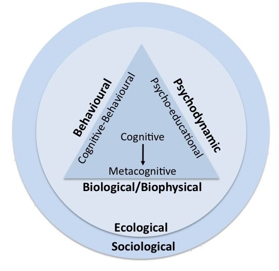

Thoughts and ideas re: the management of classes of learners within formal education.

## A simple process

In an assignment for my Grad Dip, I offered a ["simple" 5-step plan](https://djon.es/blog/2011/06/16/a-simple-class-management-plan-for-beginning-teachers/)

1. Define class management.

    Adopts Evertson and Weinstein (2006) definition with two distinct purposes:

    1. "establish and sustain an orderly environment so students can engage in meaningful academic learning", and
    2. "enhance students' social and moral growth".

    How you achieve order is perhaps has important as if you achieve order.
2. Know thyself, your students, and context.

    Be less sensitive to student behaviours that disrupt your plans, focus more of identifying and responding to cues from the class.
3. Bring the learning.
4. Adopt some techniques.
5. Reflect and return to step X.

## How off-task behaviour might be explained and addressed

Adapted from Powell and Tod (2004)

| Frequent behaviour |	Theory | 	Explanation examples | 	Action |
| --- | --- | --- | --- |
| Off-task | 	Behavioural  |	Child is getting more attention by being off-task | Reward on-task behaviour |
| Off-task  |	Cognitive  |	Child thinks he is unable to do the task |	Encourage child to reappraise task, identify what parts of the task he can do, etc. |
| Off-task  |	Affective  |	Child fears failure. | Circle time to build self-esteem; offer increased adult or peer support |
| Off-task  |	Biological | 	Perhaps the child as ADHD? | 	Refer for medical assessment
| Off-task  |	Developmental  |	Child is not ready to work independently | 	Allocate learning support assistant and set a more suitable learning challenge.  |

<figure markdown>

<caption>Figure 2. Conceptual models of behaviour. Adapted from “Behaviour and support management”, by R. Conway, 2009, in Education for Inclusion and Diversity, A. Ashman, J. Elkins (eds), p. 131. </caption>
</figure>

