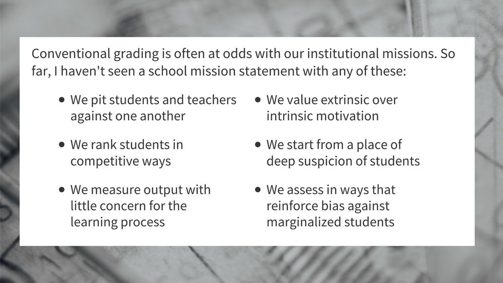

---
title: No title found
---
<!--
 Copyright (C) 2023 David Jones
 
 This file is part of memex.
 
 memex is free software: you can redistribute it and/or modify
 it under the terms of the GNU General Public License as published by
 the Free Software Foundation, either version 3 of the License, or
 (at your option) any later version.
 
 memex is distributed in the hope that it will be useful,
 but WITHOUT ANY WARRANTY; without even the implied warranty of
 MERCHANTABILITY or FITNESS FOR A PARTICULAR PURPOSE.  See the
 GNU General Public License for more details.
 
 You should have received a copy of the GNU General Public License
 along with memex.  If not, see <http://www.gnu.org/licenses/>.
-->

# Jesse Stommel on ungrading 

Summary and reflections on [a twitter thread on ungrading](https://twitter.com/Jessifer/status/1655763679437266944) from Jesse Stommel

## [Ungrading: an Introduction](https://www.jessestommel.com/ungrading-an-introduction/)

### Problem with grades 

> I would argue grading, by any of our conventional academic metrics, undermines the work:
> 
> - Grades are not good incentive.
> - Grades are not good feedback.
> - Grades encourage competitiveness over collaboration.
> - Grades are not good markers of learning.
> - Grades don't reflect the idiosyncratic, subjective, emotional character of learning.
> - Grades aren't “fair.”

### Origins of grades 

- Prior to 1700s, performance and feedback are idiosyncratic 
- First grading apparently in 1785, in Yale
- A-F systems emerged in 1898 and "E" in the 1930s
- 100 point scale/% common in the early 1900s. 
- Letter grades not widely used until 1940s, in 1971, 67% of primary & secondary schools using them
- "objective" grading created to scale systematised schooling. 
 
> "Toward standardization and away from subjectivity, human relationships, and care.

Good demo re: institutional mission statements 

- [[train-to-overcome-biases]]

### Academic misconduct 

Cites research that shows academic integrity has been an issue since at least the 60s.

### Alternatives 

Freire and "problem-posing education" - start by trusting students. 

> Alternative Forms of Assessment:
> 
> - Minimal Grading: Using scales with fewer gradations to make grading “simpler, fairer, clearer” (Elbow)
> - Contract Grading: Grading contracts convey expectations about what is required for each potential grade. Students work toward the grade they want to achieve, and goalposts don’t unexpectedly shift.
> - Authentic Assessment: Having students write for real-world audiences, focusing on intrinsic motivations, and drawing students into the design of assignments / assessments.
> - Process Letters: Asking students to reflect on their work and offer feedback on those reflections. Students help guide the grading of their own work.

### Process 

1. Start with teachers talking to students about grades and the culture, give student a sense of ownership 
2. 

Small steps 
> - Change how you talk about assessment: Ungrading works best as part of a holistic pedagogical practice. Use words like "ask" or "invite," rather than "submit" or "required." Ask students about their expectations for their work, rather than centering yours.
> - Invite students to a conversation about grades: Ask students how being graded makes them feel, how it affects their motivation. As a group, read and discuss a piece like Alfie Kohn's "The Case Against Grades."
> - Grade less stuff, grade less often, grade more simply: Create space in your course for discovery and experimentation. Use a grading scale that feels less arbitrary and communicates more clearly to students. Ask students to do work that you don't "collect."
> - Ask students to reflect on their own learning: Even if you change nothing else about how you grade, ask students when and how they learn. Ask what barriers they face. Listen. Believe the answers.

[//begin]: # "Autogenerated link references for markdown compatibility"
[train-to-overcome-biases]: train-to-overcome-biases "How Teachers’ Hidden Biases Are Hurting Our Girls"
[//end]: # "Autogenerated link references"