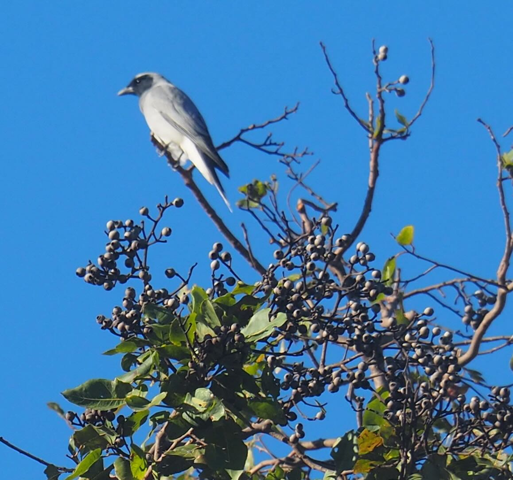

See also: [[birding]], [[life-list]]

<figure markdown="span">
    
    <figcaption><a href="https://en.wikipedia.org/wiki/Black-faced_cuckooshrike">Black-faced cuckooshrike</a></figcaption>
</figure>

[//begin]: # "Autogenerated link references for markdown compatibility"
[birding]: birding "Birding"
[life-list]: life-list "Life list"
[//end]: # "Autogenerated link references"