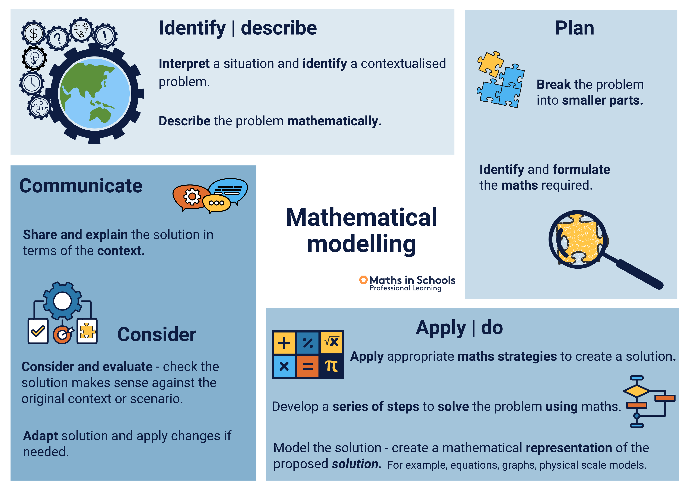

See also: [[computing]], [[integrated-computing]], [[teaching-digital-technologies]]

[This](https://www.fierceeducation.com/teaching-learning/teaching-computational-thinking-essential-future-college-students) identifies computational literacy as "an essential literacy" with four pillars 

1. [[decomposition]]: breaking the problem into multiple parts
2. [[pattern-recognition]]: looking for similarities and trends
3. [[abstraction]]: putting aside what is unnecessary and focusing on what’s important
4. [[algorithm-design]]: creating a computer artifact with step-by-step instructions to solve a problem

Wing (2006) defines computational thinking as 

> solving problems, designing systems, and understanding human behaviour, by drawing on the concepts fundamental to computer science (p. 33)

## CSER Maths in Schools

CSER [[maths-in-schools]] MOOC offers the following figure. With _computational thinking_ being included in both the mathematics and digital technologies learning areas.

<figure markdown>

<caption>Computational thinking in the Australian Curriculum (from CSER MOOC)</caption>
</figure>

## References

Wing, J. M. (2006). Computational thinking. *Communications of the ACM*, *49*(3), 33--35.

[//begin]: # "Autogenerated link references for markdown compatibility"
[computing]: computing "Computing"
[integrated-computing]: integrated-computing "Integrated Computing"
[teaching-digital-technologies]: ..%2FTeaching%2FDigital_Technologies%2Fteaching-digital-technologies "Teaching Digital Technologies"
[decomposition]: decomposition "Decomposition"
[pattern-recognition]: pattern-recognition "Pattern recognition"
[abstraction]: abstraction "Abstraction"
[algorithm-design]: algorithm-design "Algorithm design"
[maths-in-schools]: ..%2FTeaching%2FMathematics%2Fmaths-in-schools "Maths in Schools Online: Year 7 - 10 course"
[//end]: # "Autogenerated link references"