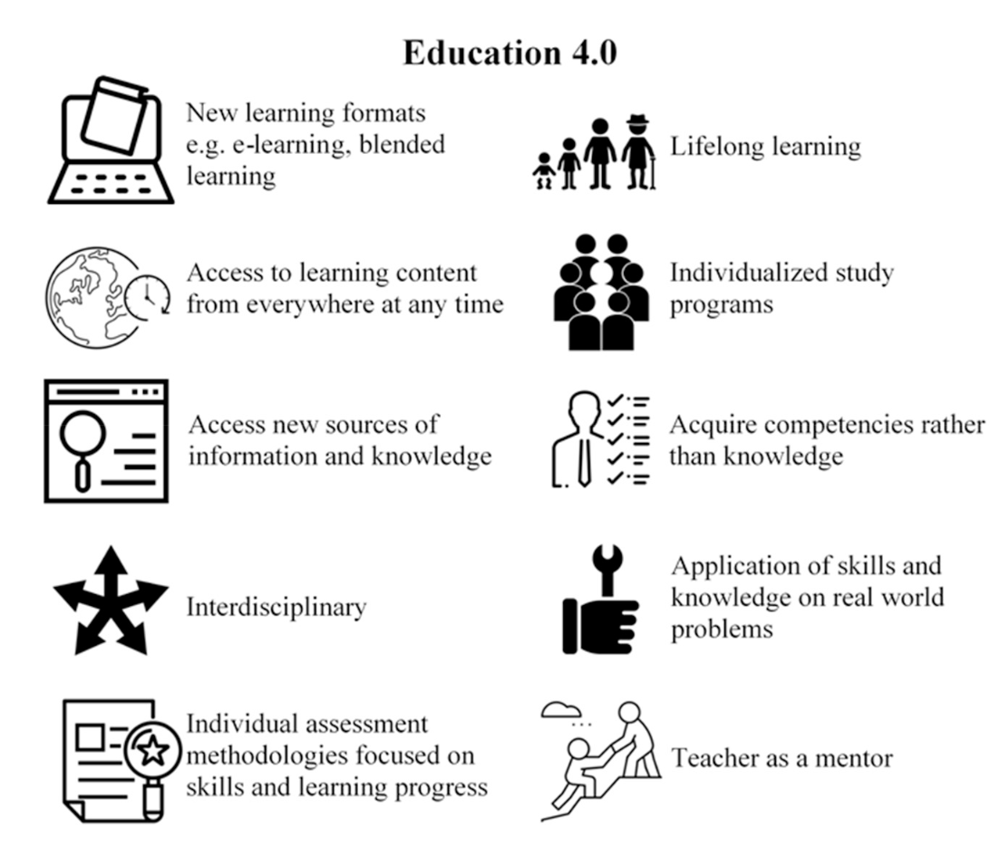

---
title: No title found
---
<!--
 Copyright 2023 s2986288
 
 Licensed under the Apache License, Version 2.0 (the "License");
 you may not use this file except in compliance with the License.
 You may obtain a copy of the License at
 
     http://www.apache.org/licenses/LICENSE-2.0
 
 Unless required by applicable law or agreed to in writing, software
 distributed under the License is distributed on an "AS IS" BASIS,
 WITHOUT WARRANTIES OR CONDITIONS OF ANY KIND, either express or implied.
 See the License for the specific language governing permissions and
 limitations under the License.
-->

# Education 4.0

## Core elements

Adapted from Goldin et al (2022)

| Scheer (2015) | Fisk (2017) |  Wallner & Wagner (2016) |
| --- | --- | --- |
| New learning formats | Diverse time and place | Individualized programs |
| Location and time-independent learning | Personalized learning | Self-organization |
| Individual study careers | Free choice | Independent goals |
| Globalization and international exposure | Project-based |  Interdisciplinary studies |
| Gamification for motivating students and teachers | Field experience | Individual assessment |
| Ability to find and locate the knowledge | Data interpretation | Transform information into knowledge |
| Lifelong learning | Exams to evaluate knowledge instead of question/answers | Collaborative learning | 
| | Student responsibility in composing the learning curriculum | Active learning | 
| | Mentoring | New media for learning (web, MOCC)  |

Really quite a hodge podge, Goldin et al (2022) refine this to 

## Perceived barriers 

Goldin et al (2022)

## References

Goldin, T., Rauch, E., Pacher, C., & Woschank, M. (2022). Reference Architecture for an Integrated and Synergetic Use of Digital Tools in Education 4.0. *Procedia Computer Science*, *200*, 407--417. <https://doi.org/10.1016/j.procs.2022.01.239>