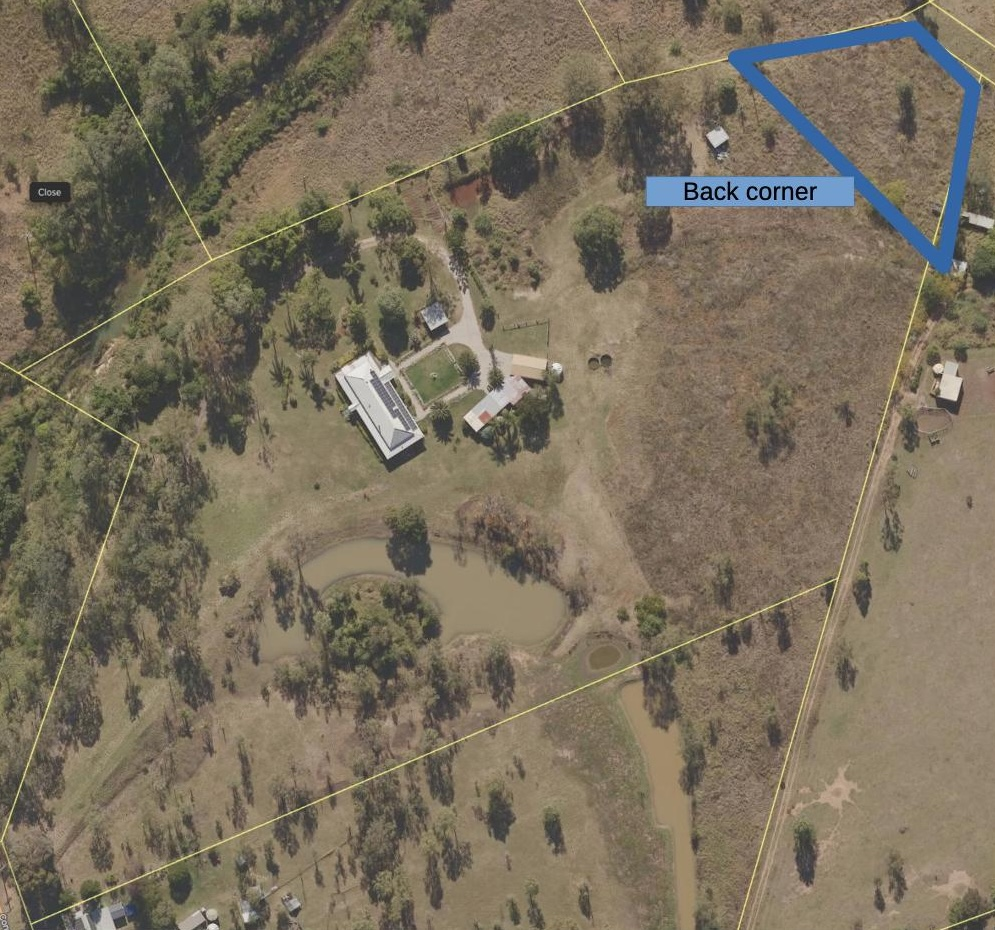

The least explored zone of [[wood-duck-meadows]] the _back corner_ is located in the north-eastern corner of the property. It's largely grass covered with the odd tree. An observations based solely on the satellite image.

!!! info "Current status"

    Largely unknown

## Location

<figure markdown>

<caption>The back corner is located in the north-eastern corner of the property</caption>
</figure>

[//begin]: # "Autogenerated link references for markdown compatibility"
[wood-duck-meadows]: wood-duck-meadows "Wood duck meadows"
[//end]: # "Autogenerated link references"