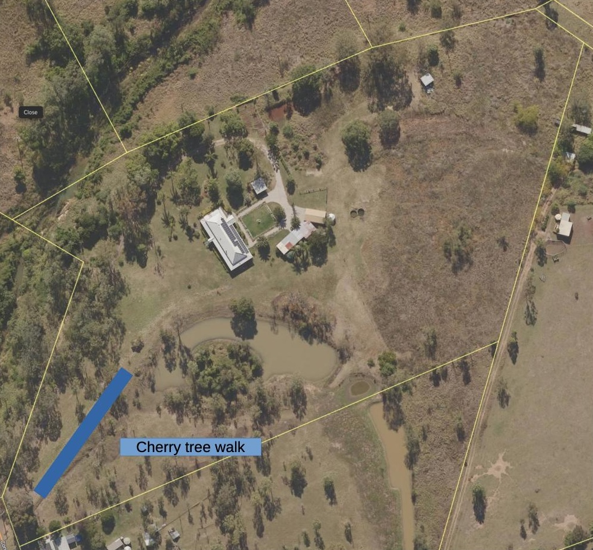

See also: [[wood-duck-meadows]]

_Cherry Tree Walk_ proceeds along the front berm which helps re-direct water run-off from the road into [[the-dam]]. Cherry trees have been planted at the start of the walk.

!!! info "Current status"

    Cherry trees have been in for a couple of years and are growing (slowly). 

## Location

<figure markdown>

<caption>Cherry Tree walk runs from near the front of the property until the start of [[the-dam]]</caption>
</figure>

[//begin]: # "Autogenerated link references for markdown compatibility"
[wood-duck-meadows]: wood-duck-meadows "Wood duck meadows"
[the-dam]: the-dam "The Dam"
[//end]: # "Autogenerated link references"