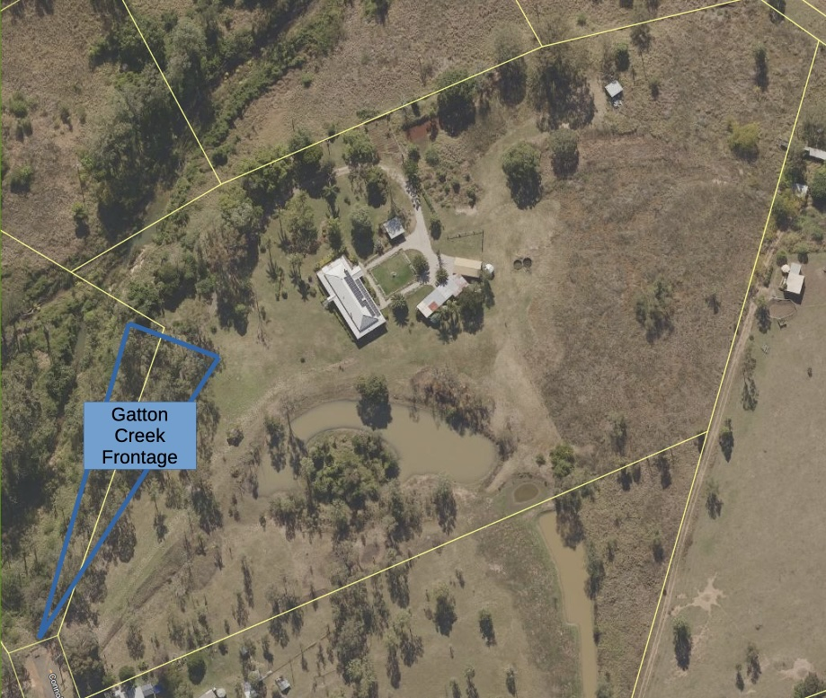

See also: [[wood-duck-meadows]]

About a half-acre of largely ignored [eucalypt woodland](https://www.qld.gov.au/environment/plants-animals/habitats/habitat/eucalypt-woodlands) running between the main driveway and Gatton Creek. An ad hoc small collection of scrub trees in a largely grassy area spread between some "suburban" shrubs and the slowly encroaching lantana, madeira vine and other weeds climbing up the creek bank.

Initial intent is to clean it up and transform it into something far more native and enjoyable. Perhaps a [[dry-rainforest]]?

## Location

<figure markdown>

<figcaption>Gatton Creek frontage location</figcaption>
</figure>

## History 

| Date | Work |
| ---- | ---- |
| Nov-Dec 2024 | Removal of a long section of [[agave]] that had taken over the top of the creek bank. From a positive perspective, the agave has probably slowed down the spread of lantana and [[madeira-vine]]. Initial [[agave]] removal completed on Xmas day 2024. |
| Late Dec 2024 | Discovered [[wombat-berry]] growing in the area. |    
| Jan-Mar 2025 | Foliar spraying and pulling [[madeira-vine]] and [[agave]] regrowth. |

[//begin]: # "Autogenerated link references for markdown compatibility"
[wood-duck-meadows]: wood-duck-meadows "Wood duck meadows"
[dry-rainforest]: dry-rainforest "Dry Rainforest"
[agave]: plants/agave "Agave"
[madeira-vine]: plants/madeira-vine "Madeira vine (Anredera cordifolia)"
[wombat-berry]: plants/wombat-berry "Wombat Berry"
[//end]: # "Autogenerated link references"