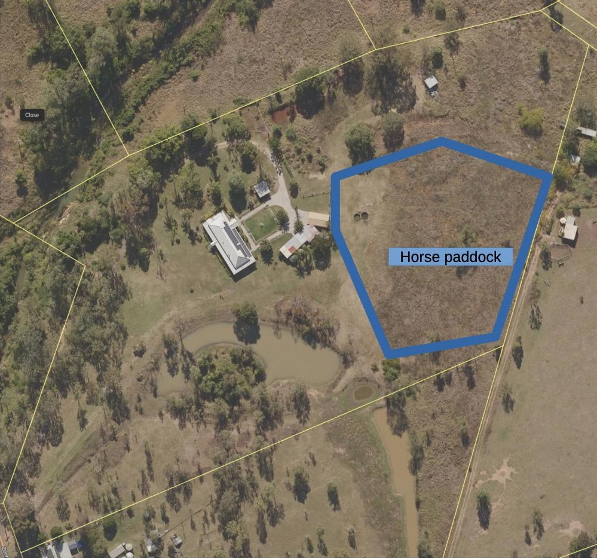

See also: [[wood-duck-meadows]]

What was the old horse paddock is the largest cleared space on the property. Taking up most of the eastern boundary of the property and containing [[the-circle]].

## Location

<figure markdown>

<caption>The horse paddock is the large cleared area taking up most of the eastern boundary of the property</caption>
</figure>

[//begin]: # "Autogenerated link references for markdown compatibility"
[wood-duck-meadows]: wood-duck-meadows "Wood duck meadows"
[the-circle]: the-circle "The Circle"
[//end]: # "Autogenerated link references"