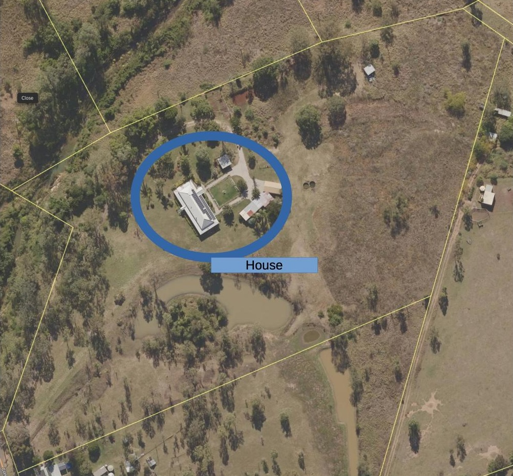
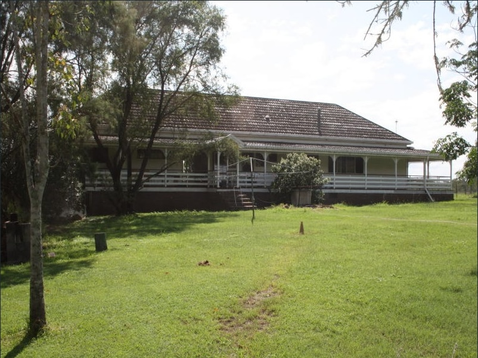
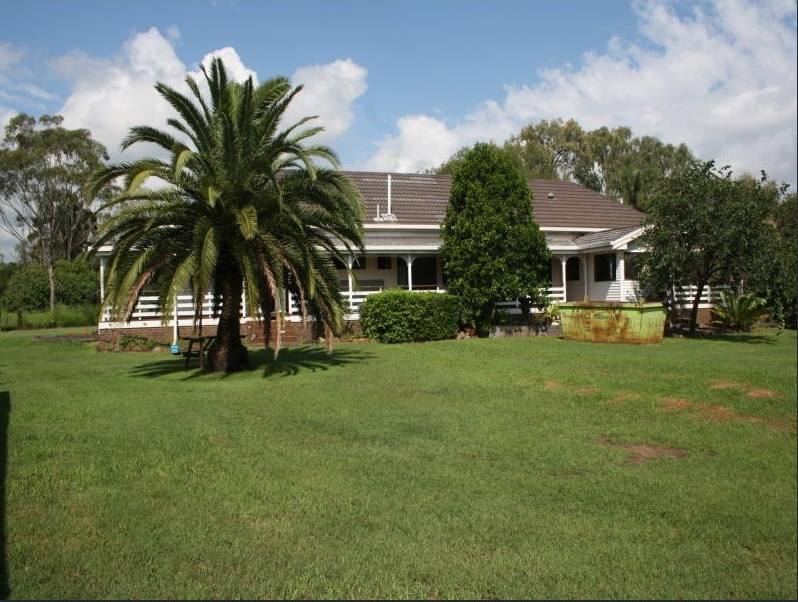
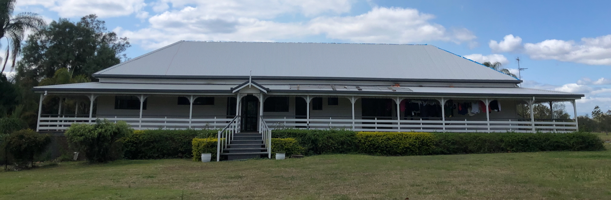

[[Wood Duck Meadows|wood-duck-meadows]] house area includes the house, various sheds, stables and more traditional gardens. Parts of the house were the original homestead which - going by the electrical wiring replaced in early 2025 - was built pre-1960s at least. Later the house was extended to almost 3/4 times the size.

## Location

<figure markdown>

<caption>House, sheds, stables and gardens located to the north of [[the-dam]] edging close to the [[rocky-creek-frontage]]</caption>
</figure>

## House regeneration

Since arriving in 2012 the house has undergone and is still undergoing a regeneration process.

### Original 2012 state

In 2012 the house had a fading brown roof tiled in tin. Numerous trees still growing close to the house.

<figure markdown>

<caption>2012 real estate photo of the house's western side</caption>
</figure>

<figure markdown>

<caption>Eastern side of the house taken in 2012 by real estate agents</caption>
</figure>

### 2024 state

By 2024 numerous changes had been made to the gardens surrounding the house, including the creation of a formal garden on the eastern side. 2024 was also the year the roof was replaced with colourbond and significantly better insulation.

<figure markdown>

<caption>September 2024 photo of the house's western side showing an almost complete roof replacement and numerous other changes.</caption>
</figure>

<figure markdown>

<caption>September 2024 photo of the house's eastern side showing an almost complete (but actively underway) roof replacement and other changes including the formal garden.</caption>
</figure>

