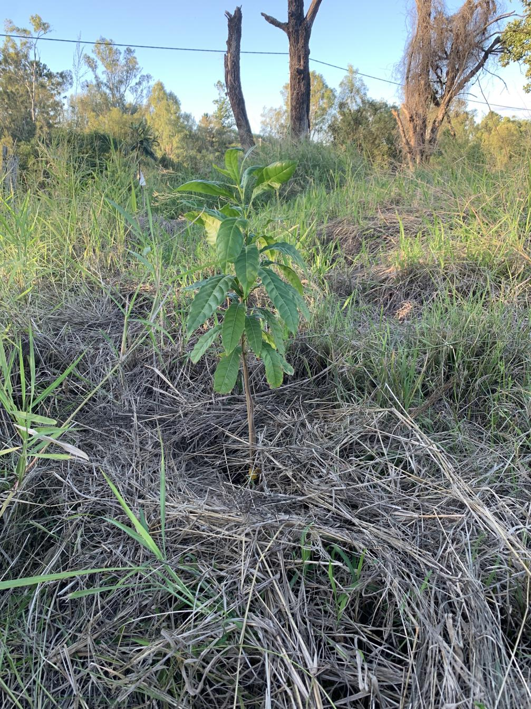

See also: [[individual-plants]], [[lower-dam]], [[wood-duck-meadows]]

As part of the March, 2025 fruit tree planting blitz, we planted an [abiu](https://en.wikipedia.org/wiki/Pouteria_caimito) on the lower dam bank.

## Just after planting

<figure markdown>

<caption>The abiu tree a few days after planting out.</caption>
</figure>

[//begin]: # "Autogenerated link references for markdown compatibility"
[individual-plants]: individual-plants "Individual plants"
[lower-dam]: ../lower-dam "The lower dam"
[wood-duck-meadows]: ../wood-duck-meadows "Wood duck meadows"
[//end]: # "Autogenerated link references"