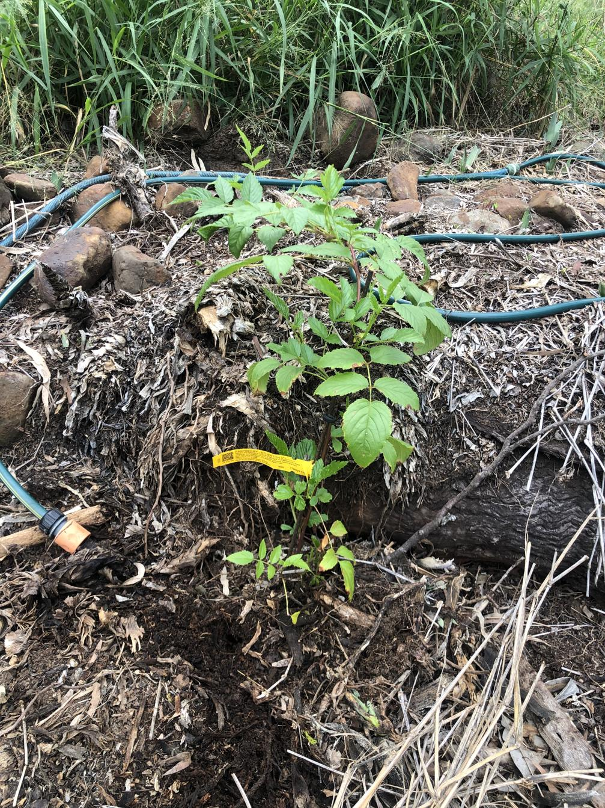

See also: [[rubus-probus]], [[gatton-creek-frontage]], [[individual-plants]]

A [[rubus-probus]] (Atherton raspberry) planted out to the [[gatton-creek-frontage]] in early 2025. Seeing some good growth due to Cyclone Alfred and the subsequent rain events.

<figure markdown>

<caption>The [[gatton-creek-frontage]] Atherton raspberry on April Fool's day 2025</caption>
</figure>

[//begin]: # "Autogenerated link references for markdown compatibility"
[rubus-probus]: ../plants/rubus-probus "Rubus probus (Atherton raspberry)"
[gatton-creek-frontage]: ../gatton-creek-frontage "Gatton creek frontage"
[individual-plants]: individual-plants "Individual plants"
[//end]: # "Autogenerated link references"